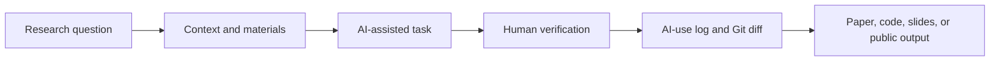
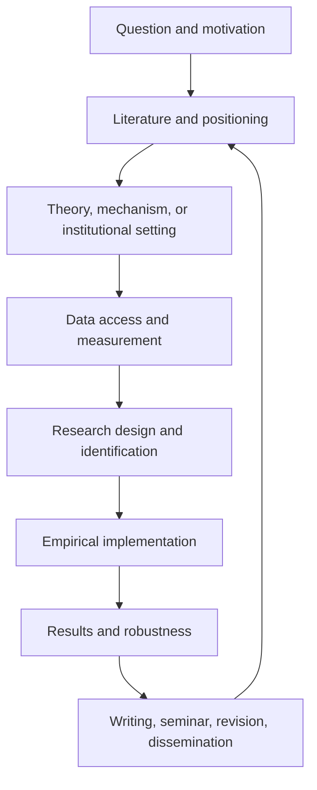

# Start Here: A Practical Handbook for AI in Economics and Finance Research

This is the reading book for the repository. It is meant to be read in GitHub without jumping across dozens of short files.

The rest of the repo gives copy-ready skills, project setups, workflow templates, examples, and source notes. This page explains the logic behind them.

> [!IMPORTANT]
> AI can make research labor cheaper. It does not make a research question important, an identification strategy credible, a citation real, a dataset safe to upload, or a paper worth writing.

> [!TIP]
> If you only have five minutes, read Sections 1, 3, 5, and 10. Then go to the copy-ready skills folder and use one skill on a small, non-confidential task.

Questions or suggestions for this handbook: email [jay.liu@bristol.ac.uk](mailto:jay.liu@bristol.ac.uk) with subject `[AI Econ Finance Handbook] Question or correction`.

## Table of Contents

- [Quick Start: Choose Your Situation](#quick-start-choose-your-situation)
- [1. What This Handbook Is For](#1-what-this-handbook-is-for)
- [2. The Basic Mental Model](#2-the-basic-mental-model)
- [3. Beginner Tool Glossary](#3-beginner-tool-glossary)
- [4. The Maturity Ladder](#4-the-maturity-ladder)
- [5. What AI Is Good At](#5-what-ai-is-good-at)
- [6. What AI Should Not Do For You](#6-what-ai-should-not-do-for-you)
- [7. Core Concepts](#7-core-concepts)
- [8. The Econ/Finance Research Workflow](#8-the-econfinance-research-workflow)
- [9. Responsible Use Rules](#9-responsible-use-rules)
- [10. Verification Is a Skill](#10-verification-is-a-skill)
- [11. Data Safety Rules](#11-data-safety-rules)
- [12. GitHub and Project Safety](#12-github-and-project-safety)
- [13. Skills, Projects, Agents, and MCPs](#13-skills-projects-agents-and-mcps)
- [14. Writing, Presenting, and Public Communication](#14-writing-presenting-and-public-communication)
- [15. Staying Updated Without Chasing Hype](#15-staying-updated-without-chasing-hype)
- [16. What To Use Next](#16-what-to-use-next)
- [17. Sources and Workflow Influences](#17-sources-and-workflow-influences)

## Quick Start: Choose Your Situation

| If you are thinking... | Start here | Then copy/use |
| --- | --- | --- |
| "I am new to AI and do not know what matters." | Read the maturity ladder and core concepts below. | [Tool choice and skill improvement](../02-Copy-and-Use-AI-Research-Instructions-and-Templates/09-tool-selection-updates-and-skill-improvement.md) |
| "I have a paper idea but I am not sure it is good." | Read Sections 2, 4, 5, and 7. | [Research Idea Stress Test](../02-Copy-and-Use-AI-Research-Instructions-and-Templates/01-ideas-brainstorming-proposal-and-literature-skills.md#skill-1-research-idea-stress-test) |
| "I need to write empirical methods." | Read Sections 7, 8, and 9. | [Economics methods skill](../02-Copy-and-Use-AI-Research-Instructions-and-Templates/03-empirical-methods-skills-for-economics-research.md) or [finance methods skill](../02-Copy-and-Use-AI-Research-Instructions-and-Templates/04-empirical-methods-skills-for-finance-research.md) |
| "I want AI to edit code or files." | Read Sections 10, 11, and 12 first. | [Clean project and set up Git](../03-Set-Up-Agents-and-Automated-Research-Workflows/01-clean-existing-research-project-and-set-up-git.md) |
| "I want to use agents." | Read Sections 10, 11, 12, and 13 first. | [One paper, one repo, one AI project](../03-Set-Up-Agents-and-Automated-Research-Workflows/02-one-paper-one-repo-one-ai-project.md) |
| "I need slides or a talk." | Read Section 14. | [Presentation, slides, website, and talk-practice skills](../02-Copy-and-Use-AI-Research-Instructions-and-Templates/06-presentations-slides-websites-and-talk-practice-skills.md) |

## Minimum Safe Setup

You do not need an elaborate system to start. You need a small system that prevents obvious mistakes.

| Component | Minimum version | Why it matters |
| --- | --- | --- |
| AI account | ChatGPT, Claude, or institution-approved tool | basic reading, writing, coding help |
| Version control | GitHub repo, even private | recover files and inspect AI edits |
| Research folder | `data/`, `code/`, `output/`, `paper/`, `slides/` | prevents raw data, code, and drafts from mixing |
| Citation manager | Zotero, BibTeX, or equivalent | prevents fake citation dependence |
| AI-use log | one markdown file | records what AI changed and what you checked |
| Data rule | one paragraph in `DATA.md` | prevents unsafe upload decisions |

Copy this rule into your first project:

```text
Before AI edits files, writes methods text, summarizes literature, or generates slides, it must state:
1. what inputs it used;
2. what it changed or produced;
3. what it is uncertain about;
4. what I must verify manually;
5. whether any private, licensed, or restricted material is involved.
```

## 1. What This Handbook Is For

This handbook is for economics and finance scholars who want to use AI in serious research work:

- PhD students and research assistants
- junior faculty
- empirical economists
- finance researchers
- policy researchers
- instructors teaching AI research workflows
- research teams that need shared rules

It is not a prompt collection. It is not a ranking of tools. It is a field-specific guide to building reliable AI-assisted research systems.

The practical goal is:

> One paper, one research repo, one AI project workspace, one AI-use log, one verification habit.

The deeper goal is to make scholars better at research, not merely faster at producing research-looking artifacts.

## 2. The Basic Mental Model

Think of AI as a research assistant that can help with labor-intensive parts of the workflow but must be managed by a scholar.



The key is not "ask better prompts." The key is controlled workflow design:

| Workflow element | Question to answer |
| --- | --- |
| Purpose | What research task is AI helping with? |
| Inputs | What files, notes, data, and constraints are safe and necessary? |
| Rules | What must AI not invent, change, or decide? |
| Output | What artifact should AI produce? |
| Verification | What must the scholar check manually? |
| Trace | What changed, what was accepted, and what remains uncertain? |

Use this test before using AI:

```text
Can I define the input, expected output, and verification check?

If yes, AI may help.
If no, the task is probably too vague, too risky, or too judgment-heavy.
```

## 3. Beginner Tool Glossary

If you have never used AI for research before, start with these distinctions.

| Term or tool | What it is | Good first use | Main caution |
| --- | --- | --- | --- |
| AI | broad term for systems that generate, classify, predict, or act using learned patterns | language help, code help, document organization | output is not evidence |
| LLM | large language model that generates text/code from context | explain code, summarize supplied text, draft checklists | not a database and may hallucinate |
| ChatGPT | OpenAI chat product; Projects can keep chats, files, and instructions together | one project per paper, literature review, or talk | check privacy settings and project instructions |
| Claude | Anthropic chat product; Projects and long-context workflows are useful for reading/writing | document review, paper critique, project workspaces | still needs source verification |
| Codex | OpenAI coding agent that can read, edit, and run code in a repo or sandbox | fix code, add tests, inspect Git diffs | use Git and review every file change |
| Claude Code | Anthropic coding/agent tool for working in codebases and project folders | repo-aware writing/code workflows, `CLAUDE.md` instructions | permissions and auto modes need caution |
| VS Code | code editor with Git, debugging, terminals, extensions, and file navigation | run scripts, inspect diffs, debug R/Python/Stata-adjacent workflows | editor convenience does not replace reproducibility |
| GitHub | version control and collaboration platform | private research repos, issues, PRs, releases | never commit restricted data |
| Zotero/BibTeX | citation and bibliography management | source-grounded literature work | AI-generated references still need verification |
| RAG/search-grounded AI | AI grounded in retrieved sources | literature checks, source-based summaries | retrieval can miss sources or quote weakly |
| MCP/connectors | ways for AI tools to connect to external apps/data | Zotero, GitHub, files, databases, search | more permissions and privacy risk |

Use the tool that matches the task:

| Task | Better starting point |
| --- | --- |
| quick explanation | ChatGPT or Claude chat |
| ongoing paper context | ChatGPT/Claude Project |
| code and file edits | Codex, Claude Code, Cursor, or VS Code with Git |
| citation/literature verification | search-grounded tool, Zotero, Google Scholar, DOI, journal pages |
| repeated research workflow | skill or project instruction |
| multi-step automation | agent with Git, logs, and approval gates |

## 4. The Maturity Ladder

Use this ladder to locate your current practice.

| Level | Name | What it looks like | Main risk |
| --- | --- | --- | --- |
| 0 | No AI | Traditional research workflow | slower execution |
| 1 | Casual chat | Ask ChatGPT/Claude occasional questions | plausible wrong answers |
| 2 | Structured chat | Give context, ask for uncertainty, verify | still hard to reproduce |
| 3 | AI project | One ChatGPT/Claude Project per paper or task | bad project instructions |
| 4 | GitHub-assisted workflow | AI edits code/text inside version control | unwanted file changes |
| 5 | Skills-based workflow | repeated tasks become reusable skills | weak or unsafe skills |
| 6 | Agentic workflow | AI plans, edits, runs code, checks outputs | permissions and overautomation |
| 7 | Research operating system | AI + GitHub + logs + data rules + source tracking | governance burden |

Do not jump to agents before you can verify outputs, use Git, and define data rules.

Practical interpretation:

- Levels 1-2 are fine for learning and brainstorming.
- Level 3 is the right default for a paper, literature review, or seminar.
- Level 4 is the minimum for code, data, or file edits.
- Levels 5-7 are for repeated work where verification is stronger than automation.

## 5. What AI Is Good At

AI is useful when the task is structured, checkable, and not confidential.

| Research task | Good use |
| --- | --- |
| Literature work | compare arguments, extract models/data/designs, identify claims to verify |
| Empirical coding | explain code, draft functions, debug errors, translate between Stata/R/Python |
| Methods writing | turn a verified design into clear prose with assumptions and limitations |
| Theory support | explain intuition, check proof flow, identify missing cases |
| Research management | create checklists, logs, repo structures, issue lists |
| Writing | improve clarity, structure, transitions, and exposition |
| Presenting | make talk outlines, speaker notes, Q&A drills, slide plans |
| Teaching | create examples, quizzes, explanations, and workshop exercises |
| Data execution | draft cleaning/merge scripts, generate EDA plans, create table/figure code |
| Text-as-data | create coding protocols, label validation sets, audit LLM-generated variables |
| Structural work | map moments to parameters, audit counterfactuals, check welfare interpretation |

## 6. What AI Should Not Do For You

AI can assist, but it should not be treated as the author of scholarly judgment.

Do not let AI independently decide:

- the final research question
- identification strategy
- causal interpretation
- literature contribution
- robustness claims
- policy or investment implications
- referee judgment
- confidential review handling
- whether restricted data may be uploaded
- final submission readiness

The short rule:

> AI can automate labor, not responsibility.

## 7. Core Concepts

| Concept | Practical meaning for researchers |
| --- | --- |
| LLM | A model that generates text/code from patterns; not a database |
| Hallucination | plausible but false or unsupported output |
| Context window | the material the model can use in a task |
| RAG | retrieval-augmented generation; outputs grounded in selected sources |
| Prompt | a one-time instruction |
| Project | persistent AI workspace for a paper, dataset, class, or role |
| Skill | reusable procedure for a repeated task |
| Agent | AI system that can plan, use tools, edit files, and run steps |
| MCP | connector standard that lets AI tools access external systems |
| AGENTS.md / CLAUDE.md | repo-level instructions for AI agents |
| AI-use log | record of task, tool, files touched, accepted output, checks, and uncertainty |

Two distinctions matter for research:

| Distinction | Why it matters |
| --- | --- |
| grounded vs. ungrounded | Literature, citations, facts, and policy details should use source-grounded tools or supplied sources, not bare model memory. |
| reasoning vs. execution | A model can explain or critique a design, but a coding agent can also change files and run code. Execution requires Git and stronger approval gates. |
| long-context vs. retrieval | Long context helps read large supplied documents; retrieval helps find and cite external sources. Both can fail. |
| automation vs. verification | Automation is useful only when verification cost is lower than the labor saved. |

## 8. The Econ/Finance Research Workflow

The useful question is not "Can AI write a paper?" It is "Where in the research pipeline can AI reduce labor while preserving judgment?"



AI is strongest in the middle execution layers: coding, organizing, summarizing, translating formats, drafting explanations, and checking consistency.

AI is weakest where taste and credibility matter most: problem choice, research design, interpretation, contribution, and final judgment.

This is especially important in finance. If AI makes it easy to generate endless factor stories, the scarce skill becomes stronger discipline: theory, data quality, out-of-sample discipline, transaction costs, identification, and honesty about multiple testing.

### The "Paper Machine, So What?" Test

When AI makes an output cheap, ask what human research quality remains.

| AI can make this faster | The scholar must still supply |
| --- | --- |
| paper outline | important question and contribution |
| data cleaning code | measurement judgment and data provenance |
| econometric implementation | credible design and interpretation |
| robustness tables | discipline against specification searching |
| literature prose | verified positioning and real novelty |
| seminar slides | clear argument and honest limitations |

If the human contribution is only "I asked the AI to generate it," the project is not ready.

### The AI Cost-Benefit Rule

Use AI when:

```text
labor saved > setup cost + verification cost + privacy risk + future maintenance cost
```

Do not use AI when verifying the output would take longer than doing the task yourself, or when the task involves confidential material that cannot safely enter the tool.

## 9. Responsible Use Rules

Use this checklist before involving AI in real research.

| Question | If no, stop |
| --- | --- |
| Do I know whether the material is public, private, licensed, or restricted? | Check data and confidentiality rules |
| Can I verify every factual claim? | Do not use output as evidence |
| Can I verify every citation? | Do not trust generated references |
| Can I reproduce any code or table changes? | Use Git and run code |
| Have coauthors agreed on AI use for shared drafts? | Ask before uploading |
| Does the journal, conference, funder, or university require disclosure? | Check policy |

High-risk materials include referee reports, unpublished manuscripts, coauthor drafts, restricted administrative microdata, student records, proprietary firm data, transaction-level data, and licensed database extracts.

### Institutional Rules Come First

This handbook gives research workflow guidance, not institutional permission. Always check:

- university or employer AI policy
- research ethics or IRB rules
- data-provider license
- journal, conference, or funder rules
- coauthor and PI expectations
- classroom or student-data rules

If a policy is stricter than this handbook, follow the stricter policy. If permission is unclear, do not upload or expose the material.

## 10. Verification Is a Skill

Many AI guides say "verify the output." That is correct but incomplete. A new researcher needs to know what kind of verification fits the object.

| AI output | Good verification method |
| --- | --- |
| citation or literature claim | DOI/journal/page check, then confirm the source supports the exact sentence |
| code | run on toy data with a known answer, then run on real data and inspect outputs |
| merge | print match rates, duplicate keys, unmatched records, and timing checks after every merge |
| coefficient interpretation | check units, transformations, baseline magnitude, confidence interval, and design support |
| proof or model step | check notation, assumptions, limiting cases, dimensions, and counterexamples |
| text-as-data variable | validate against human labels, test prompt/model sensitivity, archive prompt and model version |
| slide or public summary | compare every claim, number, and graph label against the paper |

Use this operational rule:

```text
If I cannot state how I will verify this AI output, I should not use it in research.
```

For direct copy/paste checks, use [Verification, Reproducibility, and Disclosure Skills](../02-Copy-and-Use-AI-Research-Instructions-and-Templates/17-verification-reproducibility-and-disclosure-skills.md).

## 11. Data Safety Rules

| Material | Default rule |
| --- | --- |
| Public macro data | usually okay, still cite source |
| Public paper PDFs | check copyright and do not treat summaries as facts |
| WRDS, CRSP, Compustat, Bloomberg, Refinitiv extracts | check license before uploading anywhere |
| Bank, transaction, household, firm, or administrative microdata | do not upload to public AI tools |
| Proprietary company data | do not upload without explicit permission |
| Coauthor drafts | get consent |
| Referee reports or manuscripts | use AI only if policy allows |
| Student data | avoid public AI tools |

Safer alternatives:

- summarize metadata instead of uploading raw data
- use synthetic examples
- use local or institution-approved tools
- share variable dictionaries instead of records
- ask AI to write code on a toy example, then run locally

## 12. GitHub and Project Safety

If AI can edit files, use Git.

The three common mistakes are:

1. Not using Git.
2. Underusing reusable skills.
3. Letting AI execute without a plan.

Minimum research repo structure:

```text
project-name/
  README.md
  AGENTS.md
  DATA.md
  AI-USE-LOG.md
  data/
    raw/          # never edit directly
    derived/
  code/
  output/
    tables/
    figures/
  paper/
  slides/
```

Minimum `.gitignore`:

```gitignore
data/raw/
data/restricted/
*.dta
*.sas7bdat
*.rds
*.parquet
*.csv
*.xlsx
*.zip
*.log
.env
__pycache__/
```

For serious restructuring, use a branch or worktree. Before accepting AI changes, inspect the diff, run the relevant code, and record what changed.

### Vibe Coding Warning

"Vibe coding" can be useful for fast prototypes, but it is risky for research. Do not accept code because it runs, compiles, or looks clean. For empirical work, AI code must match the research design, variable definitions, sample restrictions, and expected outputs. For paper or data pipelines, require a plan, Git diff, reproducibility check, and human review before accepting changes.

## 13. Skills, Projects, Agents, and MCPs

Use the right tool concept for the job.

| Need | Use |
| --- | --- |
| one-time answer | prompt |
| ongoing paper or task | ChatGPT/Claude Project |
| repeated procedure | skill |
| file-editing and code-running workflow | coding agent |
| connection to external systems | MCP |
| repo-level rules | AGENTS.md or CLAUDE.md |

A good research skill is not a long prompt. It has:

- purpose
- when to use
- when not to use
- required inputs
- step-by-step procedure
- output contract
- failure modes
- verification checklist

Good skills are useful because they turn repeated scholarly judgment into a repeatable procedure. Weak skills are just long prompts with no verification.

| Asset | Good for | Bad use |
| --- | --- | --- |
| Prompt | one quick task | repeated project workflow |
| Project instructions | stable context for a paper or role | one-off factual search |
| Skill | repeated procedure with inputs and checks | vague "write my paper" commands |
| Agent workflow | multi-step file/code work | confidential or unverified tasks |
| MCP connector | connecting tools and data sources | broad permissions without rules |

For any new skill, require:

```text
Inputs:
Steps:
Output:
Failure modes:
Verification:
What not to do:
Sources or workflow influences:
```

## 14. Writing, Presenting, and Public Communication

AI can help make research clearer, but it can also flatten scholarly voice and overstate claims.

Use AI for:

- outlining an introduction
- diagnosing missing motivation
- identifying where a reader gets lost
- converting tables into slide-friendly explanations
- generating Q&A practice questions
- drafting response-letter structure
- creating HTML or Beamer slide scaffolds

Do not use AI to:

- invent a contribution
- make causal claims stronger
- fabricate citations
- explain coefficients you have not checked
- turn a limited result into a general policy claim
- produce public investment advice from a research result

For talks, the goal is not "make pretty slides." The goal is to turn a paper into a clear argument for a specific audience.

Two useful presentation formats:

| Format | Use when | Guardrail |
| --- | --- | --- |
| Interactive HTML slides | you want web sharing, teaching interaction, animated mechanisms, or public explainers | interactivity must clarify the research, not decorate it |
| LaTeX/Beamer slides | you need standard seminar/conference slides, equations, institutional style, or easy PDF export | do not let slide compression remove assumptions and limitations |

Every research talk should answer:

1. What is the question?
2. Why should this audience care?
3. What is the setting or model?
4. What is the identifying variation, mechanism, or theoretical argument?
5. What is the main result?
6. What are the limits?
7. What should the audience remember after one week?

## 15. Staying Updated Without Chasing Hype

Do not follow AI news randomly. Build an information diet.

| Source type | Use it for | Risk |
| --- | --- | --- |
| official docs | actual tool behavior | may not teach research workflows |
| economists using AI | field relevance | anecdotal evidence |
| builders | practical workflow patterns | tool bias |
| GitHub repos | reusable implementation | may be unmaintained |
| newsletters and social media | discovery | hype and noise |

Follow builders and official docs because they show workflows, artifacts, failures, and updates. Do not organize your research life around viral tool rankings.

Use a weekly update rule:

```text
Adopt at most one new AI workflow per week.
Ignore tool claims that are not tied to a concrete task, date, cost, safety rule, and verification check.
```

## 16. What To Use Next

After reading this page:

- Use direct skills and templates: [Copy and Use AI Research Instructions and Templates](../02-Copy-and-Use-AI-Research-Instructions-and-Templates/README.md)
- Set up agents and automated workflows: [Set Up Agents and Automated Research Workflows](../03-Set-Up-Agents-and-Automated-Research-Workflows/README.md)
- Study examples and failure cases: [See Examples Diagrams and Failure Cases](../04-See-Examples-Diagrams-and-Failure-Cases/README.md)
- Check sources and official docs: [Check Builders Official Docs and Resources](../05-Check-Builders-Official-Docs-and-Resources/README.md)
- Teach or present the material: [Teach Workshops Practice Talks and Share Slides](../06-Teach-Workshops-Practice-Talks-and-Share-Slides/README.md)

## 17. Sources and Workflow Influences

This handbook draws on public materials and adapts only the workflow ideas relevant to economics and finance research.

Key influences include:

- Paul Goldsmith-Pinkham's applied empirical methods course and AI posts, especially the emphasis on practical implementation, research pipeline thinking, replication packages, AI-assisted writing, VS Code/Git workflows, and LLM-friendly paper bundles.
- Zara Zhang's AI learning library and follow-builders work, especially curated learning paths and the principle of learning from people who build workflows rather than people who repeat news.
- PaperSpine and Nature-oriented skill repositories, especially the idea that useful academic skills should produce artifacts, maintain audit trails, learn from strong examples, and separate research, citation, writing, LaTeX, and audit stages.
- Official OpenAI, Anthropic, MCP, Git, and GitHub documentation for skills, agent instructions, connectors, `.gitignore`, worktrees, and repository-level AI instructions.
- Economist-facing work on AI agents and generative AI for economic research.

Selected links are grouped below so readers can see the difference between workflow builders, official documentation, and methods standards. These links are not a required reading list. Use them when a page needs source context, tool behavior, or a methodological reference.

### AI Workflow Builders and Economist-Facing Resources

| Resource | Why it is included |
| --- | --- |
| [Gen Li and Siyang Liu, Claude Code Learning Resources for Economics and Finance Researchers](https://gen-li.notion.site/339195e07a238020b8aae6b5a1661f08?v=339195e07a2380c0ad01000c92c92011&pvs=149) | curated econ/finance Claude Code resource database; useful model for category, topic, level, language, and application-tool views |
| [Paul Goldsmith-Pinkham, Applied Empirical Methods PhD course](https://github.com/paulgp/applied-methods-phd) | practical empirical implementation, research design intuition, and communication |
| [Paul Goldsmith-Pinkham, Using AI in Research and Teaching](https://paulgp.com/2024/06/24/llm_talk.html) | AI for code explanation, project help, scraping, local models, VS Code, and Git workflows |
| [Paul Goldsmith-Pinkham, Research in the Time of AI](https://paulgp.com/2026/03/16/research-in-time-of-ai.html) | AI lowering execution costs, research-pipeline changes, p-hacking risk, and slop risk |
| [Paul Goldsmith-Pinkham, LLM-Friendly Academic Papers](https://paulgp.com/2026/03/10/llms-txt-for-academic-papers.html) | llms.txt-style paper orientation files and AI-readable paper bundles |
| [Paul Goldsmith-Pinkham, Things I Want to Build](https://paulgp.com/2026/04/08/incomplete-list-things-i-want-to-build.html) | citation networks, knowledge databases, replication package metadata, and better econometric tooling |
| [Paul Goldsmith-Pinkham, AI writing and Claude Code roundup](https://paulgp.com/2026/04/27/ai-writing-roundup.html) | writing help that preserves thinking, voice, evidence, and field-specific caution |
| [Paul Goldsmith-Pinkham, Tracking the Credibility Revolution across Fields](https://www.nber.org/papers/w35051) | field differences in empirical design language and credibility-revolution diffusion |
| [Paul Goldsmith-Pinkham, Causal Inference in Financial Event Studies](https://paulgp.com/papers/financial_event_studies_dec282025.pdf) | finance event-study caution, long-horizon interpretation, confounding, and design-vs-model interpretation |
| [Pedro Sant'Anna, Claude Code academic workflow](https://psantanna.com/claude-code-my-workflow/) | plan-first contractor workflows, specialized agents, quality checks, and reusable commands |
| [Pedro Sant'Anna, workflow guide](https://psantanna.com/claude-code-my-workflow/workflow-guide.html) | skills, agents, permissions, hooks, and quality-gate workflow design |
| [Chris Blattman / Claude Blattman](https://claudeblattman.com/) | non-coder academic workflows, project folders, reusable skills, and council-of-critics review |
| [Claude Blattman templates and workflows](https://claudeblattman.com/downloads/) | templates, first-session skills, project setup, and practical non-coder onboarding patterns |
| [Chris Blattman, claudeblattman repo](https://github.com/chrisblattman/claudeblattman) | public workflow system design and documentation structure |
| [Anton Korinek, AI agents for economic research](https://www.nber.org/papers/w34202) | economist-facing explanation of agents for literature, code, data, and workflow coordination |
| [Mihail Velikov, AI in Business and Economic Research](https://velikov-mihail.github.io/ai-econ-wiki/) | curated source index, summaries, categories, and knowledge-base maintenance |
| [Novy-Marx and Velikov, AI-powered finance scholarship](https://www.aeaweb.org/articles?id=10.1257/jel.20251821) | industrialized finance-paper production, HARKing, factor mining, and research-integrity risk |
| [Joshua Gans](https://joshuagans.substack.com/) | AI's effect on research and teaching production |
| [Luis Garicano](https://sites.google.com/site/luisgaricano/) | AI, knowledge work, task bundling, and the changing value of human judgment |
| [Aniket Panjwani](https://aniketpanjwani.com/) | economist-facing agent onboarding and dated tool-comparison discipline |
| [Brandon Uttley, vibe coding risks](https://www.linkedin.com/pulse/promises-risks-vibe-coding-brandon-uttley-nbk2e/) | caution that AI-generated code needs review, testing, maintainability, and ownership |
| [luongnv89, Master Claude Code in a Weekend](https://github.com/luongnv89/claude-howto) | progressive Claude Code learning path with copy-paste templates, self-assessment, commands, memory, skills, subagents, MCP, hooks, plugins, and checkpoints |
| [Piotr Orlowski, Claude Code WRDS Toolkit](https://github.com/piotrek-orlowski/claude-wrds-public) | WRDS specialist agents and skills for CRSP, Compustat, OptionMetrics, TAQ, schema preloading, psql, SSH, and SAS workflows |
| [Alexander Dickerson, AI Asset Pricing](https://github.com/Alexander-M-Dickerson/ai-asset-pricing) | empirical asset-pricing workflow reference around WRDS, factor models, repeated research automation, and LaTeX paper writing |
| [Alejandro Lopez-Lira, Research Idea Evaluation Pipeline](https://github.com/alejandroll10/idea-evaluation-pipeline) | staged finance research-idea evaluation pipeline with explicit web-search steps and top-journal fit discipline |
| [David Yanagizawa-Drott, Project APE](https://ape.socialcatalystlab.org/) | public autonomous policy-evaluation experiment that highlights both scale and the need to expose failures, code, data, and uncertainty |
| [Conor Bronsdon, avoid-ai-writing](https://github.com/conorbronsdon/avoid-ai-writing) | two-pass AI-writing audit pattern that can be adapted for preserving academic voice and avoiding generic AI prose |
| [Zara Zhang, AI learning library](https://zara.faces.site/ai) | curated learning paths and low-noise AI learning |
| [Zara Zhang, Follow Builders](https://github.com/zarazhangrui/follow-builders) | builder-focused digests, daily/weekly updates, bilingual summaries, and public-source tracking |
| [Zara Zhang, frontend-slides](https://github.com/zarazhangrui/frontend-slides) | web-native slide skills, visual exploration, single-file HTML artifacts, and avoiding generic AI aesthetics |
| [Maverick Gao, slide-craft-skill](https://github.com/maverickgao8848/slide-craft-skill) | structured slide workflow, style choices, overflow handling, and bilingual slide-skill design |
| [PaperSpine](https://github.com/WUBING2023/PaperSpine) | staged academic writing skills, branch skills, citation support bank, writing rationale matrix, and audit trail |
| [Nature Skills](https://github.com/Yuan1z0825/nature-skills) | source-grounded skill design, directly usable artifacts, and journal-style rules |

### Official Tool Documentation

| Resource | Why it is included |
| --- | --- |
| [OpenAI Help Center, Projects in ChatGPT](https://help.openai.com/en/articles/10169521-chatgpt-projects) | official behavior for ChatGPT Projects, files, instructions, sharing, and project scope |
| [OpenAI Developers, Codex Skills](https://developers.openai.com/codex/skills) | skills as reusable instruction packages for Codex |
| [OpenAI Developers, AGENTS.md guide](https://developers.openai.com/codex/guides/agents-md) | repo-level custom instructions for AI agents |
| [Claude Help Center, Claude Projects](https://support.anthropic.com/en/articles/9517075-what-are-projects) | official description of Claude Projects as workspaces with context and knowledge |
| [Claude Code Docs, How Claude Code works](https://code.claude.com/docs/en/how-claude-code-works) | agentic loop, project interaction, built-in tools, and command-line workflow |
| [Claude Code Docs, Skills](https://docs.claude.com/en/docs/claude-code/skills) | skill format and Claude Code workflow concept |
| [Model Context Protocol](https://modelcontextprotocol.io/docs/getting-started/intro) | connector standard between AI applications and external systems |
| [VS Code documentation](https://code.visualstudio.com/docs) | editor, terminal, debugging, Git, and project-navigation basics |
| [GitHub Docs, ignoring files](https://docs.github.com/en/get-started/git-basics/ignoring-files) | `.gitignore` safety for data, secrets, and generated outputs |
| [Git worktree documentation](https://git-scm.com/docs/git-worktree) | isolated branches/worktrees for parallel AI experiments |

### Methods, Measurement, and Credibility References

| Topic | Resource | Why it is included |
| --- | --- | --- |
| text-as-data | [Gentzkow, Kelly, and Taddy, "Text as Data"](https://www.aeaweb.org/articles?id=10.1257/jel.20181020) | frames text as a measurement and statistical object, not only a summarization task |
| staggered DiD | [Callaway and Sant'Anna](https://ideas.repec.org/a/eee/econom/v225y2021i2p200-230.html) | group-time treatment effects and modern DiD workflow |
| staggered DiD | [Sun and Abraham](https://ideas.repec.org/a/eee/econom/v225y2021i2p175-199.html) | event-study issues under heterogeneous treatment effects |
| staggered DiD | [Borusyak, Jaravel, and Spiess](https://www.gsb.stanford.edu/faculty-research/publications/revisiting-event-study-designs-robust-efficient-estimation) | imputation-based event-study estimation |
| staggered DiD | [Goodman-Bacon](https://www.sciencedirect.com/science/article/pii/S0304407621001445) | decomposition and weighting issues in variation-timing DiD |
| pre-trends | [Roth, "Pretest with Caution"](https://www.aeaweb.org/articles?id=10.1257/aeri.20210236) | why insignificant pre-trends do not prove design validity |
| RD | [Calonico, Cattaneo, and Titiunik / rdrobust](https://rdpackages.github.io/rdrobust/) | robust bias correction, bandwidth choice, and RD implementation |
| RD | [McCrary density test](https://www.nber.org/papers/t0334) | manipulation and sorting checks around RD cutoffs |
| weak IV | [Montiel Olea and Pflueger robust weak-instrument test](https://ideas.repec.org/a/taf/jnlbes/v31y2013i3p358-369.html) | effective-F style weak-instrument diagnostics |
| weak IV | [Andrews, Moreira, and Stock, robust confidence sets](https://economics.mit.edu/research/publications/robust-confidence-sets-presence-weak-instruments) | weak-IV robust confidence-set logic, including Anderson-Rubin-style inference |
| clustering | [Abadie, Athey, Imbens, and Wooldridge](https://academic.oup.com/qje/article/138/1/1/6750017) | when and why to adjust standard errors for clustering |
| clustering | [Cameron, Gelbach, and Miller](https://www.nber.org/papers/t0344) | wild-cluster/bootstrap inference with clustered errors |
| asset-pricing replication | [Chen and Zimmermann, Open Source Asset Pricing](https://www.openassetpricing.com/) | transparent anomaly replication and factor research infrastructure |
| asset-pricing replication | [Hou, Xue, and Zhang, "Replicating Anomalies"](https://academic.oup.com/rfs/article/33/5/2019/5236964) | replication, multiple testing, and finance-anomaly discipline |

### Dataset Starting Points

These links are starting points, not permission. Public website access, university library access, and AI-tool upload permission are different things. Before using AI with any dataset, check the data provider license, university or employer policy, IRB/ethics rules, coauthor agreements, and journal/funder requirements.

For a fuller access table, see [Dataset Starting Points and Access Notes](../05-Check-Builders-Official-Docs-and-Resources/README.md#dataset-starting-points-and-access-notes).

| Dataset or portal | Best for | Access and AI-use note |
| --- | --- | --- |
| [FRED](https://fred.stlouisfed.org/) and [FRED API](https://fred.stlouisfed.org/docs/api/fred/) | macro, financial, and policy time series | public data; cite series and transformations; use [ALFRED](https://alfred.stlouisfed.org/) when real-time/vintage data matter |
| [BEA data and API](https://apps.bea.gov/api/signup/) | national accounts, regional accounts, international accounts | public data; record table IDs, release dates, and revisions |
| [BLS data and API](https://www.bls.gov/bls/api_features.htm) | labor, prices, productivity, occupation data | public data; check seasonal adjustment, benchmark revisions, and series definitions |
| [Census Data API](https://www.census.gov/data/developers/data-sets.html) | public aggregate Census/ACS/economic data | public aggregates differ from restricted microdata; never infer restricted access from API availability |
| [World Bank Indicators API](https://datahelpdesk.worldbank.org/knowledgebase/articles/889392) | international development indicators | public indicators; cite indicator codes and source definitions |
| [IMF Data APIs](https://data.imf.org/en/Resource-Pages/IMF-API) | international macro and financial statistics | access terms vary by dataset; record API endpoint, dataset code, and download date |
| [OECD Data Explorer API](https://www.oecd.org/en/data/insights/data-explainers/2024/09/api.html) | OECD country indicators | public/registered access depending dataset; cite dataset and version |
| [SEC EDGAR APIs](https://www.sec.gov/edgar/sec-api-documentation) | filings, submissions, XBRL company facts | public filings; follow SEC fair-access rules and log parsing/version decisions |
| [WRDS](https://wrds-www.wharton.upenn.edu/) | access platform for many licensed finance/accounting/econ datasets | institution-licensed; do not upload extracts to public AI tools unless license and institution explicitly allow |
| [CRSP](https://www.crsp.org/) | securities prices, returns, indexes, delisting and market data | licensed; protect extracts and document delisting, survivorship, linking, and sample filters |
| [S&P Global Academic Research Essentials / Compustat](https://www.spglobal.com/market-intelligence/en/solutions/products/spglobal-academic-research-essentials) | firm fundamentals and market intelligence data | licensed; check redistribution, cloud upload, and AI-tool rules before use |
| [FINRA TRACE Data and Licensing](https://www.finra.org/filing-reporting/trace/data) | fixed-income transaction and market data | some products require subscription/licensing; respect dissemination and redistribution limits |
| [IPUMS Terms of Use](https://www.ipums.org/about/terms) | public-use population and survey microdata | registration and terms apply; do not attempt reidentification; public-use does not mean upload-anywhere |
| [ICPSR confidentiality and restricted-use data](https://www.icpsr.umich.edu/sites/icpsr/about/policies/confidentiality) | social science datasets, including restricted-use files | restricted data require applications, DUAs, and security plans; do not use public AI tools |
| [Census Federal Statistical Research Data Centers](https://www.census.gov/about/adrm/fsrdc.html) | restricted federal microdata | secure approved environments only; AI use requires explicit approval |
| [World Bank Microdata Library](https://microdata.worldbank.org/index.php/about) | household, firm, facility, and survey microdata | access categories vary; check terms for each dataset before analysis or AI use |
| [AEA RCT Registry](https://www.aeaweb.org/journals/policies/rct-registry) | trial registration, protocols, and transparency records | public metadata may coexist with embargoed/confidential materials; respect PI and registry permissions |
| [NBER Public Use Data Archive](https://www.nber.org/research/data) | public-use economic, demographic, and enterprise data | convenient mirrors may lag source updates; check original source and license |

Last checked: 2026-05-24
