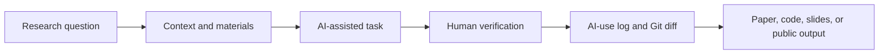
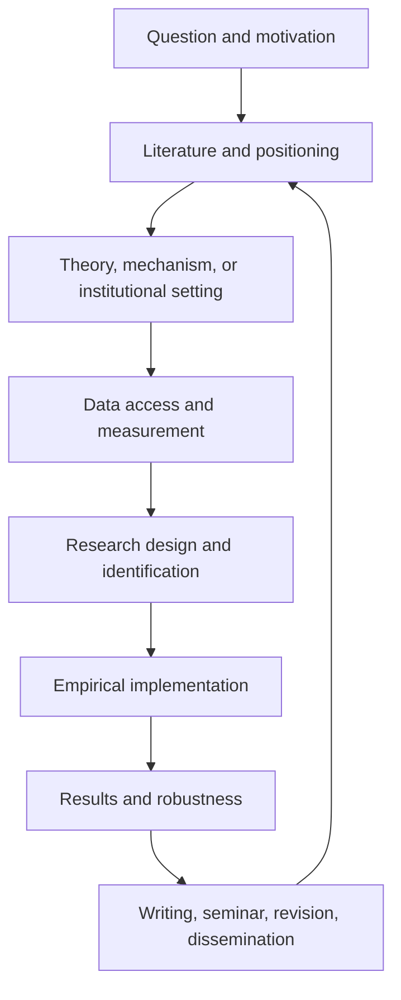

# Start Here: A Practical Handbook for AI in Economics and Finance Research

This is the reading book for the repository. It is meant to be read in GitHub without jumping across dozens of short files.

The rest of the repo gives copy-ready skills, project setups, workflow templates, examples, and source notes. This page explains the logic behind them.

> [!IMPORTANT]
> AI can make research labor cheaper. It does not make a research question important, an identification strategy credible, a citation real, a dataset safe to upload, or a paper worth writing.

> [!TIP]
> If you only have five minutes, read Sections 1, 3, 5, and 10. Then go to the copy-ready skills folder and use one skill on a small, non-confidential task.

## Table of Contents

- [Quick Start: Choose Your Situation](#quick-start-choose-your-situation)
- [1. What This Handbook Is For](#1-what-this-handbook-is-for)
- [2. The Basic Mental Model](#2-the-basic-mental-model)
- [3. The Maturity Ladder](#3-the-maturity-ladder)
- [4. What AI Is Good At](#4-what-ai-is-good-at)
- [5. What AI Should Not Do For You](#5-what-ai-should-not-do-for-you)
- [6. Core Concepts](#6-core-concepts)
- [7. The Econ/Finance Research Workflow](#7-the-econfinance-research-workflow)
- [8. Responsible Use Rules](#8-responsible-use-rules)
- [9. Data Safety Rules](#9-data-safety-rules)
- [10. GitHub and Project Safety](#10-github-and-project-safety)
- [11. Skills, Projects, Agents, and MCPs](#11-skills-projects-agents-and-mcps)
- [12. Writing, Presenting, and Public Communication](#12-writing-presenting-and-public-communication)
- [13. Staying Updated Without Chasing Hype](#13-staying-updated-without-chasing-hype)
- [14. What To Use Next](#14-what-to-use-next)
- [15. Sources and Workflow Influences](#15-sources-and-workflow-influences)

## Quick Start: Choose Your Situation

| If you are thinking... | Start here | Then copy/use |
| --- | --- | --- |
| "I am new to AI and do not know what matters." | Read the maturity ladder and core concepts below. | [Tool choice and skill improvement](../02-Copy-and-Use-AI-Research-Instructions-and-Templates/09-tool-selection-updates-and-skill-improvement.md) |
| "I have a paper idea but I am not sure it is good." | Read Sections 2, 4, 5, and 7. | [Research Idea Stress Test](../02-Copy-and-Use-AI-Research-Instructions-and-Templates/01-ideas-brainstorming-proposal-and-literature-skills.md#skill-1-research-idea-stress-test) |
| "I need to write empirical methods." | Read Sections 7, 8, and 9. | [Economics methods skill](../02-Copy-and-Use-AI-Research-Instructions-and-Templates/03-empirical-methods-skills-for-economics-research.md) or [finance methods skill](../02-Copy-and-Use-AI-Research-Instructions-and-Templates/04-empirical-methods-skills-for-finance-research.md) |
| "I want AI to edit code or files." | Read Sections 10 and 11 first. | [Clean project and set up Git](../03-Set-Up-Agents-and-Automated-Research-Workflows/01-clean-existing-research-project-and-set-up-git.md) |
| "I want to use agents." | Read Sections 10, 11, and 13 first. | [One paper, one repo, one AI project](../03-Set-Up-Agents-and-Automated-Research-Workflows/02-one-paper-one-repo-one-ai-project.md) |
| "I need slides or a talk." | Read Section 12. | [Presentation, slides, website, and talk-practice skills](../02-Copy-and-Use-AI-Research-Instructions-and-Templates/06-presentations-slides-websites-and-talk-practice-skills.md) |

## Minimum Safe Setup

You do not need an elaborate system to start. You need a small system that prevents obvious mistakes.

| Component | Minimum version | Why it matters |
| --- | --- | --- |
| AI account | ChatGPT, Claude, or institution-approved tool | basic reading, writing, coding help |
| Version control | GitHub repo, even private | recover files and inspect AI edits |
| Research folder | `data/`, `code/`, `output/`, `paper/`, `slides/` | prevents raw data, code, and drafts from mixing |
| Citation manager | Zotero, BibTeX, or equivalent | prevents fake citation dependence |
| AI-use log | one markdown file | records what AI changed and what you checked |
| Data rule | one paragraph in `DATA.md` | prevents unsafe upload decisions |

Copy this rule into your first project:

```text
Before AI edits files, writes methods text, summarizes literature, or generates slides, it must state:
1. what inputs it used;
2. what it changed or produced;
3. what it is uncertain about;
4. what I must verify manually;
5. whether any private, licensed, or restricted material is involved.
```

## 1. What This Handbook Is For

This handbook is for economics and finance scholars who want to use AI in serious research work:

- PhD students and research assistants
- junior faculty
- empirical economists
- finance researchers
- policy researchers
- instructors teaching AI research workflows
- research teams that need shared rules

It is not a prompt collection. It is not a ranking of tools. It is a field-specific guide to building reliable AI-assisted research systems.

The practical goal is:

> One paper, one research repo, one AI project workspace, one AI-use log, one verification habit.

The deeper goal is to make scholars better at research, not merely faster at producing research-looking artifacts.

## 2. The Basic Mental Model

Think of AI as a research assistant that can help with labor-intensive parts of the workflow but must be managed by a scholar.



The key is not "ask better prompts." The key is controlled workflow design:

| Workflow element | Question to answer |
| --- | --- |
| Purpose | What research task is AI helping with? |
| Inputs | What files, notes, data, and constraints are safe and necessary? |
| Rules | What must AI not invent, change, or decide? |
| Output | What artifact should AI produce? |
| Verification | What must the scholar check manually? |
| Trace | What changed, what was accepted, and what remains uncertain? |

Use this test before using AI:

```text
Can I define the input, expected output, and verification check?

If yes, AI may help.
If no, the task is probably too vague, too risky, or too judgment-heavy.
```

## 3. The Maturity Ladder

Use this ladder to locate your current practice.

| Level | Name | What it looks like | Main risk |
| --- | --- | --- | --- |
| 0 | No AI | Traditional research workflow | slower execution |
| 1 | Casual chat | Ask ChatGPT/Claude occasional questions | plausible wrong answers |
| 2 | Structured chat | Give context, ask for uncertainty, verify | still hard to reproduce |
| 3 | AI project | One ChatGPT/Claude Project per paper or task | bad project instructions |
| 4 | GitHub-assisted workflow | AI edits code/text inside version control | unwanted file changes |
| 5 | Skills-based workflow | repeated tasks become reusable skills | weak or unsafe skills |
| 6 | Agentic workflow | AI plans, edits, runs code, checks outputs | permissions and overautomation |
| 7 | Research operating system | AI + GitHub + logs + data rules + source tracking | governance burden |

Do not jump to agents before you can verify outputs, use Git, and define data rules.

Practical interpretation:

- Levels 1-2 are fine for learning and brainstorming.
- Level 3 is the right default for a paper, literature review, or seminar.
- Level 4 is the minimum for code, data, or file edits.
- Levels 5-7 are for repeated work where verification is stronger than automation.

## 4. What AI Is Good At

AI is useful when the task is structured, checkable, and not confidential.

| Research task | Good use |
| --- | --- |
| Literature work | compare arguments, extract models/data/designs, identify claims to verify |
| Empirical coding | explain code, draft functions, debug errors, translate between Stata/R/Python |
| Methods writing | turn a verified design into clear prose with assumptions and limitations |
| Theory support | explain intuition, check proof flow, identify missing cases |
| Research management | create checklists, logs, repo structures, issue lists |
| Writing | improve clarity, structure, transitions, and exposition |
| Presenting | make talk outlines, speaker notes, Q&A drills, slide plans |
| Teaching | create examples, quizzes, explanations, and workshop exercises |

## 5. What AI Should Not Do For You

AI can assist, but it should not be treated as the author of scholarly judgment.

Do not let AI independently decide:

- the final research question
- identification strategy
- causal interpretation
- literature contribution
- robustness claims
- policy or investment implications
- referee judgment
- confidential review handling
- whether restricted data may be uploaded
- final submission readiness

The short rule:

> AI can automate labor, not responsibility.

## 6. Core Concepts

| Concept | Practical meaning for researchers |
| --- | --- |
| LLM | A model that generates text/code from patterns; not a database |
| Hallucination | plausible but false or unsupported output |
| Context window | the material the model can use in a task |
| RAG | retrieval-augmented generation; outputs grounded in selected sources |
| Prompt | a one-time instruction |
| Project | persistent AI workspace for a paper, dataset, class, or role |
| Skill | reusable procedure for a repeated task |
| Agent | AI system that can plan, use tools, edit files, and run steps |
| MCP | connector standard that lets AI tools access external systems |
| AGENTS.md / CLAUDE.md | repo-level instructions for AI agents |
| AI-use log | record of task, tool, files touched, accepted output, checks, and uncertainty |

## 7. The Econ/Finance Research Workflow

The useful question is not "Can AI write a paper?" It is "Where in the research pipeline can AI reduce labor while preserving judgment?"



AI is strongest in the middle execution layers: coding, organizing, summarizing, translating formats, drafting explanations, and checking consistency.

AI is weakest where taste and credibility matter most: problem choice, research design, interpretation, contribution, and final judgment.

This is especially important in finance. If AI makes it easy to generate endless factor stories, the scarce skill becomes stronger discipline: theory, data quality, out-of-sample discipline, transaction costs, identification, and honesty about multiple testing.

### The "Paper Machine, So What?" Test

When AI makes an output cheap, ask what human research quality remains.

| AI can make this faster | The scholar must still supply |
| --- | --- |
| paper outline | important question and contribution |
| data cleaning code | measurement judgment and data provenance |
| econometric implementation | credible design and interpretation |
| robustness tables | discipline against specification searching |
| literature prose | verified positioning and real novelty |
| seminar slides | clear argument and honest limitations |

If the human contribution is only "I asked the AI to generate it," the project is not ready.

## 8. Responsible Use Rules

Use this checklist before involving AI in real research.

| Question | If no, stop |
| --- | --- |
| Do I know whether the material is public, private, licensed, or restricted? | Check data and confidentiality rules |
| Can I verify every factual claim? | Do not use output as evidence |
| Can I verify every citation? | Do not trust generated references |
| Can I reproduce any code or table changes? | Use Git and run code |
| Have coauthors agreed on AI use for shared drafts? | Ask before uploading |
| Does the journal, conference, funder, or university require disclosure? | Check policy |

High-risk materials include referee reports, unpublished manuscripts, coauthor drafts, restricted administrative microdata, student records, proprietary firm data, transaction-level data, and licensed database extracts.

## 9. Data Safety Rules

| Material | Default rule |
| --- | --- |
| Public macro data | usually okay, still cite source |
| Public paper PDFs | check copyright and do not treat summaries as facts |
| WRDS, CRSP, Compustat, Bloomberg, Refinitiv extracts | check license before uploading anywhere |
| Bank, transaction, household, firm, or administrative microdata | do not upload to public AI tools |
| Proprietary company data | do not upload without explicit permission |
| Coauthor drafts | get consent |
| Referee reports or manuscripts | use AI only if policy allows |
| Student data | avoid public AI tools |

Safer alternatives:

- summarize metadata instead of uploading raw data
- use synthetic examples
- use local or institution-approved tools
- share variable dictionaries instead of records
- ask AI to write code on a toy example, then run locally

## 10. GitHub and Project Safety

If AI can edit files, use Git.

The three common mistakes are:

1. Not using Git.
2. Underusing reusable skills.
3. Letting AI execute without a plan.

Minimum research repo structure:

```text
project-name/
  README.md
  AGENTS.md
  DATA.md
  AI-USE-LOG.md
  data/
    raw/          # never edit directly
    derived/
  code/
  output/
    tables/
    figures/
  paper/
  slides/
```

Minimum `.gitignore`:

```gitignore
data/raw/
data/restricted/
*.dta
*.sas7bdat
*.rds
*.parquet
*.csv
*.xlsx
*.zip
*.log
.env
__pycache__/
```

For serious restructuring, use a branch or worktree. Before accepting AI changes, inspect the diff, run the relevant code, and record what changed.

## 11. Skills, Projects, Agents, and MCPs

Use the right tool concept for the job.

| Need | Use |
| --- | --- |
| one-time answer | prompt |
| ongoing paper or task | ChatGPT/Claude Project |
| repeated procedure | skill |
| file-editing and code-running workflow | coding agent |
| connection to external systems | MCP |
| repo-level rules | AGENTS.md or CLAUDE.md |

A good research skill is not a long prompt. It has:

- purpose
- when to use
- when not to use
- required inputs
- step-by-step procedure
- output contract
- failure modes
- verification checklist

Good skills are useful because they turn repeated scholarly judgment into a repeatable procedure. Weak skills are just long prompts with no verification.

| Asset | Good for | Bad use |
| --- | --- | --- |
| Prompt | one quick task | repeated project workflow |
| Project instructions | stable context for a paper or role | one-off factual search |
| Skill | repeated procedure with inputs and checks | vague "write my paper" commands |
| Agent workflow | multi-step file/code work | confidential or unverified tasks |
| MCP connector | connecting tools and data sources | broad permissions without rules |

For any new skill, require:

```text
Inputs:
Steps:
Output:
Failure modes:
Verification:
What not to do:
Sources or workflow influences:
```

## 12. Writing, Presenting, and Public Communication

AI can help make research clearer, but it can also flatten scholarly voice and overstate claims.

Use AI for:

- outlining an introduction
- diagnosing missing motivation
- identifying where a reader gets lost
- converting tables into slide-friendly explanations
- generating Q&A practice questions
- drafting response-letter structure
- creating HTML or Beamer slide scaffolds

Do not use AI to:

- invent a contribution
- make causal claims stronger
- fabricate citations
- explain coefficients you have not checked
- turn a limited result into a general policy claim
- produce public investment advice from a research result

For talks, the goal is not "make pretty slides." The goal is to turn a paper into a clear argument for a specific audience.

Two useful presentation formats:

| Format | Use when | Guardrail |
| --- | --- | --- |
| Interactive HTML slides | you want web sharing, teaching interaction, animated mechanisms, or public explainers | interactivity must clarify the research, not decorate it |
| LaTeX/Beamer slides | you need standard seminar/conference slides, equations, institutional style, or easy PDF export | do not let slide compression remove assumptions and limitations |

Every research talk should answer:

1. What is the question?
2. Why should this audience care?
3. What is the setting or model?
4. What is the identifying variation, mechanism, or theoretical argument?
5. What is the main result?
6. What are the limits?
7. What should the audience remember after one week?

## 13. Staying Updated Without Chasing Hype

Do not follow AI news randomly. Build an information diet.

| Source type | Use it for | Risk |
| --- | --- | --- |
| official docs | actual tool behavior | may not teach research workflows |
| economists using AI | field relevance | anecdotal evidence |
| builders | practical workflow patterns | tool bias |
| GitHub repos | reusable implementation | may be unmaintained |
| newsletters and social media | discovery | hype and noise |

Follow builders and official docs because they show workflows, artifacts, failures, and updates. Do not organize your research life around viral tool rankings.

Use a weekly update rule:

```text
Adopt at most one new AI workflow per week.
Ignore tool claims that are not tied to a concrete task, date, cost, safety rule, and verification check.
```

## 14. What To Use Next

After reading this page:

- Use direct skills and templates: [Copy and Use AI Research Instructions and Templates](../02-Copy-and-Use-AI-Research-Instructions-and-Templates/README.md)
- Set up agents and automated workflows: [Set Up Agents and Automated Research Workflows](../03-Set-Up-Agents-and-Automated-Research-Workflows/README.md)
- Study examples and failure cases: [See Examples Diagrams and Failure Cases](../04-See-Examples-Diagrams-and-Failure-Cases/README.md)
- Check sources and official docs: [Check Builders Official Docs and Resources](../05-Check-Builders-Official-Docs-and-Resources/README.md)
- Teach or present the material: [Teach Workshops Practice Talks and Share Slides](../06-Teach-Workshops-Practice-Talks-and-Share-Slides/README.md)

## 15. Sources and Workflow Influences

This handbook draws on public materials and adapts only the workflow ideas relevant to economics and finance research.

Key influences include:

- Paul Goldsmith-Pinkham's applied empirical methods course and AI posts, especially the emphasis on practical implementation, research pipeline thinking, replication packages, AI-assisted writing, VS Code/Git workflows, and LLM-friendly paper bundles.
- Zara Zhang's AI learning library and follow-builders work, especially curated learning paths and the principle of learning from people who build workflows rather than people who repeat news.
- PaperSpine and Nature-oriented skill repositories, especially the idea that useful academic skills should produce artifacts, maintain audit trails, learn from strong examples, and separate research, citation, writing, LaTeX, and audit stages.
- Official OpenAI, Anthropic, MCP, Git, and GitHub documentation for skills, agent instructions, connectors, `.gitignore`, worktrees, and repository-level AI instructions.
- Economist-facing work on AI agents and generative AI for economic research.

Selected links:

- [Paul Goldsmith-Pinkham, Applied Empirical Methods PhD course](https://github.com/paulgp/applied-methods-phd)
- [Paul Goldsmith-Pinkham, Using AI in Research and Teaching](https://paulgp.com/2024/06/24/llm_talk.html)
- [Paul Goldsmith-Pinkham, Research in the Time of AI](https://paulgp.com/2026/03/16/research-in-time-of-ai.html)
- [Paul Goldsmith-Pinkham, LLM-Friendly Academic Papers](https://paulgp.com/2026/03/10/llms-txt-for-academic-papers.html)
- [Paul Goldsmith-Pinkham, AI writing and Claude Code roundup](https://paulgp.com/2026/04/27/ai-writing-roundup.html)
- [Zara Zhang, AI learning library](https://zara.faces.site/ai)
- [Zara Zhang, Follow Builders](https://github.com/zarazhangrui/follow-builders)
- [PaperSpine](https://github.com/WUBING2023/PaperSpine)
- [Nature Skills](https://github.com/Yuan1z0825/nature-skills)
- [OpenAI Codex Skills](https://developers.openai.com/codex/skills)
- [OpenAI AGENTS.md guide](https://developers.openai.com/codex/guides/agents-md)
- [Claude Skills](https://docs.claude.com/en/docs/claude-code/skills)
- [Model Context Protocol](https://modelcontextprotocol.io/docs/getting-started/intro)
- [GitHub Docs: ignoring files](https://docs.github.com/en/get-started/git-basics/ignoring-files)
- [Git worktree documentation](https://git-scm.com/docs/git-worktree)

Last checked: 2026-05-24
