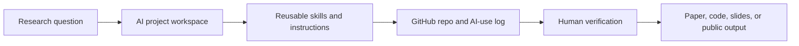

# Start Here: Learn AI for Economics and Finance Research

This folder is the handbook. Read it like a short book, not like software documentation.

It is designed to help you move from "I tried ChatGPT" to "I can build a safe, repeatable, verifiable AI-assisted research workflow."

> [!IMPORTANT]
> AI can make research tasks faster. It does not make claims true, citations real, identification credible, or confidential data safe.

## What You Will Learn

By the end of this handbook, you should be able to:

- decide when AI is useful and when it is unsafe
- build one AI workspace for one paper or project
- verify AI outputs against sources, data, code, and theory
- use GitHub to recover files and track AI-assisted edits
- turn repeated research tasks into reusable skills or instructions
- use AI for literature, empirical coding, theory, writing, slides, and revision without outsourcing judgment

## Read This First

| If you have... | Start with |
| --- | --- |
| 10 minutes | [How To Read This Handbook](00-how-to-read-this-handbook.md) |
| 30 minutes | [Minimum Setup for Scholars](what-scholars-must-know/00-minimum-setup-for-scholars.md) |
| 1 hour | [AI Research Workflow Maturity Ladder](what-scholars-must-know/05-ai-research-workflow-maturity-ladder.md) |
| A paper project | [Research Taste in the AI Age](econ-finance-research-workflow/00-research-taste-in-the-ai-age.md) |
| Sensitive data | [Data Sensitivity Matrix](responsible-use-and-risks/07-data-sensitivity-matrix.md) |
| A presentation | [AI for Research Presentations](writing-reviewing-presenting/09-ai-for-research-presentations.md) |

## Reader Promise

Every useful page should help you answer four questions:

| Question | Why it matters |
| --- | --- |
| What can I do with this today? | The handbook should lead to action, not vague awareness |
| What inputs do I need? | AI workflows fail when context is missing or unsafe |
| What can go wrong? | Polished AI output can hide citation, data, code, and logic errors |
| What must I verify? | The scholar remains responsible for claims, evidence, and disclosure |

## Book Map

| Part | Read when you want to... | Start here |
| --- | --- | --- |
| Part I. Foundations | understand what AI is, what it is not, and why it fails | [What Scholars Must Know](what-scholars-must-know/00-overview.md) |
| Part II. Responsibility | avoid privacy, citation, authorship, and disclosure mistakes | [Responsible Use and Risks](responsible-use-and-risks/00-overview.md) |
| Part III. Skill Management | decide what AI skills are worth learning and what advice to ignore | [AI Skills Management](ai-skills-management/00-overview.md) |
| Part IV. Tool Concepts | understand prompts, projects, skills, agents, MCPs, GitHub, and tool claims | [Tools and Features](tools-and-features/00-overview.md) |
| Part V. Research Skills | use AI for reading, critique, coding, theory, and verification | [Core AI Skills](core-ai-skills-for-research/00-overview.md) |
| Part VI. Research Workflow | apply AI across the economics and finance research lifecycle | [Econ Finance Research Workflow](econ-finance-research-workflow/00-overview.md) |
| Part VII. Empirical Work | use AI safely around code, data, tables, and reproducibility | [Empirical Research and Coding](empirical-research-and-coding/00-overview.md) |
| Part VIII. Communication | write, review, present, and share research without overclaiming | [Writing Reviewing Presenting](writing-reviewing-presenting/00-overview.md) |
| Part IX. Automation | move toward repeatable workflows, RAG, local models, and agents | [Advanced Automation](advanced-automation/00-overview.md) |

## Three Rules To Keep Open While Reading

> [!WARNING]
> Do not let AI invent citations, literature gaps, empirical results, robustness checks, or theoretical derivations.

> [!TIP]
> If a research task repeats more than twice, turn it into a project instruction, checklist, or skill.

> [!NOTE]
> If AI can edit files, use Git. If AI can touch data, define data rules. If AI can affect a paper, keep an AI-use log.

## Learning Checkpoints

Before moving from this handbook to direct-use templates, you should be able to explain:

- why an LLM is not a database
- why web search, reasoning, coding, and writing are different tasks
- why "upload the paper and summarize it" is weaker than a controlled literature workflow
- why restricted data, coauthor drafts, and referee reports need explicit rules
- why serious AI-assisted research should leave a trail: project instructions, Git commits, and AI-use logs

If any item feels unclear, start with the concept index and the responsible-use section before using the templates.

## Quick Concept Map

## Key Concepts

- [Concept Index and Glossary](00-concept-index-and-glossary.md)
- [Knowledge Links for Further Reading](00-knowledge-links.md)
- [Prompts, Projects, Skills, Agents, MCPs, and GitHub Repos](tools-and-features/01-prompts-projects-skills-agents-mcps.md)
- [Tool Claims Must Be Dated](tools-and-features/00-tool-claims-must-be-dated.md)

## Copy-And-Use Next

After reading, go to:

- [Copy and Use AI Research Instructions and Templates](../02-Copy-and-Use-AI-Research-Instructions-and-Templates/README.md)
- [How to Set Up Your AI Research Workflow](../03-How-to-Set-Up-Your-AI-Research-Workflow/README.md)
- [See Examples Diagrams and Failure Cases](../04-See-Examples-Diagrams-and-Failure-Cases/README.md)

## Sources and Workflow Influences

Draws on public work by economists, finance scholars, AI workflow builders, and official documentation for Codex skills, Claude skills, MCP, AGENTS.md, GitHub, Git, and AI agents for economic research. See [Check Builders Official Docs and Resources](../05-Check-Builders-Official-Docs-and-Resources/README.md).

Last checked: 2026-05-24
