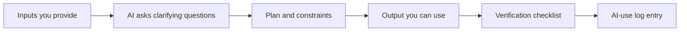
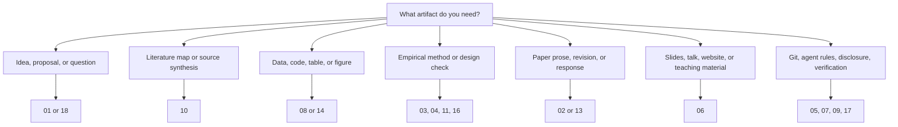
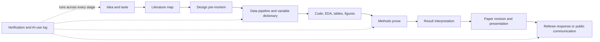

> Copyright (c) 2026 SuperJayLiu (Chaojie Liu). Licensed under the repository MIT License. These instructions/workflows are original to this repository unless otherwise noted. External inspirations are cited in relevant files.

# Copy and Use AI Research Instructions and Templates

This folder is for direct use. Open a file, copy the block you need, paste it into ChatGPT, Claude, Codex, Claude Code, Cursor, GitHub Copilot, or another AI tool, and adapt the bracketed fields.

This is not the reading book. For concepts and risks, start with [the handbook](../01-Start-Here-to-Learn-AI-for-Econ-Finance-Research/README.md).

> [!TIP]
> Start with one narrow task. Copy one block. Add your project facts. Ask for a plan. Then verify.

> [!IMPORTANT]
> Beginners should not try to use every skill. Pick the page that matches the research object in front of you: idea, literature, data, code, methods, paper text, slides, verification, or revision.

Questions or suggestions for this part: email [jay.liu@bristol.ac.uk](mailto:jay.liu@bristol.ac.uk) with subject `[AI Econ Finance Skills] Suggest a skill or prompt`.

## Start With A Task Card

Use these as the fastest entry points. Each card points to one copy-ready block and one verification habit.

| I want to... | Copy first | Then verify by... |
| --- | --- | --- |
| test whether a research idea is worth pursuing | [Research Idea Stress Test](01-ideas-brainstorming-proposal-and-literature-skills.md#skill-1-research-idea-stress-test) | naming the closest papers, data obstacle, and identification/model obstacle |
| build a literature review without fake citations | [Source-Grounded Literature Review Builder](10-literature-review-and-source-synthesis-skills.md#skill-1-source-grounded-literature-review-builder) | checking every claim against supplied sources or verified search results |
| write or revise an introduction | [Introduction Spine Builder](02-paper-drafting-revision-and-citation-skills.md#skill-1-introduction-spine-builder) | confirming the question, contribution, data/design, and strongest result are accurate |
| draft empirical methods for applied economics | [Draft Empirical Methods Section for Economics](03-empirical-methods-skills-for-economics-research.md#skill-1-draft-empirical-methods-section-for-economics) | comparing prose with code, sample, timing, estimand, and inference |
| draft empirical methods for finance | [Draft Empirical Methods Section for Finance](04-empirical-methods-skills-for-finance-research.md#skill-1-draft-empirical-methods-section-for-finance) | checking timing, link tables, survivorship, delisting, event windows, and factor-mining risk |
| debug code in Python, R, or Stata | [Coding, Data Analysis, and Debugging Skills](08-coding-data-analysis-and-debugging-skills.md) | running a toy-data test before trusting real-data output |
| use agents on files safely | [AGENTS.md for Research Repo](05-git-data-replication-and-research-safety-templates.md#template-3-agentsmd-for-research-repo) | inspecting `git diff`, running checks, and logging AI use |
| prepare slides or practice a seminar | [Paper-to-Talk Converter](06-presentations-slides-websites-and-talk-practice-skills.md#skill-5-paper-to-talk-converter) | matching every slide claim to the paper, table, figure, or model |
| decide whether an AI answer can be accepted | [Verification Method Selector](17-verification-reproducibility-and-disclosure-skills.md#skill-1-verification-method-selector) | choosing source, code, data, math, policy, or disclosure checks |
| find more tools/resources for one task | [Find More Resources For One Econ/Finance Research Task](09-tool-selection-updates-and-skill-improvement.md#skill-6-find-more-resources-for-one-econfinance-research-task) | rejecting generic hype and testing at most three resources first |

## Default Clarification Rule

Paste this before any skill when the task is serious, the inputs are incomplete, or the audience may not know technical terms:

```text
Before producing the final answer, check whether any required input, term, data rule, method detail, institutional detail, policy constraint, or output format is unclear.

If something is unclear, ask up to five numbered clarifying questions first. If you can proceed with reasonable assumptions, state those assumptions clearly and ask me to confirm or correct them.

When you use technical terms, define them in plain language and give one economics or finance research example.

At the end, include a short section called "Questions for you" listing anything I should decide, check, or clarify next.
```

Use this rule especially for Git, `.gitignore`, branches, worktrees, MCPs, agent permissions, data licenses, identification assumptions, variable construction, and disclosure policies.

## What Is Here

### How A Copy-Ready Skill Should Work

Every usable skill should move through the same visible chain.



| Part | What the reader should see | Bad sign |
| --- | --- | --- |
| inputs | exactly what to paste or attach | "give me everything" |
| clarifying questions | what the AI should ask before acting | AI guesses missing data rules |
| plan | files, assumptions, steps, risks | AI jumps straight to final prose/code |
| output | draft text, code, table, checklist, or slide plan | vague advice only |
| verification | concrete source/code/data/math/policy check | "verify manually" with no method |
| log | what to record after using the output | no trace of AI involvement |

### Skill Selection Map

Use the artifact you need, not the tool name, to choose a skill.



### Search By Function

If you are using GitHub search, search these words inside this folder. If you are reading manually, use the links.

| Function / keyword | First place to look | Typical output |
| --- | --- | --- |
| `write`, `revise`, `introduction`, `abstract` | [Paper Drafting, Revision, and Citation Skills](02-paper-drafting-revision-and-citation-skills.md) | section draft, revision plan, citation-safe prose |
| `review`, `referee`, `response`, `R&R` | [Referee Reports and Peer Review Skills](13-referee-reports-and-peer-review-skills.md) | self-review, referee report, response table |
| `literature`, `matrix`, `source`, `citation` | [Literature Review and Source Synthesis Skills](10-literature-review-and-source-synthesis-skills.md) | paper matrix, synthesis outline, claim-source bank |
| `idea`, `proposal`, `brainstorm`, `research question` | [Ideas, Brainstorming, Proposal, and Literature Skills](01-ideas-brainstorming-proposal-and-literature-skills.md) | idea stress test, proposal frame, question refinement |
| `economics methods`, `identification`, `design` | [Empirical Methods Skills for Economics Research](03-empirical-methods-skills-for-economics-research.md) | methods section, design audit, pre-mortem |
| `finance methods`, `asset pricing`, `corporate finance`, `banking` | [Empirical Methods Skills for Finance Research](04-empirical-methods-skills-for-finance-research.md) | finance methods draft, return/window/survivorship checks |
| `Python`, `R`, `Stata`, `debug`, `code review` | [Coding, Data Analysis, and Debugging Skills](08-coding-data-analysis-and-debugging-skills.md) | language-specific code plan, diagnosis, toy test |
| `WRDS`, `CRSP`, `Compustat`, `merge`, `table`, `figure` | [Data Cleaning, Merging, Analysis, and Output Skills](14-data-cleaning-merging-analysis-and-output-skills.md) | pipeline, merge plan, output audit |
| `DiD`, `IV`, `RD`, `panel`, `time series` | [Causal Inference, Econometrics, and Time-Series Skills](11-causal-inference-econometrics-and-time-series-skills.md) | method diagnostic, estimator checklist |
| `text-as-data`, `LLM measurement`, `filings` | [Text-as-Data and LLM Measurement Skills](15-text-as-data-and-llm-measurement-skills.md) | labeling protocol, validation plan |
| `Git`, `DATA.md`, `AGENTS.md`, `AI-use log` | [Git, Data, Replication, and Research Safety Templates](05-git-data-replication-and-research-safety-templates.md) | project safety files and logging templates |
| `slides`, `Beamer`, `HTML`, `website`, `practice talk` | [Presentations, Slides, Websites, and Talk Practice Skills](06-presentations-slides-websites-and-talk-practice-skills.md) | slide workflow, talk drill, website prompt |
| `find resources`, `resource scout`, `follow builders`, `tool updates` | [Tool Selection, Updates, and Skill Improvement](09-tool-selection-updates-and-skill-improvement.md) | dated comparison, update filter, resource shortlist |

### Search By Software

| Software or tool | Use first | What to ask AI to produce |
| --- | --- | --- |
| Stata | [Stata Research Workflow Assistant](08-coding-data-analysis-and-debugging-skills.md#skill-9-stata-research-workflow-assistant) | do-file plan, merge/check diagnostics, table command review |
| R | [R Econometrics Workflow Assistant](08-coding-data-analysis-and-debugging-skills.md#skill-8-r-econometrics-workflow-assistant) | `fixest`/`did`/`rdrobust`/`tidyverse` plan with tests |
| Python | [Python Empirical Analysis Assistant](08-coding-data-analysis-and-debugging-skills.md#skill-7-python-empirical-analysis-assistant) | pandas/statsmodels/linearmodels plan with toy-data tests |
| LaTeX/Beamer | [Presentations, Slides, Websites, and Talk Practice Skills](06-presentations-slides-websites-and-talk-practice-skills.md) | paper section, Beamer deck, table/figure formatting |
| Codex/Claude Code/Cursor | [Project Instructions and Agent Role Templates](07-project-instructions-and-agent-role-templates.md) | project instructions, agent role, approval gates |

| File | Use it when you need... |
| --- | --- |
| [01 Research Ideas, Brainstorming, and Proposal Skills](01-ideas-brainstorming-proposal-and-literature-skills.md) | quick idea stress tests, proposal framing, LLM-friendly paper orientation |
| [02 Paper Drafting, Revision, and Citation Skills](02-paper-drafting-revision-and-citation-skills.md) | introduction, paper drafting, revision, citation support, referee response |
| [03 Empirical Methods Skills for Economics Research](03-empirical-methods-skills-for-economics-research.md) | drafting or checking empirical methods in applied economics |
| [04 Empirical Methods Skills for Finance Research](04-empirical-methods-skills-for-finance-research.md) | drafting or checking empirical methods in asset pricing, corporate finance, banking, household finance |
| [05 Git, Data, Replication, and Research Safety Templates](05-git-data-replication-and-research-safety-templates.md) | project cleanup, `.gitignore`, AGENTS.md, DATA.md, AI-use log, replication checks |
| [06 Presentations, Slides, Websites, and Talk Practice Skills](06-presentations-slides-websites-and-talk-practice-skills.md) | HTML slides, Beamer slides, presentation practice, personal academic websites |
| [07 Project Instructions and Agent Role Templates](07-project-instructions-and-agent-role-templates.md) | ChatGPT/Claude Projects, tough referee, paper summarizer, idea verifier, conference tracker |
| [08 Coding, Data Analysis, and Debugging Skills](08-coding-data-analysis-and-debugging-skills.md) | Stata/R/Python debugging, code review, table/figure checks, reproducibility |
| [09 Tool Selection, Updates, and Skill Improvement](09-tool-selection-updates-and-skill-improvement.md) | dated tool comparison, update digest, resource scouting, continuous improvement, bad-advice filter |
| [10 Literature Review and Source Synthesis Skills](10-literature-review-and-source-synthesis-skills.md) | source-grounded literature review, paper matrices, research gaps, citation-safe synthesis |
| [11 Causal Inference, Econometrics, and Time-Series Skills](11-causal-inference-econometrics-and-time-series-skills.md) | OLS, panel FE, DiD, IV, RD, event studies, synthetic control, AR/MA/ARMA/VAR checks |
| [12 Theory Model and Math Skills](12-theory-model-and-math-skills.md) | theory-model reconstruction, assumption audit, proof gaps, economic interpretation |
| [13 Referee Reports and Peer Review Skills](13-referee-reports-and-peer-review-skills.md) | referee reports, journal response planning, revision triage, GitHub-style feedback handling |
| [14 Data Cleaning, Merging, Analysis, and Output Skills](14-data-cleaning-merging-analysis-and-output-skills.md) | data pipelines, WRDS/CRSP/Compustat merges, Fama-MacBeth, portfolio sorts, EDA, tables, figures |
| [15 Text-as-Data and LLM Measurement Skills](15-text-as-data-and-llm-measurement-skills.md) | filings, earnings calls, speeches, news, LLM-generated variables, validation, prompt sensitivity |
| [16 Structural, Quantitative, and Welfare Skills](16-structural-quantitative-and-welfare-skills.md) | GMM, SMM, MLE, calibration, counterfactuals, welfare, model fit |
| [17 Verification, Reproducibility, and Disclosure Skills](17-verification-reproducibility-and-disclosure-skills.md) | citation checks, toy-data tests, coefficient checks, proof checks, AI-use disclosure |
| [18 Research Question, Taste, and Positioning Skills](18-research-question-taste-and-positioning-skills.md) | topic-to-question sharpening, mechanisms, closest-paper positioning, so-what test, AI cost-benefit |

## Why These Skill Families Exist

| Skill family | Why a new scholar needs it |
| --- | --- |
| idea and taste | AI can make weak ideas sound polished; this helps you test whether the question is worth pursuing. |
| literature review | AI can hallucinate citations; this forces source-grounded maps and contribution checks. |
| empirical methods | AI can draft clean prose that misstates identification; this keeps design, data, and inference explicit. |
| data and coding execution | AI saves time here, but only if merges, timing, variables, and outputs are testable. |
| text-as-data | LLM labels are measurements, not magic; they need validation, versioning, and sensitivity checks. |
| theory and structural work | AI can explain and code models, but assumptions, identification, equilibrium, and welfare need scrutiny. |
| writing and slides | AI can improve clarity, but it can also overclaim or flatten the paper's voice. |
| agents and project rules | file-editing AI needs boundaries: what to touch, what not to touch, what to verify. |
| verification and disclosure | "Check it" is too vague; this gives concrete checks and AI-use records. |

## Why Some Topics Have Separate Files

Most topics should stay in one README-style file. Separate files are useful only when readers will repeatedly search for that skill family:

| Separate file | Why it is separate |
| --- | --- |
| literature review | large enough to need source matrices, synthesis workflows, and fake-citation guardrails |
| causal inference/econometrics/time series | method-specific checks are easier to find in one place |
| data cleaning/merging/output | execution workflows need code, toy tests, and data lineage in one place |
| text-as-data/LLM measurement | AI-generated variables create distinct validation and reproducibility issues |
| structural/quantitative/welfare | estimation, simulation, counterfactuals, and welfare use different checks from reduced-form methods |
| theory and math | proof, equilibrium, and model-audit workflows require different guardrails |
| verification/reproducibility/disclosure | every other skill depends on concrete verification methods |
| referee/review | reviewer comments, journal responses, and PR-style feedback need a different workflow |

## Research Pipeline: Which Skill Feeds Which

Use this when you are not sure where to begin.



| Stage | First skill to copy |
| --- | --- |
| idea | [Topic-to-Tension Research Question Builder](18-research-question-taste-and-positioning-skills.md#skill-1-topic-to-tension-research-question-builder) |
| literature | [Source-Grounded Literature Review Builder](10-literature-review-and-source-synthesis-skills.md#skill-1-source-grounded-literature-review-builder) |
| design | [Identification Design Pre-Mortem](03-empirical-methods-skills-for-economics-research.md#skill-4-identification-design-pre-mortem) |
| data execution | [Reproducible Research Data Pipeline Builder](14-data-cleaning-merging-analysis-and-output-skills.md#skill-1-reproducible-research-data-pipeline-builder) |
| code | [Debug Stata/R/Python Research Code](08-coding-data-analysis-and-debugging-skills.md#skill-1-debug-statarpython-research-code) |
| methods | [Economics Methods](03-empirical-methods-skills-for-economics-research.md#skill-1-draft-empirical-methods-section-for-economics) or [Finance Methods](04-empirical-methods-skills-for-finance-research.md#skill-1-draft-empirical-methods-section-for-finance) |
| verification | [Verification Method Selector](17-verification-reproducibility-and-disclosure-skills.md#skill-1-verification-method-selector) |
| presentation | [Paper-to-Talk Converter](06-presentations-slides-websites-and-talk-practice-skills.md#skill-5-paper-to-talk-converter) |

## Most-Used Blocks

| Task | Copy this first |
| --- | --- |
| early idea | [Research Idea Stress Test](01-ideas-brainstorming-proposal-and-literature-skills.md#skill-1-research-idea-stress-test) |
| proposal | [Proposal Builder](01-ideas-brainstorming-proposal-and-literature-skills.md#skill-2-proposal-builder-for-econfinance) |
| literature review | [Source-Grounded Literature Review Builder](10-literature-review-and-source-synthesis-skills.md#skill-1-source-grounded-literature-review-builder) |
| intro | [Introduction Spine Builder](02-paper-drafting-revision-and-citation-skills.md#skill-1-introduction-spine-builder) |
| econ methods | [Draft Empirical Methods Section for Economics](03-empirical-methods-skills-for-economics-research.md#skill-1-draft-empirical-methods-section-for-economics) |
| finance methods | [Draft Empirical Methods Section for Finance](04-empirical-methods-skills-for-finance-research.md#skill-1-draft-empirical-methods-section-for-finance) |
| causal inference | [Causal Design Diagnostic](11-causal-inference-econometrics-and-time-series-skills.md#skill-1-causal-design-diagnostic) |
| data pipeline | [Reproducible Research Data Pipeline Builder](14-data-cleaning-merging-analysis-and-output-skills.md#skill-1-reproducible-research-data-pipeline-builder) |
| WRDS/CRSP/Compustat merge | [WRDS, CRSP, Compustat, and CCM Merge Plan](14-data-cleaning-merging-analysis-and-output-skills.md#skill-2-wrds-crsp-compustat-and-ccm-merge-plan) |
| text-as-data | [LLM-as-Measurement Protocol](15-text-as-data-and-llm-measurement-skills.md#skill-1-llm-as-measurement-protocol) |
| structural/quantitative model | [Moments-to-Parameters Audit](16-structural-quantitative-and-welfare-skills.md#skill-2-moments-to-parameters-audit) |
| verification/disclosure | [AI Reproducibility Packet and Disclosure Draft](17-verification-reproducibility-and-disclosure-skills.md#skill-6-ai-reproducibility-packet-and-disclosure-draft) |
| theory model | [Economic Model Discussant](12-theory-model-and-math-skills.md#skill-1-economic-model-discussant) |
| messy repo | [Clean Up Existing Project and Start Git Safely](05-git-data-replication-and-research-safety-templates.md#template-1-clean-up-existing-project-and-start-git-safely) |
| slides | [Interactive HTML Research Slides](06-presentations-slides-websites-and-talk-practice-skills.md#skill-1-interactive-html-research-slides) |
| coding | [Debug Stata/R/Python Research Code](08-coding-data-analysis-and-debugging-skills.md#skill-1-debug-statarpython-research-code) |
| referee response | [Journal Referee Response Planner](13-referee-reports-and-peer-review-skills.md#skill-2-journal-referee-response-planner) |

## How To Use These Blocks

1. Copy one block.
2. Replace bracketed fields like `[paper title]`, `[data source]`, or `[target journal]`.
3. Add your actual materials.
4. Ask the AI to clarify missing inputs before it writes, edits, or codes.
5. Ask for a plan before letting AI write, edit, or code.
6. Verify everything.
7. Save the accepted output and checks in your AI-use log.

## Universal Safety Instruction

Add this to any skill when working on serious research:

```text
Do not invent citations, data sources, coefficients, robustness checks, institutional details, mathematical derivations, or claims about the literature. If information is missing, say exactly what is missing and what I must verify manually. Separate verified facts, interpretation, suggestions, and uncertainty.

Follow all university, employer, journal, conference, funder, data-provider, and coauthor policies on AI use. If the relevant rule is stricter than this instruction, follow the stricter rule.

If any input, term, policy, method, data rule, or output format is unclear, ask up to five clarifying questions before giving the final answer. If you proceed with assumptions, state them explicitly. End with "Questions for you" if anything remains uncertain.
```

## Universal Output Contract

Add this when you want a cleaner answer:

```text
Return your answer in five sections:
1. Direct output I can use.
2. Assumptions you made.
3. Items I must verify manually.
4. Risks or failure modes.
5. Questions for you and next action checklist.
```

## Source Use Rule

Some skills are inspired by public workflow ideas from Paul Goldsmith-Pinkham, Zara Zhang, PaperSpine, Nature-style skill repositories, and official tool documentation. Do not copy external skills wholesale unless the license permits it. This repo adapts workflow ideas into economics and finance research instructions.

## Suggest a New Skill

```text
Email subject: [AI Econ Finance Skills] Suggest a new skill

Suggested skill name:
Research task:
Who would use it:
Required inputs:
Expected output:
Risks/failure modes:
Verification checklist:
External inspiration or source, if any:
```
