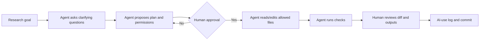

# Set Up Agents and Automated Research Workflows

This folder is for multi-step workflows where AI may plan, edit files, run code, inspect outputs, or monitor updates.

Use these only after reading the [handbook](../01-Start-Here-to-Learn-AI-for-Econ-Finance-Research/README.md) and setting up Git.

Questions or suggestions for this part: email [jay.liu@bristol.ac.uk](mailto:jay.liu@bristol.ac.uk) with subject `[AI Econ Finance Automation] Workflow question`.

> [!NOTE]
> Default add-on for every workflow here: `If any required input, file permission, data rule, Git term, agent permission, or output format is unclear, ask me up to five clarifying questions before acting. Define unfamiliar technical terms in plain language and end with "Questions for you" if anything remains uncertain.`

## Files

| File | Use it for |
| --- | --- |
| [01 Clean Existing Research Project and Set Up Git](01-clean-existing-research-project-and-set-up-git.md) | turn a messy folder into a safe repo |
| [02 One Paper, One Repo, One AI Project](02-one-paper-one-repo-one-ai-project.md) | set up a durable AI workspace for a paper |
| [03 Replication Package Agent Workflow](03-replication-package-agent-workflow.md) | inspect, run, and document replication packages |
| [04 AI Research Update Digest Workflow](04-ai-research-update-digest-workflow.md) | build a low-noise update system from official docs and builders |
| [05 Parallel Agents and Git Worktrees](05-parallel-agents-and-git-worktrees.md) | run multiple AI tasks safely without corrupting the main project |
| [06 GitHub Review Feedback and Publish Workflow](06-github-review-feedback-and-publish-workflow.md) | handle PR comments, stage changes intentionally, commit, push, and open PRs safely |

## Why This Folder Exists

A beginner can use ChatGPT or Claude in a browser without changing any files. An agentic workflow is different: the AI may inspect a project folder, edit scripts, run commands, create commits, or connect to other tools. That can save days of work, but it can also overwrite files, expose private data, or create results that look reproducible but are not.

Use this folder when the task has three properties:

1. It involves multiple steps.
2. It touches files, code, data, slides, GitHub, or external sources.
3. You can define approval gates and verification checks.

Do not use this folder for quick literature questions, confidential data decisions, or final scholarly judgment.

## Beginner Tool Map

| Tool or concept | Plain meaning | Use it for | Be careful about |
| --- | --- | --- | --- |
| ChatGPT/Claude Project | persistent workspace with instructions and files | one paper, literature review, referee response, talk | stale files, privacy settings, unsupported claims |
| Codex | OpenAI coding agent that can work in a repo | code edits, tests, Git diffs, research scripts | review every diff and run checks |
| Claude Code | Anthropic terminal/repo agent | project-aware coding, writing, agents, skills, hooks | permissions, auto modes, private files |
| VS Code | editor for code, Git, terminals, extensions | inspect files, run scripts, resolve diffs | convenience is not reproducibility |
| AGENTS.md | repo instruction file for coding agents | project rules, validation commands, files never to edit | vague instructions lead to vague behavior |
| CLAUDE.md | Claude Code project memory/instructions | project conventions, workflow rules, known commands | stale instructions can mislead |
| Skill | reusable workflow instruction | repeated tasks such as code review or slide generation | weak skills automate weak habits |
| MCP/connector | lets AI connect to apps, databases, or files | Zotero, GitHub, Drive, search, databases | permissions, token cost, data exposure |
| Git branch | isolated line of work | try a change safely | branch drift |
| Git worktree | separate folder for another branch | parallel agent experiments | mixing outputs across folders |

## What These Terms Look Like In Practice

| Term | Concrete example |
| --- | --- |
| `.gitignore` | a file containing `data/raw/` so raw data stays on your computer and is not tracked for GitHub upload |
| branch | `codex/rewrite-table-code`, a temporary version where an agent can revise table code before it is merged |
| worktree | a second folder named `paper-revision-worktree/` where a separate agent edits the introduction while the main folder remains untouched |
| Git diff | the line-by-line change report you inspect before accepting AI edits |
| commit | a named checkpoint such as `Add data dictionary and merge checks` |
| MCP | a connector that lets an AI tool reach GitHub, Zotero, Drive, or a database; use only with explicit permissions |
| agent permission | the boundary saying whether AI may read files, edit files, run commands, install packages, push to GitHub, or access external services |
| approval gate | a pause point where the agent must ask before changing files, moving data, publishing, or running risky commands |

Useful instruction for any agent:

```text
If you use a software or AI term that a non-CS economics/finance researcher may not know, define it briefly and give one example from this research project.
```

## Pick the Right Workflow

| Situation | Best workflow | Be careful about |
| --- | --- | --- |
| messy old folder | clean project and Git setup | never delete files or commit restricted data |
| one active paper | one paper, one repo, one AI project | define project instructions before file edits |
| replication package | replication package agent workflow | do not claim success until code runs and outputs match |
| staying updated | research update digest | dated claims, official docs, and low-noise sources |
| multiple AI tasks | branches/worktrees | agents editing same file or raw data |
| GitHub feedback | review feedback and publish workflow | never reply, resolve, or push without approval |

## Agentic AI in One Sentence

```text
Agentic AI is AI that does not only answer; it can plan, call tools, edit files, run commands, inspect results, and continue through a workflow.
```

For research, this means the central question changes from "Was the answer fluent?" to "Were the actions safe, logged, and verified?"

## Agentic Workflow Anatomy

An agentic workflow should be a sequence of small contracts, not one large instruction.



| Step | What the agent should produce | Human decision |
| --- | --- | --- |
| Clarify | missing inputs, unclear terms, data sensitivity questions | answer, narrow scope, or stop |
| Plan | files to read, files to edit, forbidden files, commands, risks | approve or revise |
| Execute | small changes only, tied to the approved plan | do not accept unreviewed changes |
| Check | commands run, outputs inspected, failures found | rerun, reject, or continue |
| Trace | diff summary, AI-use log entry, commit suggestion | commit only after review |

## Concrete Agentic Workflow Examples

| Research task | Safe agent role | Allowed actions | Forbidden actions | Success check |
| --- | --- | --- | --- | --- |
| clean an old project folder | project organizer | list files, propose structure, write README/DATA/AGENTS after approval | delete files, edit raw data, push public repo | raw files untouched, Git diff reviewed |
| build a WRDS merge plan | data-construction assistant | draft query plan, variable dictionary, audit tables, toy data test | expose credentials, upload licensed extracts, assume ticker matching is enough | link logic and timing rules documented |
| debug Table 2 code | coding assistant | inspect code, propose fix, edit script after approval, run minimal test | change sample restrictions silently, edit outputs by hand | code runs and output matches expected table shell |
| prepare seminar Q&A | talk practice opponent | ask tough questions, propose concise answers, flag weak slides | invent results, hide limitations, strengthen causal claims | answers trace to paper evidence |
| handle GitHub review comments | PR assistant | summarize comments, propose fixes, edit approved files | resolve comments or push without approval | review threads addressed and checks pass |

## Modes Of Agent Work

Use the lowest-power mode that solves the problem.

| Mode | Agent may... | Use when | Do not use when |
| --- | --- | --- | --- |
| explain | answer questions without file access | learning a method or term | output needs to change files |
| plan | inspect context and propose actions | task is unclear or risky | you already approved a narrow edit |
| edit | change approved files | code, docs, slides, or paper text need revision | raw data or confidential files are involved |
| run | execute approved commands | code/test/compile checks are needed | commands may move/delete/upload data |
| publish | commit, push, open PR, reply on GitHub | changes are reviewed and safe to share | repo visibility, data sensitivity, or authorship is unclear |

Copy this if an agent starts doing too much:

```text
Pause. Do not make further edits or run commands.

Restate:
1. what you have done;
2. which files you changed;
3. which commands you ran;
4. what remains uncertain;
5. what you propose to do next.

Wait for approval before continuing.
```

## Agent Rule

For any agentic workflow:

```text
Plan first. Ask before changing files. Use Git. Run checks. Report uncertainty.
```

## Automation Levels

| Level | Name | Example |
| --- | --- | --- |
| 0 | manual | scholar reads and writes alone |
| 1 | guided chat | AI explains a method or critiques a paragraph |
| 2 | project workspace | ChatGPT/Claude Project for one paper |
| 3 | repo-aware assistant | Codex/Claude Code works inside a Git repo |
| 4 | semi-automation | AI runs scripts, checks outputs, drafts logs |
| 5 | human-in-the-loop agent | AI plans and executes, scholar approves gates |

Do not use level 4 or 5 for confidential or restricted data unless the environment is approved.

## Required Safety Gates

Every automation workflow should have these gates.

```text
Gate 1: Plan
- What will the agent do?
- Which files may it touch?
- Which files are forbidden?
- What checks will prove it worked?

Gate 2: Approval
- Human approves before file edits, data movement, public sharing, or GitHub writes.

Gate 3: Verification
- Run code, compile paper/slides, inspect diffs, compare outputs, or verify sources.

Gate 4: Trace
- Record files changed, commands run, outputs checked, uncertainty, and commit hash.
```

## Concrete Approval Gate Template

Paste this before allowing an agent to edit files:

```text
Before editing, give me an approval table:

| Proposed action | Files affected | Why needed | Risk | Verification command/check | Needs approval? |
| --- | --- | --- | --- | --- | --- |

Rules:
- Do not edit raw, restricted, private, or licensed data.
- Do not change sample definitions, variable construction, identification assumptions, or paper claims unless explicitly asked.
- Do not install packages, push to GitHub, publish files, or contact external services without approval.
- If a term or risk is unclear, define it in plain language and ask me.
```

## What Counts As Done

An agentic task is not done when the AI says it is done. It is done when the relevant artifact passes a check.

| Artifact | Done means |
| --- | --- |
| cleaned repo | backup exists, Git initialized, `.gitignore` protects data, raw files untouched |
| data pipeline | scripts rebuild derived data from raw inputs, with logs and audit tables |
| code fix | minimal test passes, real script runs, output changes are explained |
| methods prose | text matches data, code, equation, sample, timing, and inference |
| slides | claims match paper, figures are correct, limitations are visible |
| GitHub PR | diff reviewed, checks pass, no confidential material included |

## What To Put In `AGENTS.md`

At minimum, every AI-assisted research repo should tell agents:

```markdown
## Project rules for AI agents

- Ask clarifying questions before acting when task scope, data sensitivity, or expected output is unclear.
- Never edit `data/raw/`, `data/restricted/`, or `data/private/`.
- Never expose private, licensed, identifiable, embargoed, or confidential material.
- Preserve citations, numbers, notation, variable definitions, sample definitions, and hedging.
- Before editing files, provide a plan and wait for approval.
- After editing files, report the diff summary, commands run, checks passed or failed, and remaining uncertainty.
- If you use technical terms, define them in plain language for an economics/finance researcher.
```

## Tool Concepts

| Tool concept | Use in research | Risk |
| --- | --- | --- |
| `AGENTS.md` | repo-level instructions for Codex and other coding agents | vague rules lead to unsafe edits |
| `CLAUDE.md` | Claude Code project memory/instructions | stale or overly broad instructions |
| Skills | repeatable procedures for common tasks | weak skills can automate mistakes |
| MCPs | connect AI tools to apps, files, databases, or services | permissions, tokens, privacy, accidental actions |
| Git branches | isolate experiments | branch drift and merge conflicts |
| Worktrees | run parallel branches in separate folders | confusion if outputs are mixed |
| GitHub PRs | review and discuss changes | public/private boundary and accidental disclosure |

## University and Institution Rules

Before using automation, check your university, employer, funder, data provider, journal, conference, and coauthor policies. If a policy says a task cannot use external AI tools, do not use external AI tools for that task. When in doubt, use synthetic examples, local approved environments, or ask the relevant authority.
