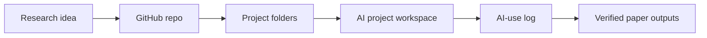
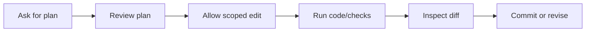

# Workflow Diagram Gallery

## What Problem This Solves

Diagrams help scholars see how AI fits into research without replacing judgment.

## One Paper One Repo One Project

## Safe AI Coding Loop

## Sources and Workflow Influences

Draws on Git-based research workflows and academic AI automation practices.

Last checked: 2026-05-24
