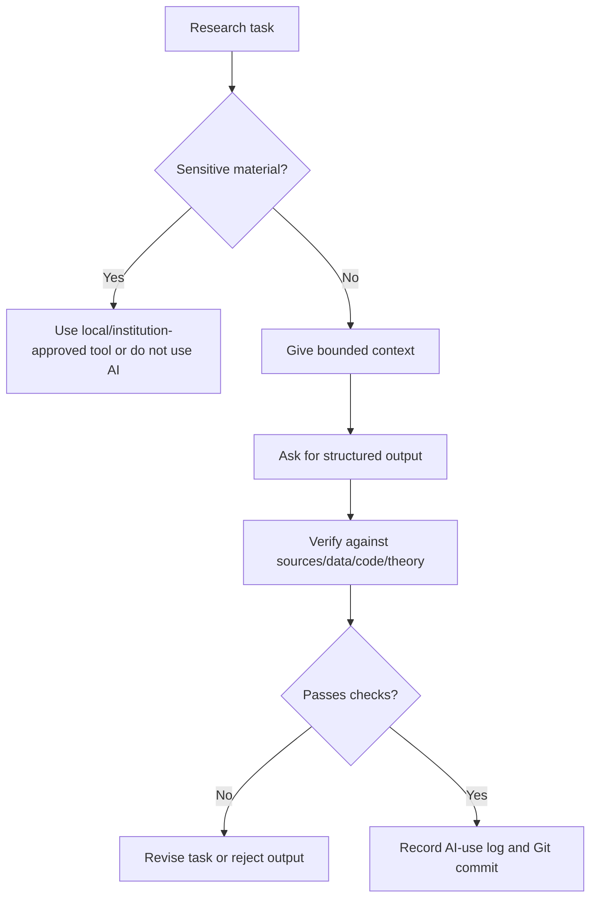

# See Examples, Diagrams, and Failure Cases

This folder keeps examples in one place so readers can learn by pattern, not by scattered advice.

> [!TIP]
> Read this page when you want to see what "responsible AI use" looks like in actual economics and finance tasks. The failure cases are as important as the success examples.

Questions or suggestions for this part: email [jay.liu@bristol.ac.uk](mailto:jay.liu@bristol.ac.uk) with subject `[AI Econ Finance Examples] Suggest an example or failure case`.

## Choose an Example

| If your task is... | Look at | Copy/use |
| --- | --- | --- |
| positioning a paper in asset pricing | Example 1 | literature map skill |
| writing a corporate finance methods section | Example 2 | finance empirical methods skill |
| running a project from idea to output | Worked spine | pipeline skills |
| checking a generated output | Failure case library | example audit prompt |
| preparing seminar slides | Presentation failure cases | presentation practice skill |
| setting up a research repo | Project safety failure cases | clean project workflow |

## AI Research Workflow Diagram



## Worked Spine: One Synthetic Paper From Idea to Seminar

This is the missing assembly instruction. Use the skill library as a chain, not as isolated prompts.

Synthetic paper:

```text
Question:
Do local bank branch closures affect small-firm borrowing and employment?

Data idea:
Branch-level closures, county/firm outcomes, credit bureau or firm panel data, local labor outcomes.

Main risk:
Closures are not random; weak local demand may cause both closures and lower borrowing.
```

| Stage | AI-assisted action | Copy-ready skill | Human check |
| --- | --- | --- | --- |
| 1. Question | turn topic into a mechanism tension | [Topic-to-Tension Research Question Builder](../02-Copy-and-Use-AI-Research-Instructions-and-Templates/18-research-question-taste-and-positioning-skills.md#skill-1-topic-to-tension-research-question-builder) | is the question important, not just feasible? |
| 2. Literature | map supplied banking/local credit papers | [Source-Grounded Literature Review Builder](../02-Copy-and-Use-AI-Research-Instructions-and-Templates/10-literature-review-and-source-synthesis-skills.md#skill-1-source-grounded-literature-review-builder) | verify closest papers and do not claim novelty too broadly |
| 3. Design | pre-mortem the DiD/event-study design | [Difference-in-Differences and Event Study Check](../02-Copy-and-Use-AI-Research-Instructions-and-Templates/11-causal-inference-econometrics-and-time-series-skills.md#skill-4-difference-in-differences-and-event-study-check) | check staggered timing, heterogeneous effects, pre-trend power, clustering |
| 4. Data | create raw-to-analysis pipeline | [Reproducible Research Data Pipeline Builder](../02-Copy-and-Use-AI-Research-Instructions-and-Templates/14-data-cleaning-merging-analysis-and-output-skills.md#skill-1-reproducible-research-data-pipeline-builder) | ensure raw files are never changed and licensed data is protected |
| 5. Code | build toy data before real code | [Toy Data Test Harness](../02-Copy-and-Use-AI-Research-Instructions-and-Templates/14-data-cleaning-merging-analysis-and-output-skills.md#skill-6-toy-data-test-harness-for-ai-written-code) | known-answer test must pass by inspection |
| 6. Methods | draft methods from verified facts | [Draft Empirical Methods Section for Economics](../02-Copy-and-Use-AI-Research-Instructions-and-Templates/03-empirical-methods-skills-for-economics-research.md#skill-1-draft-empirical-methods-section-for-economics) | prose must match code, tables, timing, and inference |
| 7. Results | check coefficient interpretation | [Back-of-Envelope Coefficient and Magnitude Check](../02-Copy-and-Use-AI-Research-Instructions-and-Templates/17-verification-reproducibility-and-disclosure-skills.md#skill-4-back-of-envelope-coefficient-and-magnitude-check) | units, baseline magnitude, CI, and design support |
| 8. Talk | prepare seminar Q&A | [Practice My Presentation With AI](../02-Copy-and-Use-AI-Research-Instructions-and-Templates/06-presentations-slides-websites-and-talk-practice-skills.md#skill-3-practice-my-presentation-with-ai) | do not invent answers to limitations |
| 9. Trace | create disclosure and AI-use record | [AI Reproducibility Packet and Disclosure Draft](../02-Copy-and-Use-AI-Research-Instructions-and-Templates/17-verification-reproducibility-and-disclosure-skills.md#skill-6-ai-reproducibility-packet-and-disclosure-draft) | check journal, coauthor, data-provider, and institutional policy |

The point is not that AI produces the paper. The point is that each AI-assisted step produces a concrete artifact that can be checked before the next step.

## Agentic Version: Same Paper With File-Editing AI

Use this only after Git, `.gitignore`, `DATA.md`, `AGENTS.md`, and `AI-USE-LOG.md` exist.

Synthetic repo:

```text
bank-closures-small-firms/
  README.md
  DATA.md
  AGENTS.md
  AI-USE-LOG.md
  data/raw/          # not edited, not committed
  data/derived/
  code/
  output/tables/
  output/figures/
  paper/
  slides/
```

Agentic workflow:

| Stage | Agent task | Allowed files | Forbidden files | Human approval point | Success check |
| --- | --- | --- | --- | --- | --- |
| 1. Repo intake | inspect structure and propose `.gitignore` | file list only | all file edits | approve cleanup plan | raw data is ignored and untouched |
| 2. Data dictionary | draft `DATA.md` from metadata and variable names | `DATA.md` | raw records | approve sensitivity labels | data access rules are explicit |
| 3. Toy pipeline | create synthetic toy data and merge test | `code/toy_*`, `output/logs/` | real data | approve test logic | known-answer merge passes |
| 4. Real pipeline | update data scripts after toy test | approved `code/` files | `data/raw/` | approve exact files | scripts run and audit tables print |
| 5. Methods audit | compare paper methods to code and tables | `paper/methods.md` comments or draft | code/data unless approved | approve prose edits | methods match scripts and sample |
| 6. Talk prep | create Q&A and slide outline | `slides/`, copied figures | raw data, code | approve public-facing claims | slide claims match paper |
| 7. Trace | draft AI-use log entry and commit message | `AI-USE-LOG.md` | none | approve commit | diff reviewed and logged |

Copy-ready instruction:

```text
Act as a cautious research agent for this economics/finance project.

Goal:
Help move one approved stage of the project forward without exposing data, changing research design silently, or creating unreproducible output.

Current stage:
[repo intake / data dictionary / toy pipeline / real pipeline / methods audit / talk prep / trace]

Project folder:
[path]

Data sensitivity:
[public/licensed/restricted/private/unknown]

Before doing anything:
1. Ask clarifying questions if task scope, data sensitivity, allowed files, forbidden files, or validation command is unclear.
2. Explain any Git or agent term in plain language.
3. Propose an approval table with action, files affected, risk, and check.
4. Wait for approval before editing files, running commands that modify outputs, installing packages, pushing to GitHub, or preparing public materials.

After approved work:
1. Report files changed.
2. Report commands run.
3. Report outputs checked.
4. Report failures or uncertainty.
5. Draft an AI-USE-LOG entry.
```

Bad agentic workflow:

```text
The agent rewrites data scripts, edits the methods section, regenerates figures, and updates slides in one pass without asking which files are allowed.
```

Why it is bad:

- the task mixes data, code, paper claims, and public communication;
- changes cannot be reviewed stage by stage;
- a methods edit may reflect code that has not been verified;
- raw or licensed data may be exposed by mistake.

## Example 1: Literature Review for Asset Pricing

Task: position a new paper on return predictability.

Good AI use:
- build a table of supplied papers
- separate predictor, sample, horizon, benchmark, and result
- flag factor-mining and multiple-testing concerns
- identify which novelty claims need manual verification

Bad AI use:
- ask AI to "find all relevant papers" and trust the answer
- accept invented citations
- let AI write a contribution claim without checking the literature

Copy-ready skill: [Literature Map Without Fake Citations](../02-Copy-and-Use-AI-Research-Instructions-and-Templates/01-ideas-brainstorming-proposal-and-literature-skills.md#skill-3-literature-map-without-fake-citations)

### Mini Case Card

```text
Research task:
Position a return-predictability idea relative to supplied papers.

AI inputs:
- real paper list or BibTeX
- notes from papers already read
- proposed predictor, horizon, sample, benchmark

AI output:
- mechanism/method/setting map
- contribution table
- fake novelty risk list

Human verification:
- confirm each citation
- read the closest papers
- check whether the predictor is already known under another name
- check multiple-testing and data-mining risk
```

## Example 2: Corporate Finance Empirical Paper

Task: write methods for a firm-level panel design.

Good AI use:
- clarify unit of observation
- check variable timing
- check controls and fixed effects
- identify clustering and serial-correlation issues
- compare methods prose to code

Bad AI use:
- claim causality because the regression has fixed effects
- describe robustness checks that were not run
- ignore sample-selection and measurement issues

Copy-ready skill: [Empirical Methods Skills for Finance Research](../02-Copy-and-Use-AI-Research-Instructions-and-Templates/04-empirical-methods-skills-for-finance-research.md)

### Mini Case Card

```text
Research task:
Write and audit methods for a firm-level panel design.

AI inputs:
- verified data source list
- unit of observation
- sample screens
- equation or table shell
- timing of outcome, treatment, controls

AI output:
- draft methods prose
- missing replication details
- timing and inference checklist

Human verification:
- compare text to code
- confirm sample filters
- inspect fixed effects and clustering
- ensure causal language matches design
```

## Example 3: Presentation Practice for a Job Talk or Seminar

Task: prepare for an economics or finance seminar where the audience may challenge identification, measurement, mechanism, and contribution.

Good AI use:
- create hostile-but-fair questions
- identify slide sequence problems
- flag overclaiming
- prepare short answers with evidence requirements
- translate technical answers for mixed audiences

Bad AI use:
- invent answers to questions you cannot answer
- hide limitations
- turn a weak design into confident prose
- generate flashy slides that obscure the paper's core argument

Copy-ready skill: [Practice My Presentation With AI](../02-Copy-and-Use-AI-Research-Instructions-and-Templates/06-presentations-slides-websites-and-talk-practice-skills.md#skill-3-practice-my-presentation-with-ai)

## Failure Case Library

| Failure | Why it looks plausible | How to catch it |
| --- | --- | --- |
| fake citation | title sounds field-appropriate | verify DOI, journal, author, year |
| wrong Stata/R/Python code that runs | code produces output | test toy example and compare formulas |
| event-study timing error | graph looks normal | inspect treatment date, event window, and leads/lags |
| coefficient overinterpretation | prose sounds academic | check units and economic magnitude |
| AI overwrites raw data | agent "cleans" files | use Git, `.gitignore`, and raw-data rules |
| figure label changed | slide looks cleaner | compare to original table/figure |
| factor-mining story | narrative sounds like finance theory | require pre-specification, out-of-sample checks, and costs |
| AI-generated slide overstates claim | confident title sounds persuasive | compare every slide title against the actual table or figure |
| public summary becomes investment advice | audience-friendly language sounds useful | remove recommendations and state limits clearly |
| AI-created methods section mismatches code | prose is cleaner than code comments | run a methods-to-code consistency check |
| CRSP delisting returns omitted | portfolio results look clean and significant | print delisting treatment and compare returns with/without delisting adjustment |
| Compustat timing uses future accounting data | annual variables merge successfully | enforce reporting-lag rule and check formation-date availability |
| TWFE event study hides negative weights | coefficient table looks standard | run estimator-choice audit for staggered timing and heterogeneous effects |
| LLM text score drifts across model versions | labels look semantically reasonable | pin model snapshot if possible and rerun prompt/model sensitivity |
| structural counterfactual changes too much at once | policy simulation has a clean welfare number | isolate mechanism and list which prices, constraints, and agents reoptimize |

## Filled Failure Case: AI-Written Merge Code Creates Look-Ahead Bias

```markdown
## Failure: accounting data used before it was public

What happened:
AI wrote a Compustat-to-CRSP merge that attached fiscal-year accounting variables to monthly stock returns in the same calendar year without a reporting lag.

Why it looked plausible:
The merge ran, the sample size looked reasonable, and the regression table had sensible signs.

Where it entered the workflow:
Data construction, before portfolio formation.

What caught it:
A timing audit asked: "Could an investor know this accounting variable at the portfolio formation date?"

What would have prevented it:
An explicit reporting-lag rule in DATA.md and a toy-data test with fiscal year end, report date, and return month.

Rule to add:
Never merge annual accounting variables into return tests without a documented public-availability or reporting-lag assumption.
```

## Filled Failure Case: LLM-Generated Text Measure Is Not Reproducible

```markdown
## Failure: disclosure-tone score changes after model update

What happened:
An LLM scored 10-K risk disclosures in January. The same prompt produced different scores in May after a model update.

Why it looked plausible:
Both outputs were fluent and each individual label seemed defensible.

Where it entered the workflow:
Text-as-data variable construction.

What caught it:
A rerun on a validation sample showed rank changes large enough to change regression coefficients.

What would have prevented it:
Archiving prompt, model snapshot, date, settings, raw outputs, parsed labels, and sensitivity runs.

Rule to add:
Treat LLM-generated variables as measurement instruments with model-version and prompt sensitivity checks.
```

## Failure Case Template

Use this to document failures found in your own research workflow.

```markdown
## Failure: [short name]

What happened:

Why it looked plausible:

Where it entered the workflow:

What caught it:

What would have prevented it:

Rule to add to future AI instructions:

Related files or commits:
```

## Example Audit Prompt

```text
Audit this AI-assisted output for economics/finance research failure modes.

Output to audit:
[paste]

Project context:
[context]

Check for:
- fake citations
- invented data/results
- overclaimed causality
- wrong coefficient interpretation
- missing limitations
- code/method mismatch
- finance-specific factor-mining or backtest risks

Return a severity-ranked list of issues and what I must verify.
```

Sources and workflow influences: applied empirical methods teaching, finance p-hacking concerns, and AI research workflow discussions.
