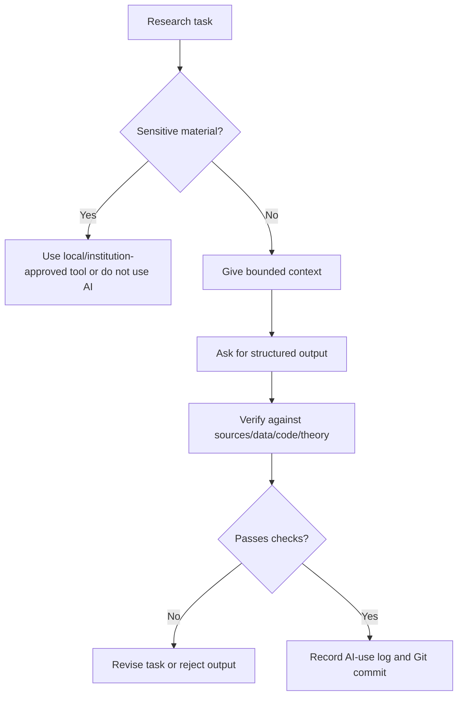

# See Examples, Diagrams, and Failure Cases

This folder keeps examples in one place so readers can learn by pattern, not by scattered advice.

## AI Research Workflow Diagram



## Example 1: Literature Review for Asset Pricing

Task: position a new paper on return predictability.

Good AI use:
- build a table of supplied papers
- separate predictor, sample, horizon, benchmark, and result
- flag factor-mining and multiple-testing concerns
- identify which novelty claims need manual verification

Bad AI use:
- ask AI to "find all relevant papers" and trust the answer
- accept invented citations
- let AI write a contribution claim without checking the literature

Copy-ready skill: [Literature Map Without Fake Citations](../02-Copy-and-Use-AI-Research-Instructions-and-Templates/01-ideas-brainstorming-proposal-and-literature-skills.md#skill-3-literature-map-without-fake-citations)

## Example 2: Corporate Finance Empirical Paper

Task: write methods for a firm-level panel design.

Good AI use:
- clarify unit of observation
- check variable timing
- check controls and fixed effects
- identify clustering and serial-correlation issues
- compare methods prose to code

Bad AI use:
- claim causality because the regression has fixed effects
- describe robustness checks that were not run
- ignore sample-selection and measurement issues

Copy-ready skill: [Empirical Methods Skills for Finance Research](../02-Copy-and-Use-AI-Research-Instructions-and-Templates/04-empirical-methods-skills-for-finance-research.md)

## Failure Case Library

| Failure | Why it looks plausible | How to catch it |
| --- | --- | --- |
| fake citation | title sounds field-appropriate | verify DOI, journal, author, year |
| wrong Stata/R/Python code that runs | code produces output | test toy example and compare formulas |
| event-study timing error | graph looks normal | inspect treatment date, event window, and leads/lags |
| coefficient overinterpretation | prose sounds academic | check units and economic magnitude |
| AI overwrites raw data | agent "cleans" files | use Git, `.gitignore`, and raw-data rules |
| figure label changed | slide looks cleaner | compare to original table/figure |
| factor-mining story | narrative sounds like finance theory | require pre-specification, out-of-sample checks, and costs |

## Example Audit Prompt

```text
Audit this AI-assisted output for economics/finance research failure modes.

Output to audit:
[paste]

Project context:
[context]

Check for:
- fake citations
- invented data/results
- overclaimed causality
- wrong coefficient interpretation
- missing limitations
- code/method mismatch
- finance-specific factor-mining or backtest risks

Return a severity-ranked list of issues and what I must verify.
```

Sources and workflow influences: applied empirical methods teaching, finance p-hacking concerns, and AI research workflow discussions.
