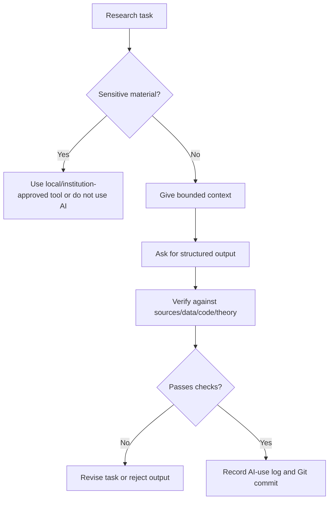

# See Examples, Diagrams, and Failure Cases

This folder keeps examples in one place so readers can learn by pattern, not by scattered advice.

> [!TIP]
> Read this page when you want to see what "responsible AI use" looks like in actual economics and finance tasks. The failure cases are as important as the success examples.

## Choose an Example

| If your task is... | Look at | Copy/use |
| --- | --- | --- |
| positioning a paper in asset pricing | Example 1 | literature map skill |
| writing a corporate finance methods section | Example 2 | finance empirical methods skill |
| checking a generated output | Failure case library | example audit prompt |
| preparing seminar slides | Presentation failure cases | presentation practice skill |
| setting up a research repo | Project safety failure cases | clean project workflow |

## AI Research Workflow Diagram



## Example 1: Literature Review for Asset Pricing

Task: position a new paper on return predictability.

Good AI use:
- build a table of supplied papers
- separate predictor, sample, horizon, benchmark, and result
- flag factor-mining and multiple-testing concerns
- identify which novelty claims need manual verification

Bad AI use:
- ask AI to "find all relevant papers" and trust the answer
- accept invented citations
- let AI write a contribution claim without checking the literature

Copy-ready skill: [Literature Map Without Fake Citations](../02-Copy-and-Use-AI-Research-Instructions-and-Templates/01-ideas-brainstorming-proposal-and-literature-skills.md#skill-3-literature-map-without-fake-citations)

### Mini Case Card

```text
Research task:
Position a return-predictability idea relative to supplied papers.

AI inputs:
- real paper list or BibTeX
- notes from papers already read
- proposed predictor, horizon, sample, benchmark

AI output:
- mechanism/method/setting map
- contribution table
- fake novelty risk list

Human verification:
- confirm each citation
- read the closest papers
- check whether the predictor is already known under another name
- check multiple-testing and data-mining risk
```

## Example 2: Corporate Finance Empirical Paper

Task: write methods for a firm-level panel design.

Good AI use:
- clarify unit of observation
- check variable timing
- check controls and fixed effects
- identify clustering and serial-correlation issues
- compare methods prose to code

Bad AI use:
- claim causality because the regression has fixed effects
- describe robustness checks that were not run
- ignore sample-selection and measurement issues

Copy-ready skill: [Empirical Methods Skills for Finance Research](../02-Copy-and-Use-AI-Research-Instructions-and-Templates/04-empirical-methods-skills-for-finance-research.md)

### Mini Case Card

```text
Research task:
Write and audit methods for a firm-level panel design.

AI inputs:
- verified data source list
- unit of observation
- sample screens
- equation or table shell
- timing of outcome, treatment, controls

AI output:
- draft methods prose
- missing replication details
- timing and inference checklist

Human verification:
- compare text to code
- confirm sample filters
- inspect fixed effects and clustering
- ensure causal language matches design
```

## Example 3: Presentation Practice for a Job Talk or Seminar

Task: prepare for an economics or finance seminar where the audience may challenge identification, measurement, mechanism, and contribution.

Good AI use:
- create hostile-but-fair questions
- identify slide sequence problems
- flag overclaiming
- prepare short answers with evidence requirements
- translate technical answers for mixed audiences

Bad AI use:
- invent answers to questions you cannot answer
- hide limitations
- turn a weak design into confident prose
- generate flashy slides that obscure the paper's core argument

Copy-ready skill: [Practice My Presentation With AI](../02-Copy-and-Use-AI-Research-Instructions-and-Templates/06-presentations-slides-websites-and-talk-practice-skills.md#skill-3-practice-my-presentation-with-ai)

## Failure Case Library

| Failure | Why it looks plausible | How to catch it |
| --- | --- | --- |
| fake citation | title sounds field-appropriate | verify DOI, journal, author, year |
| wrong Stata/R/Python code that runs | code produces output | test toy example and compare formulas |
| event-study timing error | graph looks normal | inspect treatment date, event window, and leads/lags |
| coefficient overinterpretation | prose sounds academic | check units and economic magnitude |
| AI overwrites raw data | agent "cleans" files | use Git, `.gitignore`, and raw-data rules |
| figure label changed | slide looks cleaner | compare to original table/figure |
| factor-mining story | narrative sounds like finance theory | require pre-specification, out-of-sample checks, and costs |
| AI-generated slide overstates claim | confident title sounds persuasive | compare every slide title against the actual table or figure |
| public summary becomes investment advice | audience-friendly language sounds useful | remove recommendations and state limits clearly |
| AI-created methods section mismatches code | prose is cleaner than code comments | run a methods-to-code consistency check |

## Failure Case Template

Use this to document failures found in your own research workflow.

```markdown
## Failure: [short name]

What happened:

Why it looked plausible:

Where it entered the workflow:

What caught it:

What would have prevented it:

Rule to add to future AI instructions:

Related files or commits:
```

## Example Audit Prompt

```text
Audit this AI-assisted output for economics/finance research failure modes.

Output to audit:
[paste]

Project context:
[context]

Check for:
- fake citations
- invented data/results
- overclaimed causality
- wrong coefficient interpretation
- missing limitations
- code/method mismatch
- finance-specific factor-mining or backtest risks

Return a severity-ranked list of issues and what I must verify.
```

Sources and workflow influences: applied empirical methods teaching, finance p-hacking concerns, and AI research workflow discussions.
