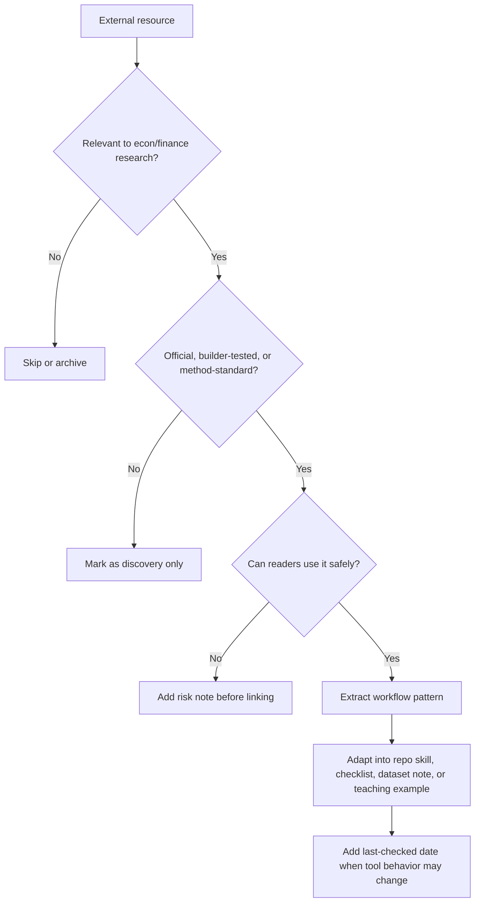
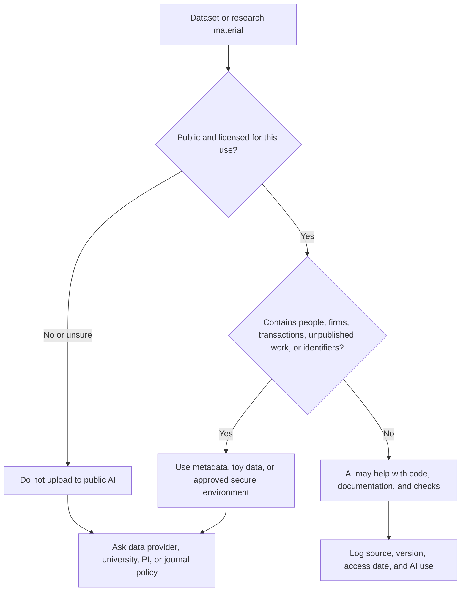

# Check Builders, Official Docs, and Resources

This folder is not a link dump. It explains which external resources influenced the repo and what we extract from them.

> [!IMPORTANT]
> This page is for learning what to extract from outside sources. It is not a recommendation to copy another person's skill, code, or writing without checking license, attribution, and fit.
>
> The consolidated selected-links list now also appears in the [01 handbook](../01-Start-Here-to-Learn-AI-for-Econ-Finance-Research/README.md#17-sources-and-workflow-influences), so readers can find source context without leaving the book-style entry page.

Questions or suggestions for this part: email [jay.liu@bristol.ac.uk](mailto:jay.liu@bristol.ac.uk) with subject `[AI Econ Finance Sources] Resource suggestion`.

## Update Notifications and Privacy

Readers can stay informed through GitHub-native notifications or a minimal email update list.

Recommended order:

1. Use GitHub Watch or GitHub Releases if you already use GitHub.
2. Use the email update list only if you prefer email.

Email update list:

```text
To subscribe:
Email jay.liu@bristol.ac.uk
Subject: [AI Econ Finance Updates] Subscribe

To unsubscribe:
Email jay.liu@bristol.ac.uk
Subject: [AI Econ Finance Updates] Unsubscribe
```

Information-security rules:

- Do not send research data, manuscripts, referee reports, student data, licensed database extracts, private code, or confidential information when subscribing.
- The update list should be used only for repository updates, release notes, workshop notices, and major new skill pages.
- Collect and retain only the minimum contact information needed for updates.
- Do not share the list with third parties.
- Follow university, employer, data-provider, funder, journal, and conference rules if they are stricter.

## Source Use Policy

We cite briefly and adapt only relevant workflow ideas. We do not copy external skills wholesale unless the license permits it.

Use this extraction rule:

```text
Source -> workflow pattern -> econ/finance adaptation -> copy-ready asset -> verification rule
```

### Source Evaluation Funnel

Use this before adding any resource, tool claim, dataset link, or builder workflow.



### Resource Card Layout

Each useful external link should answer five reader questions quickly.

| Reader question | Resource-card answer |
| --- | --- |
| What is this? | category and topic |
| Who is it for? | level and audience |
| What can I do with it? | direct-use value |
| What can go wrong? | risk note |
| Where does it fit here? | repo destination |

## Why This Folder Exists

New AI users often ask "which tool should I use?" A better research question is "which source tells me what is true, current, and useful for this task?"

Use this folder to distinguish:

| Source type | Use it for | Do not use it for |
| --- | --- | --- |
| official tool docs | current product behavior, permissions, file/project features | field-specific research judgment |
| economist builders | practical research workflows and failure cases | timeless tool rankings |
| canonical methods papers | estimator assumptions and diagnostics | copy-paste prompts |
| skill repositories | examples of reusable workflow design | unlicensed copying |
| newsletters/social media | discovery | unverified claims |

## Resource Library Pattern To Reuse

A good AI research-resource page should behave like a small searchable database, not a long unordered reading list. The most useful pattern is:

```text
resource -> category -> topic -> level -> language -> direct-use value -> risk note -> where it belongs in this repo
```

Use these fields when adding or reviewing resources:

| Field | Why it matters |
| --- | --- |
| Name and URL | lets readers click through immediately |
| Author or maintainer | helps readers judge source context and accountability |
| Category | separates learning materials, application tools, setup guides, methods references, datasets, and official docs |
| Topic | shows whether the item is about workflow, Stata, WRDS, skills/MCP, writing, data, presentation, or general AI |
| Level | helps beginners avoid advanced tools too early |
| Language | makes Chinese and English routes easier to maintain |
| Direct-use value | says whether the reader can copy a skill, install a tool, follow a workflow, or only read for background |
| Risk note | records license, data-safety, tool-version, or hallucination risks |
| Last checked | prevents stale tool claims |
| Repo destination | states which README, skill, or workflow should absorb the useful idea |

Recommended views:

| View | Purpose |
| --- | --- |
| Start Here | first resources for new users |
| Learning Materials | tutorials, talks, courses, and explainers |
| Application Tools | skills, agents, MCPs, scripts, and templates readers may directly try |
| Chinese Resources | Chinese-language paths and bilingual resources |
| Needs Testing | promising resources that should not be recommended until tested |

Copy-ready resource card:

```markdown
## [Resource name]

URL:
Author/maintainer:
Category: Learning material / Application tool / Setup / Official docs / Dataset / Methods reference
Topic:
Level: Beginner / Intermediate / Advanced
Language:
Direct-use value:
Risk note:
Where it belongs in this repo:
Last checked:
```

## Source-to-Repo Map

| Source | What this repo extracts |
| --- | --- |
| [Gen Li and Siyang Liu: Claude Code Learning Resources for Economics and Finance Researchers](https://gen-li.notion.site/339195e07a238020b8aae6b5a1661f08?v=339195e07a2380c0ad01000c92c92011&pvs=149) | resource-library design: category/topic/level/language tags, separate learning/tool/setup views, Chinese-resource routing, and econ/finance Claude Code discovery |
| [Frank Lee: Academic Research Skills](https://github.com/franklee16/academic-research-skills) | broad academic skill taxonomy across writing, literature review, data analysis, Stata/R/Python, visualization, peer review, presentations, citations, grants, data sourcing, output tools, and project management |
| [Agentic Assets: Corbis Literature Starter Kit](https://github.com/Agentic-Assets/corbis-literature-starter-kit) | literature-workflow pattern: search, mapping, idea positioning, trend visualization, and citation verification, with the caution that MCP/data access requires permission and traceability |
| [Paul Goldsmith-Pinkham: Applied Methods PhD](https://github.com/paulgp/applied-methods-phd) | practical empirical implementation, research design intuition, communication and artisanship |
| [Paul Goldsmith-Pinkham: Using AI in Research and Teaching](https://paulgp.com/2024/06/24/llm_talk.html) | VS Code/Git mindset, code explanation, scraping, Makefile/project help, local models for sensitive contexts |
| [Paul Goldsmith-Pinkham: Research in the Time of AI](https://paulgp.com/2026/03/16/research-in-time-of-ai.html) | research pipeline thinking, AI lowering execution costs, p-hacking and slop risks |
| [Paul Goldsmith-Pinkham: LLM-Friendly Academic Papers](https://paulgp.com/2026/03/10/llms-txt-for-academic-papers.html) | llms.txt-style paper orientation files, paper bundles, limitations-first AI reading |
| [Paul Goldsmith-Pinkham: Things I Want to Build](https://paulgp.com/2026/04/08/incomplete-list-things-i-want-to-build.html) | citation networks, knowledge databases, replication package metadata, better econometric tooling |
| [Paul Goldsmith-Pinkham: AI writing roundup](https://paulgp.com/2026/04/27/ai-writing-roundup.html) | writing help should preserve thinking, voice, evidence, and field-specific caution |
| [Paul Goldsmith-Pinkham: Tracking the Credibility Revolution across Fields](https://www.nber.org/papers/w35051) | field differences in empirical design language, especially applied micro vs finance/macroeconomics |
| [Paul Goldsmith-Pinkham: Causal Inference in Financial Event Studies](https://paulgp.com/papers/financial_event_studies_dec282025.pdf) | event-study caution, especially long horizons, confounding, and design-vs-model interpretation |
| [Pedro Sant'Anna: Claude Code academic workflow](https://psantanna.com/claude-code-my-workflow/) | plan-first contractor workflow, specialized agents, quality checks, reusable commands |
| [Pedro Sant'Anna: workflow guide](https://psantanna.com/claude-code-my-workflow/workflow-guide.html) | skills, agents, permissions, hooks, and quality-gate workflow design |
| [Chris Blattman / Claude Blattman](https://claudeblattman.com/) | non-coder academic workflows, project folders, reusable skills, council-of-critics style review |
| [Claude Blattman templates and workflows](https://claudeblattman.com/downloads/) | templates, first-session skills, project setup, and practical non-coder onboarding patterns |
| [Chris Blattman: claudeblattman repo](https://github.com/chrisblattman/claudeblattman) | public workflow system design and documentation structure |
| [Anton Korinek: AI agents for economic research](https://www.nber.org/papers/w34202) | economist-facing explanation of agents for literature, code, data, and workflow coordination |
| [Mihail Velikov: AI in Business and Economic Research](https://velikov-mihail.github.io/ai-econ-wiki/) | curated source index, summaries, categories, and knowledge-base maintenance |
| [Novy-Marx and Velikov: AI-powered finance scholarship](https://www.aeaweb.org/articles?id=10.1257/jel.20251821) | caution about industrialized finance paper production, HARKing, and factor-mining incentives |
| [Joshua Gans](https://joshuagans.substack.com/) | AI's effect on research and teaching production, course-specific AI assistants |
| [Luis Garicano](https://sites.google.com/site/luisgaricano/) | AI, knowledge work, task bundling, and the changing value of human judgment |
| [Aniket Panjwani](https://aniketpanjwani.com/) | practical economist-facing agent onboarding and dated tool-comparison discipline |
| [The AI Economist: AI Agents for Economics Research](https://aieconomist.io/tutorials/ai-agents-for-economics-research) | economist-facing training path and update channel; useful for learning agentic workflows while keeping tool claims dated |
| Aniket Panjwani, "AI Agents for Economics Research" webinar PDF, provided by the repo maintainer | practical first exercise: back up a messy project, initialize Git, create a private GitHub repo, restructure on a branch, run checks, and avoid three beginner mistakes: no Git, underusing skills, and skipping plans |
| [Brandon Uttley: vibe coding risks](https://www.linkedin.com/pulse/promises-risks-vibe-coding-brandon-uttley-nbk2e/) | caution that AI-generated code needs human review, testing, and maintainability checks |
| [luongnv89: Master Claude Code in a Weekend](https://github.com/luongnv89/claude-howto) | progressive Claude Code learning path, self-assessment, copy-paste templates, and modules for commands, memory, skills, subagents, MCP, hooks, plugins, and checkpoints |
| [Piotr Orlowski: Claude Code WRDS Toolkit](https://github.com/piotrek-orlowski/claude-wrds-public) | WRDS specialist agents, schema preloading, psql/SSH/TAQ workflows, and permission patterns that need strong data-license safeguards |
| [Siyang Liu fork: Claude Code WRDS Toolkit](https://github.com/lsy617004926/claude-wrds-public) | extended WRDS-oriented workflow reference for economics and finance researchers |
| [Alexander Dickerson: AI Asset Pricing](https://github.com/Alexander-M-Dickerson/ai-asset-pricing) | empirical asset-pricing workflow design around WRDS, factor-model workflows, PyBondLab, repeated research automation, and LaTeX paper writing |
| [Alejandro Lopez-Lira: Research Idea Evaluation Pipeline](https://github.com/alejandroll10/idea-evaluation-pipeline) | staged idea screening for finance research, including web-search-dependent evaluation steps and top-journal fit discipline |
| [David Yanagizawa-Drott: Project APE](https://ape.socialcatalystlab.org/) | public experiment in autonomous policy evaluation at scale, including the need to expose failures, code, data, uncertainty, and human evaluation |
| [Thinking with Agents](https://thinkingwithagents.github.io/) | conceptual framing for thinking with agentic systems; useful for distinguishing agent workflows from one-shot prompting |
| [Conor Bronsdon: avoid-ai-writing](https://github.com/conorbronsdon/avoid-ai-writing) | two-pass detection and revision of AI writing patterns; useful as a design model for academic voice preservation rather than generic style polishing |
| [Antonio Mele: Awesome Econ AI Stuff](https://github.com/meleantonio/awesome-econ-ai-stuff) | economics-specific reusable skills, SKILL.md format, Stata/R/Python/LaTeX/econometrics/writing skill families, and cross-tool portability |
| [Antonio Mele: Awesome Econ AI Stuff website](https://meleantonio.github.io/awesome-econ-ai-stuff/) | searchable skill catalog pattern and examples such as `r-econometrics`, `python-panel-data`, `stata-regression`, `stata-data-cleaning`, `api-data-fetcher`, and `econ-visualization` |
| [Arpit Gupta: AI in Finance](https://github.com/arpitrage/ai-in-finance) | finance-specific teaching structure around document intelligence, risk assessment, market intelligence, fraud detection, and compliance |
| [FromCSUZhou: Econometrics-Agent](https://github.com/FromCSUZhou/Econometrics-Agent) | example of a specialized econometrics agent; useful as a reminder that domain agents must still be checked against estimator assumptions, data construction, and reproducibility |
| [MaciejMacko / Salesforce: AI Economist](https://github.com/MaciejMacko/ai-economist) | economic simulation and reinforcement-learning framework; relevant for advanced simulation, policy, and mechanism-design workflows rather than ordinary empirical paper drafting |
| [Han Lulong: Awesome AI for Economists](https://github.com/hanlulong/awesome-ai-for-economists) | broad tool/resource catalog for economists, including MCPs, coding tools, econometrics, simulation, NLP, finance-specific AI, data collection, and teaching resources |
| [Han Lulong: Econ Writing Skill](https://github.com/hanlulong/econ-writing-skill) | economics-writing skill design with cross-platform compatibility and field-specific paper-section guidance; useful for writing skills but not a substitute for author judgment |
| [Reader-submitted Chinese AI workflow note](https://mp.weixin.qq.com/s/oHtZKjtIFp0eh2zAo6XqQA) | Chinese-language reference to review for future Chinese-path examples; extract specific claims only after manual verification because public mirror/access can vary |
| [Zara Zhang: AI Learning Library](https://zara.faces.site/ai) | curated learning paths and low-noise AI learning |
| [Zara Zhang: Follow Builders](https://github.com/zarazhangrui/follow-builders) | builder-focused digest, daily/weekly updates, bilingual summaries, public-source tracking |
| [Zara Zhang: frontend-slides](https://github.com/zarazhangrui/frontend-slides) | web-native slide skills, visual exploration, single-file HTML artifacts, avoiding generic AI aesthetics |
| [Maverick Gao: slide-craft-skill](https://github.com/maverickgao8848/slide-craft-skill) | structured slide workflow, style choices, overflow handling, bilingual slide-skill design |
| [PaperSpine](https://github.com/WUBING2023/PaperSpine) | staged academic writing skills, branch skills, citation support bank, writing rationale matrix, audit trail |
| [Nature Skills](https://github.com/Yuan1z0825/nature-skills) | source-grounded skill design, directly usable artifacts, journal-style rules |
| [OpenAI Help Center: Projects in ChatGPT](https://help.openai.com/en/articles/10169521-chatgpt-projects) | official behavior for ChatGPT Projects, files, instructions, sharing, and project scope |
| [OpenAI Codex Skills](https://developers.openai.com/codex/skills) | skills as reusable instruction packages |
| [OpenAI AGENTS.md](https://developers.openai.com/codex/guides/agents-md) | repo-level AI agent instructions |
| [Claude Help Center: Claude Projects](https://support.anthropic.com/en/articles/9517075-what-are-projects) | official description of Claude project workspaces |
| [Claude Code Docs: How Claude Code works](https://code.claude.com/docs/en/how-claude-code-works) | agentic loop, project interaction, built-in tools, and command-line workflow |
| [Claude Skills](https://docs.claude.com/en/docs/claude-code/skills) | skill format and Claude Code workflow concept |
| [Model Context Protocol](https://modelcontextprotocol.io/docs/getting-started/intro) | connectors between AI tools and external systems |
| [VS Code documentation](https://code.visualstudio.com/docs) | editor, terminal, debugging, Git, and project-navigation basics |
| [GitHub ignoring files](https://docs.github.com/en/get-started/git-basics/ignoring-files) | `.gitignore` safety for data and secrets |
| [Git worktree docs](https://git-scm.com/docs/git-worktree) | isolated branches/worktrees for AI experiments |

## Canonical Methods and Credibility Sources To Link With Skills

These sources are not "AI resources." They are the method standards that make AI-generated methods and code worth checking.

| Topic | Sources to know | How this repo uses them |
| --- | --- | --- |
| text-as-data | [Gentzkow, Kelly, and Taddy, "Text as Data"](https://www.aeaweb.org/articles?id=10.1257/jel.20181020) | frames text as a measurement and statistical object, not just a summarization task |
| staggered DiD | [Callaway and Sant'Anna](https://ideas.repec.org/a/eee/econom/v225y2021i2p200-230.html), [Sun and Abraham](https://ideas.repec.org/a/eee/econom/v225y2021i2p175-199.html), [Borusyak, Jaravel, and Spiess](https://www.gsb.stanford.edu/faculty-research/publications/revisiting-event-study-designs-robust-efficient-estimation), [Goodman-Bacon](https://www.sciencedirect.com/science/article/pii/S0304407621001445) | turns "check parallel trends" into estimator choice, timing, heterogeneity, and weighting checks |
| pre-trends | [Roth, "Pretest with Caution"](https://www.aeaweb.org/articles?id=10.1257/aeri.20210236) | warns that insignificant pre-trends are not proof of validity |
| RD | [Calonico, Cattaneo, and Titiunik/rdrobust](https://rdpackages.github.io/rdrobust/), [McCrary density test](https://www.nber.org/papers/t0334) | adds bandwidth, robust bias correction, manipulation, and local interpretation checks |
| weak IV | [Montiel Olea and Pflueger robust weak-instrument test](https://ideas.repec.org/a/taf/jnlbes/v31y2013i3p358-369.html), [Andrews, Moreira, and Stock robust confidence sets](https://economics.mit.edu/research/publications/robust-confidence-sets-presence-weak-instruments) | prevents mechanical "first-stage F > 10" reasoning |
| clustering | [Abadie, Athey, Imbens, and Wooldridge](https://academic.oup.com/qje/article/138/1/1/6750017), [Cameron, Gelbach, and Miller](https://www.nber.org/papers/t0344) | turns clustering into a design decision and adds few-cluster bootstrap cautions |
| finance factor/anomaly replication | [Chen and Zimmermann Open Source Asset Pricing](https://www.openassetpricing.com/), [Hou, Xue, and Zhang, "Replicating Anomalies"](https://academic.oup.com/rfs/article/33/5/2019/5236964) | motivates factor-mining, multiple-testing, sample construction, and out-of-sample checks |

When adding a new method skill, include the method standard and the AI-specific risk. Example: for DiD, the AI-specific risk is not only "wrong prose"; it is that an agent may implement a conventional TWFE/event-study specification while the design needs group-time or imputation-style estimands.

## Dataset Starting Points and Access Notes

Use this section as a starting map for economics and finance data. It is not a legal opinion and not upload permission. The practical rule is:

```text
Dataset link -> access terms -> data sensitivity -> allowed compute environment -> AI-use rule -> citation and version log
```

### Dataset Safety Map



| Safety color | Meaning | Examples | Default AI rule |
| --- | --- | --- | --- |
| green | public aggregate or public documentation | FRED series, public SEC filing URLs | OK for source-grounded help; still log IDs and dates |
| yellow | public-use or licensed material with terms | IPUMS public-use extracts, WRDS metadata, journal PDFs | use metadata/toy data unless terms allow more |
| red | restricted, confidential, proprietary, identifiable, or coauthored private material | administrative microdata, bank transactions, Bloomberg/FactSet extracts, referee manuscripts | do not upload to public AI without explicit approval |

Before asking AI to read, clean, merge, summarize, or transform data, check:

- the data-provider license or terms of use;
- university, employer, IRB/ethics, funder, journal, and conference rules;
- whether the material is public, licensed, restricted, embargoed, proprietary, or coauthored;
- whether public AI tools, cloud tools, MCP connectors, coding agents, or external APIs are allowed;
- whether metadata, toy data, synthetic data, or code-only assistance would be safer.

### Open or Public Economic Data

| Source | Best for | Access/confidentiality note | AI-use guidance |
| --- | --- | --- | --- |
| [FRED](https://fred.stlouisfed.org/) and [FRED API](https://fred.stlouisfed.org/docs/api/fred/) | macro, monetary, financial, labor, and policy time series | public; series definitions and transformations still matter | fine for source-grounded AI help; log series IDs, transformations, frequency, and download date |
| [ALFRED](https://alfred.stlouisfed.org/) | real-time/vintage economic data | public vintage data | use when revised data could create look-ahead bias |
| [BEA data and API](https://apps.bea.gov/api/signup/) | national income and product accounts, regional accounts, international accounts | public; tables can be revised | log table IDs, line numbers, vintage/release date, and transformation |
| [BLS data and API](https://www.bls.gov/bls/api_features.htm) | labor markets, CPI/PPI, productivity, occupation data | public; benchmark revisions and seasonal adjustment matter | ask AI to draft retrieval code, but verify series IDs and definitions from BLS |
| [Census Data API](https://www.census.gov/data/developers/data-sets.html) | public Census/ACS/economic aggregate data | public API data are not the same as restricted microdata | use AI for API queries and documentation, not for restricted data unless approved |
| [Federal Reserve Data Download Program](https://www.federalreserve.gov/datadownload/help/) | Board statistical releases such as H.8, H.15, Z.1, and related series | public current-release data; real-time history may require other sources | log release, series, and access date; check whether vintage data are needed |
| [World Bank Indicators API](https://datahelpdesk.worldbank.org/knowledgebase/articles/889392) | development indicators and international comparisons | public indicators, but definitions differ across countries and time | use AI to draft API code and metadata summaries; verify indicator definitions |
| [IMF Data APIs](https://data.imf.org/en/Resource-Pages/IMF-API) | international macro, balance of payments, IFS, WEO-style data | dataset access and portals may vary | record dataset code, API endpoint, filters, and download date |
| [OECD Data Explorer API](https://www.oecd.org/en/data/insights/data-explainers/2024/09/api.html) | OECD indicators and cross-country panels | public/registered access varies by dataset | cite dataset, version, filters, and API date |
| [NBER Public Use Data Archive](https://www.nber.org/research/data) | public-use economic, demographic, and enterprise datasets | convenient public archive; source updates may not propagate | check the original source and license, not only the NBER mirror |

### Finance, Accounting, and Market Data

| Source | Best for | Access/confidentiality note | AI-use guidance |
| --- | --- | --- | --- |
| [SEC EDGAR APIs](https://www.sec.gov/edgar/sec-api-documentation) | filings, submissions history, XBRL company facts | public filings; automated access must follow SEC fair-access guidance | use AI for parsers and extraction plans; log CIKs, forms, filing dates, parser version, and SEC endpoint |
| [OpenFIGI](https://www.openfigi.com/) | security identifiers and metadata mapping | public API tools with rate/access terms | useful for identifier mapping, but never treat a mapping as verified without spot checks |
| [WRDS](https://wrds-www.wharton.upenn.edu/) | institutional access platform for CRSP, Compustat, TAQ, IBES, OptionMetrics, and many other datasets | licensed through institution or subscription | do not upload raw extracts, query results, or licensed files to public AI tools unless explicitly allowed |
| [CRSP](https://www.crsp.org/) | stock returns, prices, delisting returns, indexes, mutual funds, and security history | licensed data; often accessed through WRDS | protect extracts; document delisting return treatment, share codes, exchange codes, identifiers, and sample filters |
| [S&P Global Academic Research Essentials / Compustat](https://www.spglobal.com/market-intelligence/en/solutions/products/spglobal-academic-research-essentials) | Compustat fundamentals and related academic finance datasets | licensed product; access and redistribution terms apply | use AI on variable dictionaries or toy examples unless institutional rules permit otherwise |
| [S&P Global Fundamental Financial Data](https://www.spglobal.com/market-intelligence/en/solutions/products/fundamental-data) | global firm fundamentals and point-in-time financial data | commercial licensed data | keep raw extracts out of public AI and public GitHub; document point-in-time logic |
| [FINRA TRACE Data and Licensing](https://www.finra.org/filing-reporting/trace/data) | corporate bond and fixed-income transaction data | some products are subscription/licensed; redistribution can be restricted | verify license before AI/cloud use; log filters, reporting rules, and cleaned-price logic |
| [Bloomberg Professional Data](https://www.bloomberg.com/professional/products/data/) | market, reference, news, and analytics data | commercial license; terminal and API terms are strict | do not upload extracts to public AI unless your license and institution allow it |
| [LSEG Data and Analytics](https://www.lseg.com/en/data-analytics) | Refinitiv/LSEG market, fundamentals, ownership, and news datasets | commercial license | use metadata and toy schemas for AI help unless approved |
| [FactSet Data](https://www.factset.com/data) | market, fundamentals, ownership, estimates, and analytics data | commercial license | treat extracts as licensed/confidential; check redistribution and cloud rules |
| [Open Source Asset Pricing](https://www.openassetpricing.com/) | finance anomaly replication and factor research infrastructure | public research infrastructure; check code/data terms | useful for replication learning and anomaly-discipline examples |

### Microdata, Restricted Data, and Registries

| Source | Best for | Access/confidentiality note | AI-use guidance |
| --- | --- | --- | --- |
| [IPUMS Terms of Use](https://www.ipums.org/about/terms) | census, ACS, international, health, and harmonized microdata | registration and terms apply; no reidentification | public-use does not mean upload-anywhere; use AI with metadata/toy data unless allowed |
| [ICPSR confidentiality and restricted-use data](https://www.icpsr.umich.edu/sites/icpsr/about/policies/confidentiality) | social science public-use and restricted-use datasets | restricted-use files require applications, DUAs, and security plans | do not use public AI tools for restricted files; ask AI to help with code on synthetic examples |
| [Census Federal Statistical Research Data Centers](https://www.census.gov/about/adrm/fsrdc.html) | restricted federal household, firm, linked employer-employee, and administrative data | secure approved environments only | AI use requires explicit approval from the data authority and institution |
| [World Bank Microdata Library](https://microdata.worldbank.org/index.php/about) | household, firm, facility, and development survey microdata | each dataset has its own access category and terms | read terms for each dataset; do not assume all World Bank microdata are open |
| [AEA RCT Registry](https://www.aeaweb.org/journals/policies/rct-registry) | trial registration, protocols, version history, and transparency records | public metadata may coexist with embargoed/confidential files | use AI for public protocols and planning; do not expose confidential trial documents |

### Concrete Dataset Handling Examples

| Dataset situation | What AI can safely help with | What not to upload | Concrete instruction |
| --- | --- | --- | --- |
| FRED macro series | retrieve series metadata, draft API code, explain transformations | none if using public series, but still avoid private project notes if sensitive | "Use these public FRED series IDs and write reproducible download code. Log frequency, transformation, and download date." |
| BLS employment data | draft API query, explain series definitions, create seasonal-adjustment checklist | private research notes if not ready to share | "Verify each series ID against BLS documentation before writing interpretation." |
| ACS/CPS public-use microdata through IPUMS | help with variable dictionary, harmonized variable meanings, toy code | individual-level extracts unless terms and institution allow it | "Use only variable names and metadata. Write code on synthetic rows that mimic the schema." |
| WRDS CRSP/Compustat | draft merge plan, link-table audit checklist, toy merge tests | raw extracts, query results, credentials, licensed files | "Work from schema descriptions and toy identifiers. Do not request or expose WRDS extracts." |
| EDGAR filings | build scraper/parser plan, XBRL extraction checks, text-as-data validation | private annotations or unpublished linked datasets | "Use public filing URLs and log CIK, accession number, form type, filing date, parser version." |
| TRACE/Bloomberg/FactSet/LSEG | design code structure, variable dictionary, audit plan | licensed extracts and terminal/API outputs unless license allows | "Use metadata and synthetic examples. Do not paste commercial data into public AI." |
| Restricted administrative microdata | write code patterns on synthetic examples, draft disclosure review checklist | actual records, linked IDs, cell counts, raw outputs | "Assume no external AI upload. Ask what secure environment and disclosure rules apply." |

Copy-ready dataset prompt:

```text
Act as a data-access and AI-safety assistant for an economics/finance project.

Dataset:
[name/provider]

Research use:
[brief purpose]

Access status:
[public/licensed/restricted/confidential/unknown]

Materials I can safely provide:
[metadata / variable names / toy data / public URLs / code only / other]

Before giving advice:
1. classify the data sensitivity;
2. list what must not be uploaded to public AI tools;
3. suggest safer AI inputs, such as metadata, variable dictionaries, toy data, or synthetic examples;
4. identify license, IRB/ethics, university, journal, coauthor, or provider rules I must check;
5. propose a reproducible citation/version/access log.

If any term, rule, or permission boundary is unclear, ask clarifying questions before proceeding.
```

### Copy-Ready Dataset Access Checklist

```text
Before using AI with a dataset, answer:

1. What is the dataset name, provider, version, and download date?
2. Is it public, licensed, restricted, confidential, embargoed, or coauthored?
3. What rules govern redistribution, cloud upload, AI use, and derived outputs?
4. Does the project require IRB/ethics, DUA, or provider approval?
5. Can AI work from metadata, variable dictionaries, toy data, or synthetic examples instead of raw data?
6. What files must stay out of GitHub and public AI tools?
7. What citation, license note, and access statement will appear in the paper or replication package?
8. What code, logs, and checks will prove that the dataset was handled correctly?
```

## Resource Inclusion Criteria

Add a resource only if it does at least one of these:

- teaches a reusable workflow
- gives official tool behavior
- is directly relevant to economics/finance research
- provides working code or a reproducible example
- explains risks, limitations, or failures
- helps scholars build skills rather than chase tools

Exclude or mark cautiously:

- generic tool rankings
- "write a paper in one hour" claims
- unsupported model comparisons
- advice that ignores privacy, Git, or verification

## Tool Claims Must Be Dated

Use this format for any tool comparison:

```text
Last checked:
Tool versions/plans checked:
Task tested:
Author's judgment:
Known uncertainty:
```

Do not write timeless claims such as "Codex is best" or "Claude is best." Write task-specific, dated claims.

## Learning From Builders

Extract:

- what they built
- what workflow problem it solves
- what inputs it needs
- what output artifact it produces
- what risks remain
- what must be adapted for economics/finance

Do not simply collect personalities.

## Builder Extraction Card

Use this card when adding a new source.

```markdown
## Source: [name]

Link:
Type: official docs / economist workflow / skill repo / course / blog / paper
Level: beginner / intermediate / advanced

What they built or taught:

Reusable workflow pattern:

How this changes economics/finance research practice:

What to adapt into this repo:

What not to copy blindly:

License or attribution notes:

Last checked:
```

## Missing Topics To Keep Watching

These are not fully settled and should be updated carefully:

| Topic | Why it matters | What to watch |
| --- | --- | --- |
| AI disclosure policies | journal, conference, funder, and university rules differ | official policy pages and publisher updates |
| local/private models | sensitive data may require local or approved tools | institutional guidance, model quality, security rules |
| AI coding agents | capabilities and costs change quickly | official docs, hands-on tests, GitHub issue patterns |
| MCP security | connectors increase permissions and data exposure | official MCP docs and security advisories |
| AI-generated finance research | paper production may scale faster than review standards | finance methodology, replication, and p-hacking discussions |
| AI for teaching | course assistants and study tools are improving | student privacy, academic integrity, instructor controls |
| LLM-generated variables | AI can become a measurement instrument in empirical work | validation, model-version drift, prompt sensitivity, disclosure norms |
| AI execution layer | agents can now clean data and implement estimators | reproducibility, data lineage, and toy-data tests |
