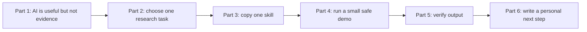
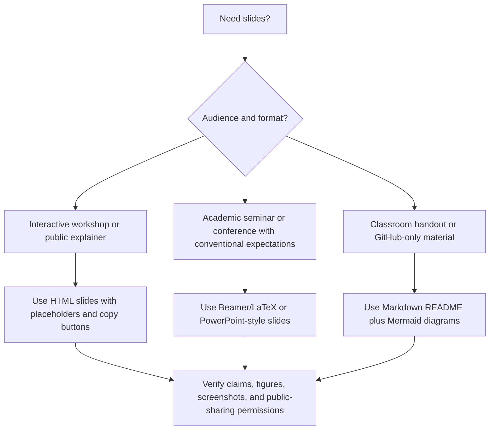

# Teach Workshops, Practice Talks, and Share Slides

This folder is for instructors, PIs, PhD organizers, seminar leaders, and researchers who want to turn the handbook into live teaching or presentation material. Use this README for the teaching flow, exercises, and audience guidance; use [`materials/`](materials/) for the two-hour presentation script and HTML slide deck.

> [!TIP]
> Treat every workshop as a live workflow-design session. Participants should leave with one usable project instruction, one skill, and one verification rule for their own research.

Questions or suggestions for this part: email [jay.liu@bristol.ac.uk](mailto:jay.liu@bristol.ac.uk) with subject `[AI Econ Finance Teaching] Workshop suggestion`.

## Why This Folder Exists

Teaching AI to researchers is not mainly about showing impressive demos. A useful workshop should help participants leave with:

1. a safer mental model of AI;
2. one project setup they can reuse;
3. one copy-ready skill;
4. one concrete verification method;
5. one rule about what not to upload or automate.

For beginners, start with ordinary tools: ChatGPT or Claude for chat, GitHub for version history, VS Code for code/projects, Zotero or BibTeX for sources, and a simple AI-use log.

## Use This Folder For

### Teaching Flow

The simplest strong workshop has three movements: show the problem, let participants use one skill, then make them verify the output.



| Teaching asset | Best visual format | What participants should leave with |
| --- | --- | --- |
| concept explanation | one diagram plus one example | a mental model |
| live demo | side-by-side casual vs controlled prompt | a better instruction habit |
| skill practice | copy block with bracketed fields | a reusable workflow |
| failure case | small case card | a verification method |
| agent setup | approval-gate diagram | a safe file-editing rule |
| presentation practice | Q&A drill table | better answers under pressure |

| Goal | Use |
| --- | --- |
| teach a two-hour presentation | [Two-hour presentation script](materials/two-hour-ai-econ-finance-presentation.md) and [HTML slide deck](materials/two-hour-ai-econ-finance-slides.html) |
| teach a 90-minute introduction | Two-session workshop, Session 1 only |
| teach a half-day workshop | both sessions plus live skill-building |
| onboard RAs | RA onboarding checklist |
| prepare a seminar or job talk | presentation practice activity |
| make shareable material | slide-ready outline and HTML/Beamer skills |

## Two-Hour Presentation Kit

Use this if another scholar wants to teach the handbook as a self-contained talk.

| Asset | Use it for | Notes |
| --- | --- | --- |
| [Two-hour presentation script](materials/two-hour-ai-econ-finance-presentation.md) | readable GitHub version, speaker plan, timed agenda, demos, exercises | source of truth for teaching |
| [Interactive HTML slide deck](materials/two-hour-ai-econ-finance-slides.html) | live presentation | open locally in a browser |
| [Presentation and slide skills](../02-Copy-and-Use-AI-Research-Instructions-and-Templates/skills/06-presentations-slides-websites-and-talk-practice-skills.md) | adapting the talk to other audiences | includes HTML, Beamer, talk-practice, and paper-to-talk prompts |

Suggested use:

```text
1. Read the Markdown script.
2. Open the HTML deck in a browser.
3. Replace any screenshot placeholders only with public or synthetic examples if desired.
4. Use public or synthetic examples only.
5. Keep the live demo small enough to verify in the room.
```

## Beginner Module: What Are These Tools?

Use this 10-minute explanation before live demos.

| Tool | One-sentence explanation | Beginner exercise |
| --- | --- | --- |
| ChatGPT/Claude | chat tools that can reason over supplied context and draft text/code | ask for a structured summary of a public abstract |
| Project | a persistent AI workspace with instructions and files | create one project for one paper idea |
| Codex/Claude Code/Cursor/Copilot | AI coding agents or assistants that can work with files and code | ask for a plan before touching files |
| VS Code | editor for code, Git, terminal, and project navigation | open a repo and inspect a Git diff |
| GitHub | version control, collaboration, issues, releases, and recovery | make a private repo and commit a README |
| Skill | reusable instruction for a repeated task | turn one repeated task into inputs, steps, output, verification |
| MCP/connector | connection from AI to external tools or data | discuss why permissions and data exposure matter |

## Two-Session Workshop

### Session 1: Foundations

Goal: help scholars understand what AI can and cannot do.

Agenda:
1. AI is not evidence.
2. LLMs, projects, skills, agents, MCPs.
3. Data safety and confidentiality.
4. Literature review without fake citations.
5. Empirical methods drafting and checking.
6. Verification methods, not just "be careful."
7. AI-use logs and disclosure.

Exercise:

```text
Take one research task you do repeatedly. Convert it into:
1. purpose
2. safe inputs
3. AI instruction
4. expected output
5. verification checklist
```

Live demo:

```text
Pick a harmless task such as summarizing a public abstract or rewriting a methods paragraph.
Ask AI to do it casually.
Then rerun the task with purpose, inputs, rules, output contract, and verification checklist.
Compare the two outputs.
```

### Session 2: Applied Workflows

Goal: help scholars build a safe workflow.

Agenda:
1. One paper, one repo, one AI project.
2. GitHub safety and `.gitignore`.
3. AGENTS.md and project instructions.
4. Replication-package agent workflow.
5. Presentation practice with AI.
6. Data-pipeline and toy-data testing.
7. Staying updated without hype.

Exercise:

```text
Create a safe AI project setup for one paper:
- project instructions
- folder structure
- data rules
- AI-use log
- first skill to create
- first verification check
```

Live demo:

```text
Take a messy mock research folder.
Ask AI to propose a Git-safe reorganization plan.
Reject any plan that changes raw data, deletes files, or skips verification.
Then show how a branch or worktree isolates the experiment.
```

## Exercise: Verification Is the Skill

```text
Give participants one deliberately flawed AI output:
- a fake citation;
- a coefficient with the wrong unit interpretation;
- a merge plan with look-ahead bias;
- an event-study paragraph that claims parallel trends "passed";
- a slide title that turns correlation into causality.

Ask them to identify:
1. why it looks plausible;
2. what evidence would verify it;
3. what source, code, toy data, or table they need;
4. what sentence or instruction would prevent it next time.
```

Suggested debrief:

```text
The goal is not to distrust everything. The goal is to match each AI output to the correct verification method.
```

## Slide-Ready Outline

### Slide Deck Choice Map



```text
Title: AI for Economics and Finance Research

1. The promise and danger
2. Why AI output is not evidence
3. Research workflow maturity ladder
4. What AI can help with
5. What not to automate
6. Data safety matrix
7. Skills, projects, agents, MCPs
8. GitHub as research safety infrastructure
9. Copy-ready workflows
10. Failure cases
11. Data pipelines and toy-data tests
12. Building your own AI research system
13. Q&A and live workflow design
```

## Workshop Handout: One-Page Rules

```text
1. AI output is not evidence.
2. Never trust generated citations.
3. If AI can edit files, use Git.
4. If data is private, licensed, restricted, or confidential, do not upload it without permission.
5. Plan before execution.
6. Turn repeated tasks into skills.
7. Keep an AI-use log.
8. Check code, tables, equations, and citations against original sources.
9. Use dated tool claims.
10. Automate only when verification is stronger than automation.
```

## RA Onboarding Checklist

```text
Before an RA uses AI on a project:
- read project README
- read DATA.md
- read AGENTS.md
- confirm data privacy rules
- set up Git
- understand branch workflow
- know what files never to edit
- know how to log AI use
- run one small reproducibility check
- ask before uploading or sharing drafts
```

## RA First Assignment

```text
Create a safe project orientation note for this research project.

Use only the files and rules provided by the PI.

Include:
1. project purpose
2. folder map
3. data sensitivity rules
4. files never to edit
5. how to run the main code
6. how to record AI use
7. first reproducibility check
8. questions for the PI
```

## Presentation Practice Activity

Use the [presentation practice skill](../02-Copy-and-Use-AI-Research-Instructions-and-Templates/skills/06-presentations-slides-websites-and-talk-practice-skills.md#skill-3-practice-my-presentation-with-ai).

Ask each participant to prepare:

- one-slide research question
- one-slide design/data
- one-slide main result
- one-slide limitation

Then have AI generate tough questions and require human answers.

## End-to-End Classroom Activity

Use one synthetic project for the whole session so participants see how skills compose.

```text
Synthetic project:
Does a local policy shock affect firm investment?

Teams:
1. idea and mechanism team
2. literature map team
3. design and identification team
4. data pipeline team
5. methods prose team
6. verification and failure-case team
7. presentation team

Each team uses one skill from the repo and produces:
- input facts;
- AI instruction used;
- output artifact;
- verification checklist;
- one thing they refused to let AI decide.
```

## Slide-Building Exercise

Use both slide styles so participants see the tradeoff.

| Slide style | Exercise | Best for |
| --- | --- | --- |
| HTML interactive | create an animated mechanism, event timeline, or data-flow slide | teaching, online sharing, public explainers |
| LaTeX/Beamer | create a standard seminar deck with equations, tables, and limitations | conferences, job talks, academic seminars |

Prompt:

```text
Take this paper abstract and results summary.
Create two presentation plans:
1. an interactive HTML explainer deck;
2. a traditional LaTeX Beamer seminar deck.

For each, explain:
- target audience
- slide sequence
- what interaction or equation belongs where
- what claims must be verified
- where limitations should be shown
```
