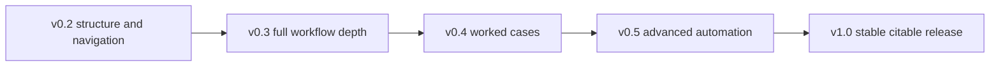

# Roadmap

Use this roadmap as a linked status map. The main reader path is the root [README](../README.md); this page is for maintainers and contributors who want to see what each release is trying to improve.

| Version | Reader-facing goal | Main linked surfaces |
| --- | --- | --- |
| [v0.2](#v02-resource-first-reorganization) | resource-first bilingual handbook and practical skill library | [01 handbook](../01-Start-Here-to-Learn-AI-for-Econ-Finance-Research/README.md), [02 skills](../02-Copy-and-Use-AI-Research-Instructions-and-Templates/README.md), [03 workflows](../03-Set-Up-Agents-and-Automated-Research-Workflows/README.md), [ZH Chinese path](../ZH-中文-AI经济金融研究手册/README.md) |
| [v0.3](#v03-full-research-workflow) | deeper research workflow coverage | [02 skills](../02-Copy-and-Use-AI-Research-Instructions-and-Templates/README.md), [04 examples](../04-See-Examples-Diagrams-and-Failure-Cases/README.md) |
| [v0.4](#v04-case-studies) | concrete econ/finance case studies | [04 examples](../04-See-Examples-Diagrams-and-Failure-Cases/README.md), [06 teaching](../06-Teach-Workshops-Practice-Talks-and-Share-Slides/README.md) |
| [v0.5](#v05-advanced-automation) | stronger agentic and repeatable workflows | [03 workflows](../03-Set-Up-Agents-and-Automated-Research-Workflows/README.md), [05 sources](../05-Check-Builders-Official-Docs-and-Resources/README.md) |
| [v1.0](#v10-stable-citable-release) | stable citable release | [citation and maintenance](README.md) |

## v0.2: Resource-First Reorganization

Goal: make the repository easier to read and use as a bilingual handbook plus practical resource library.

Included:

- bilingual root README with English and Chinese sections in the same file
- long-form handbook folder with book-style navigation, learning checkpoints, concept glossary, and knowledge links
- directly usable research instructions folder
- workflow setup folder for AI projects
- examples, diagrams, and failure cases folder
- source/resource folder for brief workflow influences and official docs
- teaching, workshop, and slide-ready material folder
- minimum setup, maturity ladder, what-not-to-automate, data sensitivity, AI-use log, review standards, and citation guidance
- tailored direct-use skills for interactive HTML research slides, traditional LaTeX/Beamer research slides, presentation practice, and personal academic websites
- AI learning-library layer, resource inclusion rules, and AI information-diet guidance
- action-oriented folder names and one README per major folder whenever possible

## v0.1: Useful First Release

Goal: make the repository immediately useful for economics and finance scholars.

Included:

- GitHub-native handbook structure
- beginner entry point and learning paths
- responsible-use foundations
- AI skills management
- ChatGPT and Claude project concept
- five complete project guides:
  - literature review
  - empirical paper
  - theory paper
  - replication
  - seminar presentation
- GitHub and research-safety foundations

## v0.3: Full Research Workflow

Add fuller pages for:

- research questions
- literature mapping
- theory and mechanism
- data and measurement
- identification
- empirical strategy
- results and robustness
- submission and revision
- Stata, R, Python, and LaTeX workflows

## v0.4: Case Studies

Add realistic examples:

- asset pricing literature review
- corporate finance empirical paper
- event study
- panel data
- text as data
- seminar talk

## v0.5: Advanced Automation

Add:

- RAG for literature libraries
- local LLMs for sensitive research
- AI agents
- batch paper reading
- automated code review
- research monitoring

## v1.0: Stable Citable Release

Release when the structure is stable, core pages are complete, and citation metadata is final.
