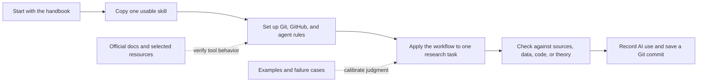

# AI for Economics and Finance Research

A practical, GitHub-native handbook and resource library for using AI responsibly in economics and finance research.

> [!IMPORTANT]
> This repository is built around a simple workflow: read the handbook, copy a skill, use it on a real research task, verify the output, and record what changed.

## Choose Your Language / 选择语言

| English | 中文 |
| --- | --- |
| [Read below in English](#english) | [阅读完整中文入口页](ZH-中文-AI经济金融研究手册/README.md) |

---

## English

This repository is designed for readers who want to **click, copy, paste, adapt, and verify**. It is not a prompt dump and not a tool list.

The main page keeps only the primary reading and working folders visible. Supporting files and old short pages are consolidated under [Repository Reference and Maintenance](99-Repository-Reference-and-Maintenance/README.md).

### Visual Reader Map

Use this map when you are not sure where to click first.

### Start Here

| Need | Open |
| --- | --- |
| Read the handbook like a book | [01 Start Here: Learn AI for Economics and Finance Research](01-Start-Here-to-Learn-AI-for-Econ-Finance-Research/README.md) |
| Copy usable instructions, skills, and templates | [02 Copy and Use: AI Research Instructions and Templates](02-Copy-and-Use-AI-Research-Instructions-and-Templates/README.md) |
| Set up agents and automated research workflows | [03 Set Up: Agents and Automated Research Workflows](03-Set-Up-Agents-and-Automated-Research-Workflows/README.md) |
| See concrete examples, diagrams, and failure cases | [04 See Examples: Diagrams and Failure Cases](04-See-Examples-Diagrams-and-Failure-Cases/README.md) |
| Check official docs and durable references | [05 Check Sources: Builders, Official Docs, and Resources](05-Check-Builders-Official-Docs-and-Resources/README.md) |
| Teach a workshop, onboard RAs, or prepare talks | [06 Teach and Share: Workshops, Practice Talks, and Slides](06-Teach-Workshops-Practice-Talks-and-Share-Slides/README.md) |

### Fast Paths

| If you have 15 minutes and want... | Go directly to... |
| --- | --- |
| a research idea stress test | [Research Idea Stress Test](02-Copy-and-Use-AI-Research-Instructions-and-Templates/01-ideas-brainstorming-proposal-and-literature-skills.md#skill-1-research-idea-stress-test) |
| a zero-to-working Git/GitHub/agent setup | [Zero To Working Setup](03-Set-Up-Agents-and-Automated-Research-Workflows/README.md#zero-to-working-setup) |
| a source-grounded literature review | [Literature Review and Source Synthesis Skills](02-Copy-and-Use-AI-Research-Instructions-and-Templates/10-literature-review-and-source-synthesis-skills.md) |
| an empirical methods section | [Economics Methods Skill](02-Copy-and-Use-AI-Research-Instructions-and-Templates/03-empirical-methods-skills-for-economics-research.md#skill-1-draft-empirical-methods-section-for-economics) or [Finance Methods Skill](02-Copy-and-Use-AI-Research-Instructions-and-Templates/04-empirical-methods-skills-for-finance-research.md#skill-1-draft-empirical-methods-section-for-finance) |
| a data-cleaning or merge pipeline | [Data Cleaning, Merging, Analysis, and Output Skills](02-Copy-and-Use-AI-Research-Instructions-and-Templates/14-data-cleaning-merging-analysis-and-output-skills.md) |
| dataset links and access/confidentiality notes | [Dataset Starting Points and Access Notes](05-Check-Builders-Official-Docs-and-Resources/README.md#dataset-starting-points-and-access-notes) |
| causal inference or time-series checks | [Causal Inference, Econometrics, and Time-Series Skills](02-Copy-and-Use-AI-Research-Instructions-and-Templates/11-causal-inference-econometrics-and-time-series-skills.md) |
| a text-as-data or LLM measurement design | [Text-as-Data and LLM Measurement Skills](02-Copy-and-Use-AI-Research-Instructions-and-Templates/15-text-as-data-and-llm-measurement-skills.md) |
| a structural, quantitative, or welfare check | [Structural, Quantitative, and Welfare Skills](02-Copy-and-Use-AI-Research-Instructions-and-Templates/16-structural-quantitative-and-welfare-skills.md) |
| an AI-output verification method | [Verification, Reproducibility, and Disclosure Skills](02-Copy-and-Use-AI-Research-Instructions-and-Templates/17-verification-reproducibility-and-disclosure-skills.md) |
| a sharper research question or contribution | [Research Question, Taste, and Positioning Skills](02-Copy-and-Use-AI-Research-Instructions-and-Templates/18-research-question-taste-and-positioning-skills.md) |
| theory model review | [Theory Model and Math Skills](02-Copy-and-Use-AI-Research-Instructions-and-Templates/12-theory-model-and-math-skills.md) |
| a safe project cleanup | [Clean Existing Research Project and Set Up Git](03-Set-Up-Agents-and-Automated-Research-Workflows/01-clean-existing-research-project-and-set-up-git.md) |
| a detailed agentic workflow runbook | [Agentic Workflow Anatomy](03-Set-Up-Agents-and-Automated-Research-Workflows/README.md#agentic-workflow-anatomy) |
| a coauthor, RA, or team workflow with agents | [Collaborating With Coauthors, RAs, And Agents](03-Set-Up-Agents-and-Automated-Research-Workflows/README.md#collaborating-with-coauthors-ras-and-agents) |
| presentation practice | [Practice My Presentation With AI](02-Copy-and-Use-AI-Research-Instructions-and-Templates/06-presentations-slides-websites-and-talk-practice-skills.md#skill-3-practice-my-presentation-with-ai) |
| a two-hour teaching deck for AI in econ/finance research | [Presentation script](06-Teach-Workshops-Practice-Talks-and-Share-Slides/two-hour-ai-econ-finance-presentation.md) and [HTML slides](06-Teach-Workshops-Practice-Talks-and-Share-Slides/two-hour-ai-econ-finance-slides.html) |
| plain-language explanations of Git, agents, MCPs, and other technical terms | [Beginner Tool Glossary](01-Start-Here-to-Learn-AI-for-Econ-Finance-Research/README.md#3-beginner-tool-glossary) |
| a low-noise AI resource database | [Build a Low-Noise AI Research Resource Database](02-Copy-and-Use-AI-Research-Instructions-and-Templates/09-tool-selection-updates-and-skill-improvement.md#skill-5-build-a-low-noise-ai-research-resource-database) |
| a weekly AI update filter | [AI Research Update Digest Workflow](03-Set-Up-Agents-and-Automated-Research-Workflows/04-ai-research-update-digest-workflow.md) |

### Reader Rule

AI can automate labor, but not scholarly responsibility. Treat AI output as a draft, checklist, critique, explanation, or coding aid. Verify claims, citations, coefficients, code, equations, and policy details before using them in research.

Always read and follow your university, employer, funder, journal, conference, data-provider, and coauthor rules on AI use. When those rules are stricter than this repository, follow the stricter rule.

### Direct-Use Promise

Every practical page should make the usable object obvious:

- **Copy block**: a prompt, instruction, checklist, code block, or workflow readers can reuse.
- **Inputs**: what the reader must provide.
- **Output**: what AI should produce.
- **Risk**: what can go wrong.
- **Verification**: what the scholar must check manually.
- **Questions**: what the AI should ask before proceeding when inputs, terms, data rules, permissions, or output expectations are unclear.

If a page only talks around a workflow, revise it into a directly usable skill, template, checklist, code block, or example.

### Repository Structure

| Folder | What readers should do there |
| --- | --- |
| [01-Start-Here-to-Learn-AI-for-Econ-Finance-Research](01-Start-Here-to-Learn-AI-for-Econ-Finance-Research/README.md) | Read one consolidated handbook on concepts, risks, research workflow, empirical work, writing, and automation. |
| [02-Copy-and-Use-AI-Research-Instructions-and-Templates](02-Copy-and-Use-AI-Research-Instructions-and-Templates/README.md) | Copy ready-to-use instructions, skills, prompts, logs, checklists, and agent rules. |
| [03-Set-Up-Agents-and-Automated-Research-Workflows](03-Set-Up-Agents-and-Automated-Research-Workflows/README.md) | Use step-by-step workflows for Git setup, one-paper-one-repo projects, replication packages, and update digests. |
| [04-See-Examples-Diagrams-and-Failure-Cases](04-See-Examples-Diagrams-and-Failure-Cases/README.md) | Learn from concrete examples, diagrams, failure cases, and applied economics/finance scenarios. |
| [05-Check-Builders-Official-Docs-and-Resources](05-Check-Builders-Official-Docs-and-Resources/README.md) | Verify source claims, official docs, builder workflows, and resource inclusion rules. |
| [06-Teach-Workshops-Practice-Talks-and-Share-Slides](06-Teach-Workshops-Practice-Talks-and-Share-Slides/README.md) | Use workshop outlines, slide-ready material, classroom exercises, presentation practice, and RA onboarding material. |
| [99-Repository-Reference-and-Maintenance](99-Repository-Reference-and-Maintenance/README.md) | Open only when you need citation, contribution, review, changelog, roadmap, or archived old pages. |

### Suggest a Skill or Correction

Email [jay.liu@bristol.ac.uk](mailto:jay.liu@bristol.ac.uk) with one of these subject lines:

- `[AI Econ Finance Handbook] Question or correction`
- `[AI Econ Finance Skills] Suggest a new skill`
- `[AI Econ Finance Chinese] 中文版本建议`

### Get Updates Safely

Low-risk options:

| Option | How to use it | Privacy/security note |
| --- | --- | --- |
| GitHub Watch | Use GitHub's Watch button and choose the notification level you want. | Best if you already use GitHub. The repo owner does not need to collect your email address. |
| GitHub Releases | Watch releases if you only want stable update notices. | Good for low-noise updates. |
| Email update list | Email [jay.liu@bristol.ac.uk](mailto:jay.liu@bristol.ac.uk) with subject `[AI Econ Finance Updates] Subscribe`. | Send only your name and email address if you want. Do not send research data, manuscripts, referee material, student data, or confidential information. |

Email list rules:

- Use the list only for repository updates, release notes, workshops, and major new skill pages.
- Store only the minimum needed contact information.
- Do not share the list with third parties.
- Do not send attachments or confidential research material to subscribe.
- To leave, email the same address with subject `[AI Econ Finance Updates] Unsubscribe`.
- If your university, employer, or institution has stricter information-security rules, follow those rules.

### What AI Can Help With

- organizing literature notes
- clarifying research questions and mechanisms
- explaining and reviewing Stata, R, Python, MATLAB, and LaTeX
- drafting and checking empirical methods sections
- improving paper structure and language
- preparing seminar talks and referee responses
- building repeatable project workflows
- setting up Git, logs, and replication checks

### What AI Should Not Be Trusted With

- citations without verification
- causal interpretation without expert judgment
- confidential data or referee material without policy approval
- final literature claims
- theoretical derivations without manual checking
- final submission decisions

### What Makes This Repo Different

| Not this | Instead this repo tries to provide |
| --- | --- |
| prompt dump | reusable research skills with inputs, outputs, and verification |
| tool ranking | dated tool evaluation by task |
| "AI writes papers" | AI helps build accountable research workflows |
| generic productivity advice | economics and finance-specific workflows |
| scattered links | source-aware synthesis and official docs |

---

## 中文

这是一个 GitHub 原生的手册和资源库，帮助经济学和金融学研究者负责任地使用 AI 和大语言模型。本仓库不是提示词合集，也不是 AI 工具清单，而是面向研究流程、数据安全、可复现性和人工核查的实用手册。

### 从这里开始

| 需求 | 打开 |
| --- | --- |
| 进入完整中文阅读路径 | [中文入口：AI 经济金融研究手册](ZH-中文-AI经济金融研究手册/README.md) |
| 像读书一样学习核心概念 | [01 从这里开始：AI 经济金融研究手册](ZH-中文-AI经济金融研究手册/01-从这里开始：AI经济金融研究手册.md) |
| 复制可直接使用的技能、指令和模板 | [02 复制即用：AI 研究指令与模板](ZH-中文-AI经济金融研究手册/02-复制即用：AI研究指令与模板.md) |
| 搭建 agent 和自动化研究工作流 | [03 设置 Agent 和自动化研究工作流](ZH-中文-AI经济金融研究手册/03-设置Agent和自动化研究工作流.md) |
| 看例子、图示和失败案例 | [04 案例、图示与失败案例](ZH-中文-AI经济金融研究手册/04-案例图示与失败案例.md) |
| 查资料来源、官方文档和更新方式 | [05 资料来源、官方文档与更新](ZH-中文-AI经济金融研究手册/05-资料来源官方文档与更新.md) |
| 教工作坊、培训 RA、练习展示 | [06 教学、工作坊、展示与分享](ZH-中文-AI经济金融研究手册/06-教学工作坊展示与分享.md) |

### 快速入口

| 如果你有 15 分钟并且想要... | 直接打开... |
| --- | --- |
| 检查研究想法、写 proposal、写文献综述、写方法段落 | [02 复制即用：AI 研究指令与模板](ZH-中文-AI经济金融研究手册/02-复制即用：AI研究指令与模板.md) |
| 从零设置 Git、GitHub 和 AI agent 工作流 | [中文从零设置路径](ZH-中文-AI经济金融研究手册/03-设置Agent和自动化研究工作流.md#从零开始设置-gitgithub-和-ai-agent) |
| 设计数据清洗、合并、变量构造、表格和图形 workflow | [中文数据工作流模板](ZH-中文-AI经济金融研究手册/02-复制即用：AI研究指令与模板.md#数据清洗合并和输出工作流) |
| 查经济学和金融学常用数据入口及权限提醒 | [中文数据资源与访问说明](ZH-中文-AI经济金融研究手册/05-资料来源官方文档与更新.md#常用经济金融数据入口和权限提醒) |
| 做 text-as-data 或 LLM-generated variable | [中文 Text-as-Data 模板](ZH-中文-AI经济金融研究手册/02-复制即用：AI研究指令与模板.md#text-as-data-和-llm-measurement-协议) |
| 选择 AI 输出核查方法 | [中文核查方法选择器](ZH-中文-AI经济金融研究手册/02-复制即用：AI研究指令与模板.md#ai-输出核查方法选择器) |
| 理解 Git、agent、MCP 等技术词 | [中文技术词解释](ZH-中文-AI经济金融研究手册/01-从这里开始：AI经济金融研究手册.md#这些技术词在研究项目里是什么意思) |
| 清理项目、设置 Git、写 `AGENTS.md` 或 `CLAUDE.md` | [03 设置 Agent 和自动化研究工作流](ZH-中文-AI经济金融研究手册/03-设置Agent和自动化研究工作流.md) |
| 查看 agentic workflow 具体步骤和批准表 | [中文 Agent 工作流](ZH-中文-AI经济金融研究手册/03-设置Agent和自动化研究工作流.md#agentic-workflow-应该如何运行) |
| 与 coauthors、RA 或团队一起使用 AI agent | [中文协作式 AI 工作流](ZH-中文-AI经济金融研究手册/03-设置Agent和自动化研究工作流.md#与合作者ra-和团队一起使用-ai-agent) |
| 学习失败案例，避免假引用、错代码、过度因果解释 | [04 案例、图示与失败案例](ZH-中文-AI经济金融研究手册/04-案例图示与失败案例.md) |
| 安全获取更新、查看资料来源、判断外部资源 | [05 资料来源、官方文档与更新](ZH-中文-AI经济金融研究手册/05-资料来源官方文档与更新.md) |
| 建立低噪音 AI 资源库 | [中文资源库结构模板](ZH-中文-AI经济金融研究手册/05-资料来源官方文档与更新.md#可以借鉴的资源库结构) |
| 设计 workshop、培训 RA、练习 seminar 或 job talk | [06 教学、工作坊、展示与分享](ZH-中文-AI经济金融研究手册/06-教学工作坊展示与分享.md) |

### 核心原则

AI 可以自动化劳动，但不能替代学术责任。AI 输出只能作为草稿、解释、清单、批评意见或代码辅助，必须用原始文献、数据、代码或推导来核查。

### 安全获取更新

| 方式 | 如何使用 | 隐私与信息安全说明 |
| --- | --- | --- |
| GitHub Watch | 点击 GitHub 的 Watch 按钮，选择你想收到的通知类型。 | 推荐给 GitHub 用户。仓库维护者不需要额外收集你的邮箱。 |
| GitHub Releases | 只关注 releases，接收稳定版本更新。 | 适合只想收到低频更新的读者。 |
| 邮件更新列表 | 给 [jay.liu@bristol.ac.uk](mailto:jay.liu@bristol.ac.uk) 发邮件，标题写 `[AI Econ Finance Updates] Subscribe`。 | 只发送姓名和邮箱即可。不要发送研究数据、论文草稿、审稿材料、学生数据或任何 confidential information。 |

邮件列表规则：

- 只用于本仓库更新、版本说明、工作坊信息和重要技能更新。
- 只保存必要联系信息。
- 不向第三方分享邮件列表。
- 订阅时不要发送附件或任何保密、受限、授权数据库或未公开研究材料。
- 退订邮件标题写 `[AI Econ Finance Updates] Unsubscribe`。
- 如果你的学校、雇主或机构有更严格的信息安全要求，请遵守更严格的规则。

### 仓库结构

| 中文页面 | 用途 |
| --- | --- |
| [中文入口](ZH-中文-AI经济金融研究手册/README.md) | 中文路径总导航。 |
| [01 从这里开始](ZH-中文-AI经济金融研究手册/01-从这里开始：AI经济金融研究手册.md) | AI 概念、风险、数据安全、Git 和研究责任。 |
| [02 复制即用](ZH-中文-AI经济金融研究手册/02-复制即用：AI研究指令与模板.md) | 中文可复制模板，包括研究想法、文献综述、实证方法、因果识别、理论模型和展示练习。 |
| [03 设置 Agent](ZH-中文-AI经济金融研究手册/03-设置Agent和自动化研究工作流.md) | Git、`AGENTS.md`、`CLAUDE.md`、worktree 和 agent 安全门。 |
| [04 案例与失败案例](ZH-中文-AI经济金融研究手册/04-案例图示与失败案例.md) | 真实研究场景中的好用法、坏用法和失败案例。 |
| [05 资料来源与更新](ZH-中文-AI经济金融研究手册/05-资料来源官方文档与更新.md) | 安全订阅更新、跟进官方文档和判断外部资源。 |
| [06 教学与分享](ZH-中文-AI经济金融研究手册/06-教学工作坊展示与分享.md) | 工作坊、RA 培训、展示练习和教学材料。 |
