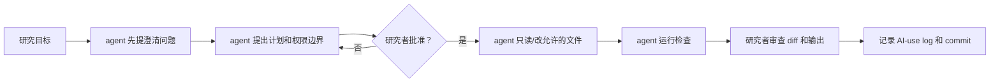

# 03 设置 Agent 和自动化研究工作流

这一页解释如何安全使用 Codex、Claude Code、Cursor、GitHub Copilot 等工具，让 AI 帮助计划、修改文件、运行代码、检查输出和整理项目。

> [!WARNING]
> 只要 AI 能改文件，就必须用 Git。只要涉及数据、代码、论文文本或公开发布，就必须有人工批准、人工核查和日志记录。

## 为什么需要这一页？

普通聊天工具只是回答问题。Agentic AI 不只是回答，它可能会读文件、改代码、运行命令、连接外部工具、生成 commit 或准备发布材料。对研究者来说，这很有用，但也更危险。

你需要这一页是因为：

1. AI 可能改错文件或覆盖结果；
2. AI 可能把 raw data、授权数据或保密材料放到不该放的地方；
3. AI 可能写出能运行但不符合研究设计的代码；
4. AI 可能让项目看起来更整洁，但降低可复现性；
5. 你需要 Git、日志和安全门来追踪它做了什么。

## 初学者工具地图

| 工具/概念 | 简单解释 | 适合做什么 | 风险 |
| --- | --- | --- | --- |
| ChatGPT/Claude Project | 有长期上下文、文件和 instructions 的 AI 工作区 | 一个论文、一个文献综述、一个展示 | 文件过期、隐私设置、错误引用 |
| Codex | OpenAI 的代码/repo agent | 改代码、跑测试、检查 Git diff | 必须审查所有改动 |
| Claude Code | Claude 的命令行/repo agent | 项目级写作、代码、skills、agents | 权限和 auto mode 要谨慎 |
| VS Code | 代码编辑器和项目工作台 | 看文件、运行脚本、处理 Git | 不能替代验证 |
| `AGENTS.md` | 给 coding agent 的项目说明 | 规定项目结构、验证命令、禁止编辑文件 | 写得太泛会导致行为太泛 |
| `CLAUDE.md` | Claude Code 项目记忆和规则 | 保存项目阶段、规则、命令 | 过期规则会误导 AI |
| MCP/connector | 让 AI 连接外部工具或数据 | Zotero、GitHub、搜索、数据库 | 权限和数据暴露 |

## 这些词在实际操作中长什么样？

| 术语 | 具体例子 |
| --- | --- |
| `.gitignore` | 一个写着 `data/raw/` 的文件，意思是原始数据不被 Git 追踪，也不应上传 GitHub。 |
| branch | `codex/rewrite-table-code`，让 agent 在旁支里改表格代码，主项目先不受影响。 |
| worktree | 第二个项目文件夹，让另一个 agent 在不同 branch 上改 introduction。 |
| diff | AI 改文件后显示的逐行修改记录。 |
| commit | 一个命名检查点，例如 `Add data dictionary and merge checks`。 |
| MCP | 让 AI 连接 GitHub、Zotero、Drive 或数据库的接口；只有权限清楚时才使用。 |
| agent permission | 规定 AI 是否可以读文件、改文件、运行命令、安装包、push GitHub 或连接外部工具。 |
| approval gate | AI 在改文件、移动数据、公开发布或运行高风险命令前必须停下来询问。 |

给任何 agent 的有用规则：

```text
如果你使用非计算机专业经济学/金融学研究者可能不熟悉的软件或 AI 术语，请先用一句话解释，并给出本项目中的例子。
```

## Agentic workflow 应该如何运行？

Agentic workflow 不应该是一句“大指令”，而应该是一连串小合同：



| 步骤 | agent 应该给出什么 | 研究者要决定什么 |
| --- | --- | --- |
| 澄清 | 缺失输入、不清楚的术语、数据敏感性问题 | 回答、缩小范围或停止 |
| 计划 | 可读文件、可改文件、禁止文件、命令、风险 | 批准或要求修改 |
| 执行 | 小范围、按批准计划执行 | 不接受未审查改动 |
| 检查 | 跑过的命令、检查过的输出、失败原因 | 重跑、拒绝或继续 |
| 追踪 | diff 摘要、AI-use log、commit 建议 | 审查后再 commit |

### 具体任务例子

| 研究任务 | 安全 agent 角色 | 可以做什么 | 不能做什么 | 成功标准 |
| --- | --- | --- | --- | --- |
| 清理旧项目文件夹 | project organizer | 列文件、提结构、批准后写 README/DATA/AGENTS | 删除文件、改 raw data、push 公开 repo | raw data 未动，Git diff 已审查 |
| 设计 WRDS 合并 | data-construction assistant | 写 query plan、变量字典、audit tables、toy merge | 暴露账号、上传授权数据、假设 ticker 匹配足够 | link 逻辑和 timing rule 写清楚 |
| debug Table 2 代码 | coding assistant | 看代码、提修复、批准后改脚本、跑最小测试 | 悄悄改 sample restriction 或手改输出 | 代码能跑，输出和预期表格一致 |
| 准备 seminar Q&A | talk opponent | 提尖锐问题、写简短回答、标出弱 slide | 编造结果、隐藏限制、强化因果说法 | 回答都能追溯到论文证据 |
| 处理 GitHub review comments | PR assistant | 总结评论、提修复、改批准文件 | 未批准就 resolve、reply、push | 评论已回应，检查通过 |

### 批准表模板

```text
在编辑前，请先给我一个批准表：

| 拟执行动作 | 影响文件 | 为什么需要 | 风险 | 验证命令/检查 | 是否需要批准 |
| --- | --- | --- | --- | --- | --- |

规则：
- 不要编辑 raw、restricted、private 或 licensed data。
- 不要悄悄改变样本定义、变量构造、识别假设或论文结论。
- 未经批准，不要安装包、push GitHub、公开发布或连接外部服务。
- 如果术语或风险不清楚，请用普通语言解释并提问。
```

## 什么时候使用自动化？

| 情况 | 推荐方式 | 注意事项 |
| --- | --- | --- |
| 旧项目文件夹很乱 | 先备份，再设置 Git 和 `.gitignore` | 不删除文件，不提交 raw/restricted data。 |
| 一个正在写的 paper | one paper, one repo, one AI project | 先写 project instructions，再让 AI 编辑。 |
| 复现包 | replication package workflow | 代码没跑通前，不声称复现成功。 |
| 多个任务并行 | branch 或 worktree | 不让多个 agent 改同一个文件。 |
| GitHub review comments | PR comment triage | 不经同意不公开回复、不 resolve、不 push。 |

## Agent 四道安全门

```text
Gate 1: Plan
- agent 要做什么？
- 可以读哪些文件？
- 可以改哪些文件？
- 禁止改哪些文件？
- 用什么命令验证？

Gate 2: Approval
- 文件修改、数据移动、公开分享、GitHub 写操作前必须人工批准。

Gate 3: Verification
- 运行代码、编译 paper/slides、检查 diff、对比输出或核查来源。

Gate 4: Trace
- 记录改了哪些文件、跑了哪些命令、检查了哪些输出、还有什么不确定、commit hash 是什么。
```

## 清理旧项目并设置 Git

```text
我想清理这个研究项目并设置安全的 Git 工作流。

在改变任何文件前：
1. 检查当前文件夹结构。
2. 判断哪些可能是 raw data、derived data、code、paper、figures、tables、logs、temporary files。
3. 提出备份方案。
4. 提出 `.gitignore`。
5. 提出清理后的文件夹结构。
6. 等我批准后再移动文件。

批准后：
1. 创建或更新 README.md、DATA.md、AGENTS.md、AI-USE-LOG.md。
2. 把文件整理到 data/raw、data/derived、code、output/tables、output/figures、paper、slides。
3. 如有需要，初始化 Git。
4. 提交初始版本。
5. 新建 branch 进行重组。
6. 运行被移动或修改的代码。
7. 尽可能对比旧输出和新输出。

规则：
- 不删除文件。
- 不修改 raw data。
- 不提交 restricted/private data。
- 不经明确批准，不 push 到公开 GitHub。
- 如果项目路径、数据敏感性、GitHub 隐私设置或软件环境不清楚，先提出最多五个澄清问题。
- 首次出现 `.gitignore`、branch、commit、diff、raw data 等术语时，用普通语言解释。
```

## `AGENTS.md` 基本模板

```markdown
# AGENTS.md

## 项目目的
[用一段话说明研究项目。]

## AI agent 规则
- 不要编辑 `data/raw/`、`data/restricted/`、`data/private/`。
- 不要提交或暴露 private、restricted、licensed、identifiable 或 confidential data。
- 重组文件夹前必须先说明计划并等待批准。
- 改代码前先说明计划。
- 改代码后运行最小相关测试或脚本。
- 改论文文字时保留 citation、数字、notation、hedging。
- 不要编造结果、引用、稳健性检验或制度事实。
- 如果任务、数据敏感性、验证命令或权限边界不清楚，先提问。
- 对非计算机专业经济学/金融学研究者简要解释技术词。

## 文件夹结构
- `data/raw/`：原始数据，不要编辑
- `data/derived/`：清洗后数据
- `code/`：脚本
- `output/tables/`：生成的表格
- `output/figures/`：生成的图
- `paper/`：论文
- `slides/`：展示材料

## 完成前必须报告
- 改了哪些文件
- 跑了哪些命令
- 检查了哪些输出
- 还有什么不确定
```

## `CLAUDE.md` 基本模板

```markdown
# CLAUDE.md

## 项目阶段
[idea / data cleaning / empirical analysis / theory / writing / revision / replication]

## 不可违反的规则
- 不要编辑 `data/raw/`、`data/restricted/`、`data/private/`。
- 不要上传、暴露、总结或提交 private、restricted、licensed、identifiable 或 confidential material。
- 改文件结构、运行危险命令、重写论文、准备公开材料前必须问我。
- 保留 citation、数字、notation、table labels、变量定义、样本定义和 hedging。
- 不要编造结果、引用、数据来源、稳健性检验、制度事实或理论结论。
- 如果任务、数据规则、验证命令或预期输出不清楚，先提出澄清问题。
- 对非计算机专业经济学/金融学研究者简要解释技术词。

## 推荐工作流
1. 重述任务。
2. 提出计划。
3. 指出要读或改的文件。
4. 指出风险。
5. 需要编辑或公开操作时等待批准。
6. 小范围执行。
7. 运行检查。
8. 报告文件、命令、输出和不确定性。
```

## 并行 agent 和 worktree

```text
请帮我安全设置多个 AI agent 并行工作。

项目：
[项目说明]

任务：
1. [任务 A]
2. [任务 B]
3. [任务 C]

规则：
- 每个 agent 只有一个窄任务。
- 每个 agent 使用不同 branch 或 worktree。
- 不允许任何 agent 编辑 raw data。
- 不允许任何 agent 直接 push 到 main。
- 每个 agent 必须报告改了哪些文件、跑了哪些命令、检查了哪些输出、还有什么不确定。
- 如果任务分配、可编辑文件、禁止编辑文件或验证命令不清楚，先提出澄清问题。

请先提出：
1. branch/worktree 名称；
2. 任务分配；
3. 每个 agent 可以编辑的文件；
4. 每个 agent 禁止编辑的文件；
5. 每个任务的验证命令；
6. merge 顺序和冲突风险。
```

## 下一步

如果你需要可复制技能，请回到 [02 复制即用：AI 研究指令与模板](02-复制即用：AI研究指令与模板.md)。如果你需要英文完整工作流，可查看 [英文自动化工作流文件夹](../03-Set-Up-Agents-and-Automated-Research-Workflows/README.md)。
