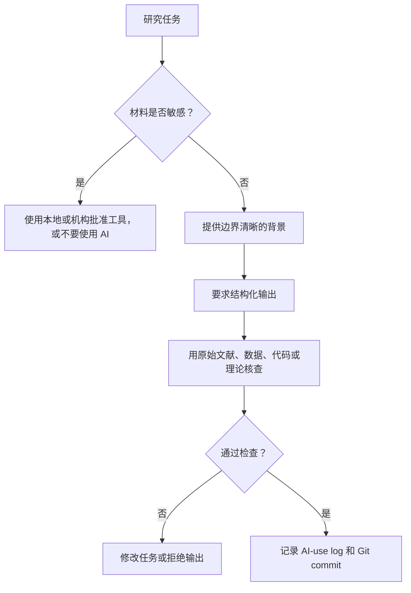

# 04 案例、图示与失败案例

这一页用案例说明：怎样负责任地使用 AI，怎样发现看起来合理但实际错误的 AI 输出。

## AI 辅助研究流程



## 案例 1：Asset Pricing 文献综述

任务：为一个 return predictability 项目定位文献贡献。

好的用法：

- 基于你提供的真实论文构建 literature matrix；
- 区分 predictor、sample、horizon、benchmark 和结果；
- 标出 factor-mining 和 multiple-testing 风险；
- 标出哪些 novelty claims 必须人工核查。

坏的用法：

- 让 AI “找所有相关文献”并直接相信；
- 接受 AI 编造的引用；
- 不读最接近的论文就写 contribution。

## Agentic 版本：一个项目从文件到输出

只有当项目已经有 Git、`.gitignore`、`DATA.md`、`AGENTS.md` 和 `AI-USE-LOG.md` 时，才建议使用。

```text
bank-closures-small-firms/
  README.md
  DATA.md
  AGENTS.md
  AI-USE-LOG.md
  data/raw/          # 不编辑，不提交
  data/derived/
  code/
  output/tables/
  output/figures/
  paper/
  slides/
```

| 阶段 | agent 任务 | 可改文件 | 禁止文件 | 人工批准点 | 成功检查 |
| --- | --- | --- | --- | --- | --- |
| repo intake | 检查结构并建议 `.gitignore` | 先只读文件列表 | 所有编辑 | 批准清理方案 | raw data 未动且被 ignore |
| data dictionary | 根据 metadata 写 `DATA.md` | `DATA.md` | 原始记录 | 批准敏感性标签 | 数据权限规则明确 |
| toy pipeline | 写 synthetic toy data 和 merge test | `code/toy_*`、`output/logs/` | 真实数据 | 批准 toy test 逻辑 | 已知答案测试通过 |
| real pipeline | toy test 后更新数据脚本 | 批准的 `code/` 文件 | `data/raw/` | 批准具体文件 | 脚本能跑且打印 audit tables |
| methods audit | 对照 code/table 检查 methods | `paper/methods.md` 草稿或评论 | code/data，除非批准 | 批准文字修改 | 方法与代码、样本一致 |
| talk prep | 写 Q&A 和 slide outline | `slides/` 和复制图 | raw data、code | 批准公开表述 | slide claim 能追溯到论文 |
| trace | 写 AI-use log 和 commit message | `AI-USE-LOG.md` | 无 | 批准 commit | diff 已审查并记录 |

坏的 agentic workflow：

```text
agent 一次性改数据脚本、改 methods、重生成图、更新 slides，没有先问哪些文件可以改。
```

为什么不好：

- 混合了数据、代码、论文结论和公开展示；
- 很难逐步审查；
- methods 可能引用了未验证代码；
- raw 或授权数据可能被错误暴露。

## 案例 2：Corporate Finance 实证方法

任务：写 firm-level panel design 的 methods section。

好的用法：

- 明确观测单位；
- 检查 treatment、controls、outcome 的时间顺序；
- 检查 fixed effects 是否吸收关键变异；
- 检查 clustering 是否合理；
- 把 methods prose 和 code/table 对照。

坏的用法：

- 因为有 fixed effects 就声称 causality；
- 描述没有运行的 robustness checks；
- 忽略 sample selection、merge、survivorship 或 measurement issues。

## 案例 3：展示练习

任务：准备 seminar、conference 或 job talk。

好的用法：

- 生成 hostile but fair questions；
- 检查 slide title 是否过度声称；
- 提醒缺少哪些制度、数据、识别或机制解释；
- 准备简洁回答，并区分“现在能回答”和“需要回去核查”。

坏的用法：

- 让 AI 编造回答；
- 把弱设计讲成强因果；
- 用华丽动画掩盖研究设计；
- 把 public summary 写成投资建议。

## 失败案例库

| 失败 | 为什么看起来合理 | 如何发现 |
| --- | --- | --- |
| 假引用 | 标题、作者和期刊听起来都像真的 | 查 DOI、期刊页面、作者主页、Google Scholar。 |
| 能跑但错的代码 | 代码产生了表格或图 | 用 toy example 检查公式，和方法段落对照。 |
| event-study timing 错误 | 图看起来平滑 | 检查 treatment date、event window、leads/lags。 |
| 系数解释错误 | 文字听起来学术 | 检查单位、尺度、log/level、economic magnitude。 |
| AI 覆盖 raw data | agent 说自己“cleaned data” | 用 Git diff、`.gitignore`、raw-data rule。 |
| slide title 过度声称 | 标题更有冲击力 | 对照原始表格和识别设计。 |
| factor-mining 故事 | 金融机制听起来合理 | 要求 out-of-sample、transaction costs、multiple testing 说明。 |

## 失败案例记录模板

```markdown
## 失败：[简短名称]

发生了什么：

为什么它看起来合理：

它在工作流哪里进入：

什么检查发现了它：

本来怎样可以避免：

以后应该加入哪条 AI instruction：

相关文件或 commit：
```

## AI 输出审计模板

```text
请审计下面这个 AI 辅助输出，寻找经济学/金融学研究中的常见失败模式。

输出：
[粘贴]

项目背景：
[填写]

请检查：
- 假引用；
- 编造数据或结果；
- 过度因果解释；
- 系数解释错误；
- 缺失限制条件；
- code/method mismatch；
- factor-mining 或 backtest 风险；
- public summary 是否像投资建议。

请按严重程度列出问题，并说明我必须人工核查什么。
```
