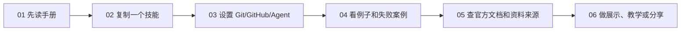

# 中文入口：AI 经济金融研究手册

这是本仓库的中文阅读入口。请先阅读本 README 了解整体结构，再进入 [`中文内容/`](中文内容/) 查看完整中文页面：手册、复制即用技能、Agent 与 Git 工作流、案例、资源和教学材料。目标是帮助经济学和金融学研究者用中文理解本仓库如何使用，并快速找到可以直接复制使用的 AI 研究技能、工作流模板和安全规则。部分专业术语保留英文，例如 prompt、skill、agent、MCP、Git、GitHub、LaTeX、Beamer、DiD、IV、RD。

> [!IMPORTANT]
> 本仓库不是提示词合集，也不是 AI 工具排行榜。它的核心目标是帮助研究者建立可核查、可复现、可追踪、负责任的 AI 辅助研究工作流。

如有中文版本建议，请邮件联系 [jay.liu@bristol.ac.uk](mailto:jay.liu@bristol.ac.uk)，邮件标题建议使用 `[AI Econ Finance Chinese] 中文版本建议`。

## 安全获取更新

推荐优先使用 GitHub 原生通知，这样维护者不需要额外收集你的邮箱。

| 方式 | 如何使用 | 信息安全说明 |
| --- | --- | --- |
| GitHub Watch | 在仓库页面点击 Watch，选择通知类型。 | 最少额外个人信息，适合 GitHub 用户。 |
| GitHub Releases | 只关注 releases，接收稳定版本更新。 | 低频、低噪音。 |
| 邮件更新列表 | 给 [jay.liu@bristol.ac.uk](mailto:jay.liu@bristol.ac.uk) 发邮件，标题写 `[AI Econ Finance Updates] Subscribe`。 | 只需要姓名和邮箱。不要发送研究数据、论文草稿、审稿材料、学生数据、受限或授权数据、保密信息。 |

邮件列表规则：

- 只用于本仓库更新、版本说明、工作坊信息和重要技能更新。
- 只保存必要联系信息。
- 不向第三方分享邮件列表。
- 不通过订阅邮件接收或处理保密研究材料。
- 退订邮件标题写 `[AI Econ Finance Updates] Unsubscribe`。
- 如果学校、雇主、期刊、会议、基金、数据提供方或合作者有更严格的信息安全规则，请遵守更严格的规则。

## 快速选择

### 中文阅读地图



| 如果你是... | 建议路径 | 目标 |
| --- | --- | --- |
| 完全新手 | 先读 `01`，再复制 `02` 里的一个小技能 | 理解 AI 能做什么、不能做什么 |
| 正在写论文 | `02` 技能 + `03` 项目设置 + `04` 失败案例 | 把 AI 输出变成可核查的研究产物 |
| 要用 agent 改文件 | `03` 工作流 + Git/GitHub + `AI-USE-LOG.md` | 防止文件丢失、数据泄露和不可复现 |
| 要教别人 | `06` 展示材料 + `04` 例子 | 让听众能现场复制和验证 |

| 如果你想要... | 打开 |
| --- | --- |
| 像读书一样理解 AI 在经济金融研究中的使用 | [01 从这里开始：AI 经济金融研究手册](中文内容/01-从这里开始：AI经济金融研究手册.md) |
| 直接复制可用的技能、指令和模板 | [02 复制即用：AI 研究指令与模板](中文内容/02-复制即用：AI研究指令与模板.md) |
| 设置 Codex、Claude Code、GitHub、agent 和自动化工作流 | [03 设置 Agent 和自动化研究工作流](中文内容/03-设置Agent和自动化研究工作流.md) |
| 看例子、图示、失败案例 | [04 案例、图示与失败案例](中文内容/04-案例图示与失败案例.md) |
| 查官方文档、builder、外部资源和资料来源 | [05 资料来源、官方文档与更新](中文内容/05-资料来源官方文档与更新.md) |
| 教工作坊、培训 RA、练习展示和做 slides | [06 教学、工作坊、展示与分享](中文内容/06-教学工作坊展示与分享.md) |

## 最重要的原则

```text
AI 可以自动化劳动，但不能替代学术责任。
```

这意味着：

- AI 输出不是 evidence。
- AI 生成的引用必须逐条核查。
- AI 生成的代码必须运行、检查、对照研究设计。
- AI 不能替你决定识别策略。
- AI 不能替你判断研究问题是否重要。
- AI 不能替你决定能否上传受限、授权、保密或合作者材料。
- AI 不能替你承担期刊、会议、学校、基金和数据提供方的合规责任。

## 最小安全配置

严肃研究项目至少需要：

| 工具/文件 | 用途 |
| --- | --- |
| ChatGPT / Claude / 机构批准工具 | 读写、解释、代码辅助 |
| GitHub repo | 记录 AI 改了什么，防止文件丢失 |
| `README.md` | 项目说明 |
| `DATA.md` | 数据来源、权限、敏感性规则 |
| `AGENTS.md` 或 `CLAUDE.md` | 给 AI agent 的项目规则 |
| `AI-USE-LOG.md` | 记录 AI 使用、人工核查、剩余不确定性 |
| `.gitignore` | 防止原始、受限或私人数据被提交 |

## 最常用的中文导航

| 任务 | 直接打开 |
| --- | --- |
| 检查研究想法、写 proposal、做文献综述、写实证方法 | [02 复制即用：AI 研究指令与模板](中文内容/02-复制即用：AI研究指令与模板.md) |
| 从零设置 Git、GitHub、private repo 和 AI agent | [03 从零开始设置 Git/GitHub 和 AI agent](中文内容/03-设置Agent和自动化研究工作流.md#从零开始设置-gitgithub-和-ai-agent) |
| 设计数据清洗、合并、变量构造、表格和图形 workflow | [02 数据清洗、合并和输出工作流](中文内容/02-复制即用：AI研究指令与模板.md#数据清洗合并和输出工作流) |
| 做 text-as-data 或 LLM-generated variable | [02 Text-as-Data 和 LLM Measurement 协议](中文内容/02-复制即用：AI研究指令与模板.md#text-as-data-和-llm-measurement-协议) |
| 选择 AI 输出核查方法或写 AI-use log | [02 AI 输出核查方法选择器](中文内容/02-复制即用：AI研究指令与模板.md#ai-输出核查方法选择器) |
| 理解 Git、agent、MCP、branch、worktree 等技术词 | [01 技术词解释](中文内容/01-从这里开始：AI经济金融研究手册.md#这些技术词在研究项目里是什么意思) |
| 设置一个安全的 AI 研究项目、清理旧文件夹、使用 Git | [03 设置 Agent 和自动化研究工作流](中文内容/03-设置Agent和自动化研究工作流.md) |
| 学习失败案例，避免假文献、错代码、过度因果解释 | [04 案例、图示与失败案例](中文内容/04-案例图示与失败案例.md) |
| 跟进 AI 更新、查官方文档、加入更新通知 | [05 资料来源、官方文档与更新](中文内容/05-资料来源官方文档与更新.md) |
| 教工作坊、培训 RA、练习 seminar 或 job talk | [06 教学、工作坊、展示与分享](中文内容/06-教学工作坊展示与分享.md) |

## 按功能和关键词查找

如果你知道自己要做什么，但不知道该打开哪个页面，可以按下面的关键词查找。

| 功能/关键词 | 打开 |
| --- | --- |
| `写作`、`introduction`、`abstract`、`论文修改` | [02 复制即用：AI 研究指令与模板](中文内容/02-复制即用：AI研究指令与模板.md) |
| `paper review`、`referee`、`R&R`、`审稿意见` | [02 复制即用：AI 研究指令与模板](中文内容/02-复制即用：AI研究指令与模板.md) |
| `literature review`、`文献矩阵`、`citation` | [来源可靠的文献综述](中文内容/02-复制即用：AI研究指令与模板.md#来源可靠的文献综述) |
| `Python`、`R`、`Stata`、`debug`、`代码检查` | [02 复制即用：AI 研究指令与模板](中文内容/02-复制即用：AI研究指令与模板.md) |
| `DiD`、`IV`、`RD`、`panel`、`event study` | [因果识别诊断](中文内容/02-复制即用：AI研究指令与模板.md#因果识别诊断) |
| `WRDS`、`CRSP`、`Compustat`、`数据合并` | [02 复制即用：AI 研究指令与模板](中文内容/02-复制即用：AI研究指令与模板.md#数据清洗合并和输出工作流) |
| `agent`、`Codex`、`Claude Code`、`GitHub` | [03 设置 Agent 和自动化研究工作流](中文内容/03-设置Agent和自动化研究工作流.md) |
| `dataset`、`资源`、`官方文档`、`找工具` | [05 资料来源、官方文档与更新](中文内容/05-资料来源官方文档与更新.md) |

## 使用任何 skill 前都要加的安全指令

```text
不要编造引用、数据来源、系数、稳健性检验、制度细节、数学推导或文献结论。
如果信息不足，请明确说明缺少什么，以及我需要人工核查什么。
请区分：已知事实、解释、建议和不确定性。
请遵守学校、雇主、期刊、会议、基金、数据提供方和合作者关于 AI 使用的规则。
如果相关规则比本指令更严格，请遵守更严格的规则。
如果任务、术语、数据规则、政策限制或输出格式不清楚，请先提出最多五个澄清问题。若基于假设继续，请明确列出假设，并在最后列出“需要我确认的问题”。
```

## 适合中文读者的使用方式

1. 先读本页，理解总体结构。
2. 打开 `01` 中文手册，把它当成一本书读。
3. 进入 `02` 中文模板页，选择一个具体任务，只复制一个技能。
4. 用自己的研究事实替换方括号内容。
5. 要求 AI 先给 plan，不要直接执行。
6. 人工核查引用、代码、数据、系数、识别策略和理论证明。
7. 把接受的 AI 输出和人工核查记录到 `AI-USE-LOG.md`。

## 与英文版的关系

英文路径保留完整细节和持续更新的原始版本。中文路径不是只有一个入口页，而是提供中文阅读和中文可复制模板。若中文页和英文页内容不一致，以更新日期较新的页面为准。欢迎通过邮件建议需要优先翻译或补充的部分。
