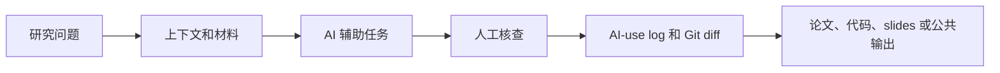
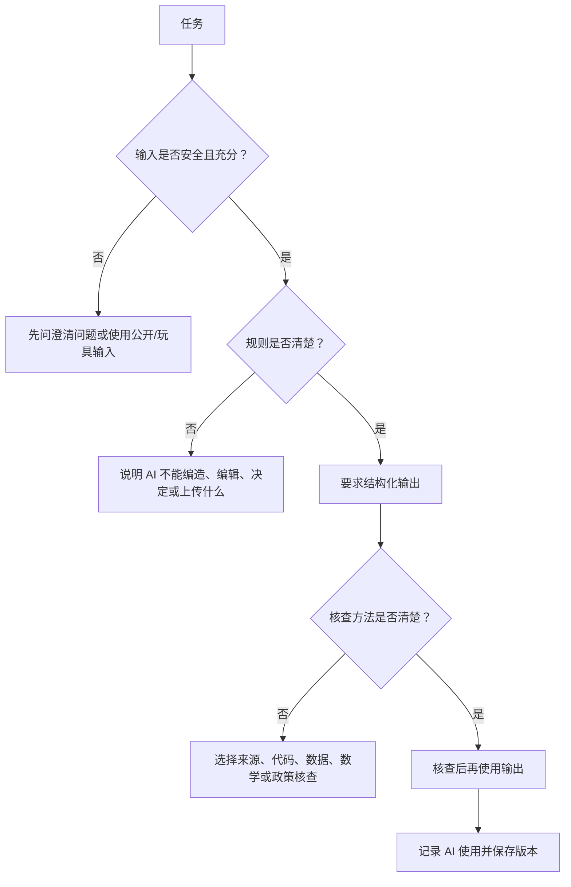
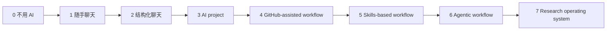

# 01 从这里开始：经济学和金融学研究中的 AI 实用手册

这是本仓库的中文阅读手册。它对应英文版 `01 Start Here` 的内容结构，目标是让经济学和金融学研究者像读一本短书一样理解：AI 可以帮什么、不能替代什么、如何核查、如何保护数据、如何把 ChatGPT/Claude Projects、Codex、Claude Code、GitHub、skills、agents 和 MCPs 放进一个可靠的研究工作流。

本页不是提示词合集，也不是工具排行榜。复制即用的技能和模板在 [02 复制即用：AI 研究指令与模板](02-复制即用：AI研究指令与模板.md)。

> [!IMPORTANT]
> AI 可以降低研究劳动成本，但不能让一个研究问题变重要，不能让识别策略变可信，不能让引用变真实，不能让数据自动变得可以上传，也不能替研究者承担学术责任。

> [!TIP]
> 如果只有五分钟，先读“快速开始”“初学者工具词汇表”“AI 擅长什么”“核查是一项技能”。然后去 `02` 复制一个小技能，在非保密材料上试一次。

问题或建议请邮件联系 [jay.liu@bristol.ac.uk](mailto:jay.liu@bristol.ac.uk)，标题建议写 `[AI Econ Finance Handbook] Question or correction`。

## 目录

- [快速开始：选择你的情况](#快速开始选择你的情况)
- [如何阅读这本手册](#如何阅读这本手册)
- [章节地图：你会学到什么](#章节地图你会学到什么)
- [最小安全配置](#最小安全配置)
- [1. 本手册适合谁](#1-本手册适合谁)
- [2. 基本思维模型](#2-基本思维模型)
- [研究者控制面板](#研究者控制面板)
- [具体任务例子](#具体任务例子)
- [可以直接复制的正向工作流](#可以直接复制的正向工作流)
- [从聊天到可复用工作流](#从聊天到可复用工作流)
- [3. 初学者工具词汇表](#3-初学者工具词汇表)
- [这些技术词在研究项目里是什么意思](#这些技术词在研究项目里是什么意思)
- [具体工具选择例子](#具体工具选择例子)
- [4. 成熟度阶梯](#4-成熟度阶梯)
- [5. AI 擅长什么](#5-ai-擅长什么)
- [6. 什么事情不应该交给 AI 决定](#6-什么事情不应该交给-ai-决定)
- [7. 核心概念](#7-核心概念)
- [8. 经济金融研究工作流](#8-经济金融研究工作流)
- [Paper Machine, So What 测试](#paper-machine-so-what-测试)
- [AI 成本收益规则](#ai-成本收益规则)
- [9. 负责任使用规则](#9-负责任使用规则)
- [机构规则优先](#机构规则优先)
- [与合作者和研究团队一起使用 AI](#与合作者和研究团队一起使用-ai)
- [10. 核查是一项技能](#10-核查是一项技能)
- [核查看起来应该是什么样](#核查看起来应该是什么样)
- [11. 数据安全规则](#11-数据安全规则)
- [12. GitHub 和项目安全](#12-github-和项目安全)
- [Vibe Coding 提醒](#vibe-coding-提醒)
- [13. Skills、Projects、Agents 和 MCPs](#13-skillsprojectsagents-和-mcps)
- [14. 写作、展示和公共传播](#14-写作展示和公共传播)
- [15. 不追热点地保持更新](#15-不追热点地保持更新)
- [16. 下一步使用什么](#16-下一步使用什么)
- [17. 来源和工作流影响](#17-来源和工作流影响)
- [AI 工作流建设者和面向经济学者的资源](#ai-工作流建设者和面向经济学者的资源)
- [官方工具文档](#官方工具文档)
- [方法、测量和可信度参考](#方法测量和可信度参考)
- [数据入口](#数据入口)

## 快速开始：选择你的情况

| 如果你在想... | 先读 | 然后复制/使用 |
| --- | --- | --- |
| “我刚开始用 AI，不知道什么重要。” | 成熟度阶梯和核心概念 | [工具选择与 skill 改进](02-复制即用：AI研究指令与模板.md#按功能和关键词查找) |
| “我有一个 paper idea，但不知道值不值得做。” | 第 2、4、5、7 节 | [研究想法压力测试](02-复制即用：AI研究指令与模板.md#研究想法压力测试) |
| “我要写实证方法。” | 第 7、8、9 节 | [应用经济学实证方法](02-复制即用：AI研究指令与模板.md#应用经济学实证方法段落) 或 [金融学实证方法](02-复制即用：AI研究指令与模板.md#金融学实证方法段落) |
| “我要让 AI 改代码或文件。” | 第 10、11、12 节 | [从零开始设置 Git/GitHub 和 AI agent](03-设置Agent和自动化研究工作流.md#从零开始设置-gitgithub-和-ai-agent) |
| “我要使用 agents。” | 第 10、11、12、13 节 | [Agentic workflow 应该如何运行](03-设置Agent和自动化研究工作流.md#agentic-workflow-应该如何运行) |
| “我和合作者、RA 或团队一起工作。” | 第 9、10、11、12 节 | [与合作者、RA 和团队一起使用 AI agent](03-设置Agent和自动化研究工作流.md#与合作者ra-和团队一起使用-ai-agent) |
| “我要做 slides 或练习 seminar。” | 第 14 节 | [展示练习](02-复制即用：AI研究指令与模板.md#展示练习) |

## 如何阅读这本手册

这页可以像一本短手册读。初学者先读左边的逻辑，有具体任务时再跳到右边的复制即用内容。


| 如果你有... | 阅读方式 | 读完应该能回答... |
| --- | --- | --- |
| 10 分钟 | 第 1、3、5、10 节 | 今天我能安全地让 AI 做什么？ |
| 30 分钟 | 第 1-6、10-13 节 | AI 改文件前需要什么设置？ |
| 1 小时 | 通读本页 | AI 在我的研究流程中应该放在哪里？ |
| 工作坊听众 | 把本页当作前半场讲稿 | 哪个 demo 可以现场核查？ |

## 章节地图：你会学到什么

| 章节组 | 学到的结果 | 什么时候用 |
| --- | --- | --- |
| 第 1-4 节 | 理解 AI、LLM、GitHub、Projects、Skills、Agents、MCPs 和成熟度阶梯 | 新手入门或给别人解释本仓库 |
| 第 5-8 节 | 知道 AI 在文献、数据、方法、理论、写作和展示中的位置 | 想把 AI 放进研究工作流 |
| 第 9-11 节 | 避免不安全使用、假引用、坏代码、保密材料上传和数据权限错误 | 使用真实研究材料 |
| 第 12-13 节 | 设置 GitHub、项目规则、可复用 skills 和 agent 工作流 | AI 可能改文件或运行代码 |
| 第 14-16 节 | 把研究转化为论文、slides、公共解释和持续学习系统 | 写作、教学、展示或跟进 AI 更新 |
| 第 17 节 | 查看 builders、官方文档、方法标准和数据入口 | 需要来源背景或继续阅读 |

## 最小安全配置

你不需要复杂系统才能开始。你需要一个能避免明显错误的小系统。

| 组成部分 | 最小版本 | 为什么重要 |
| --- | --- | --- |
| AI 账号 | ChatGPT、Claude 或机构批准工具 | 基础阅读、写作、代码辅助 |
| 版本控制 | GitHub repo，哪怕是 private | 恢复文件，检查 AI 改了什么 |
| 研究文件夹 | `data/`, `code/`, `output/`, `paper/`, `slides/` | 防止原始数据、代码、输出和论文混在一起 |
| 引文管理 | Zotero、BibTeX 或同类工具 | 降低依赖 AI 假引用的风险 |
| AI-use log | 一个 markdown 文件 | 记录 AI 辅助、接受的输出和人工核查 |
| 数据规则 | `DATA.md` 中的一段规则 | 防止不安全上传数据 |

复制到第一个项目里：

```text
Before AI edits files, writes methods text, summarizes literature, or generates slides, it must state:
1. what inputs it used;
2. what it changed or produced;
3. what it is uncertain about;
4. what I must verify manually;
5. whether any private, licensed, or restricted material is involved.
```

## 1. 本手册适合谁

本手册面向想在严肃研究中使用 AI 的经济学和金融学研究者：

- PhD 学生和 RA
- junior faculty
- 应用经济学者
- 金融学研究者
- 政策研究者
- 教授 AI 研究工作流的教师
- 需要共同规则的研究团队

本手册不是 prompt collection，也不是 tool ranking。它是一份面向经济金融研究的 AI 辅助研究系统指南。

实践目标：

> 一篇论文，一个 research repo，一个 AI project workspace，一个 AI-use log，一个 verification habit。

更深层目标是让研究者更会做研究，而不是更快地产出“看起来像研究”的东西。

## 2. 基本思维模型

把 AI 看作可以帮助处理劳动密集任务的研究助理，但必须由研究者管理。



## 研究者控制面板

在给 AI 严肃任务前，先看这个控制面板。



| 控制项 | 简单意思 | 例子 |
| --- | --- | --- |
| input | AI 被允许读取的内容 | 公开 abstract、变量字典、toy data |
| rule | AI 不能做什么 | 不要编造引用；不要修改原始数据 |
| output | 你想得到的产物 | 表格、代码 patch、slide outline、methods paragraph |
| check | 你如何判断可接受 | DOI 查询、toy-data test、系数单位检查 |
| trace | 记录发生了什么 | AI-use log + Git diff |

关键不是“写更好的 prompt”，而是设计受控工作流：

| 工作流元素 | 要回答的问题 |
| --- | --- |
| Purpose | AI 在帮哪个研究任务？ |
| Inputs | 哪些文件、笔记、数据和约束既安全又必要？ |
| Rules | AI 不能编造、改变或决定什么？ |
| Output | AI 应该产生什么 artifact？ |
| Verification | 研究者必须人工核查什么？ |
| Trace | 什么被改变、接受、仍然不确定？ |

使用 AI 前先问：

```text
我能否定义输入、预期输出和核查方法？

如果能，AI 可能有帮助。
如果不能，这个任务可能太模糊、太高风险，或者太依赖学术判断。
```

## 具体任务例子

| 模糊请求 | 受控 AI 工作流 |
| --- | --- |
| “总结这篇文献。” | “只用这 12 篇论文，做一张表：研究问题、数据、识别/模型、发现、限制、与我项目的关系。缺少的 citation facts 标记为 [verify]。” |
| “写我的 methods section。” | “只用下面已核查事实，起草 methods section，包括 data、sample、equation、identification assumptions、inference、limitations，并用 [needs author input] 标记缺口。” |
| “帮我清洗数据。” | “检查文件夹并提出 raw-to-derived pipeline。现在不要编辑文件。识别 raw data、derived data、code、outputs、privacy risks 和需要我批准的 checks。” |
| “做 slides。” | “根据这篇论文做 25 分钟 seminar outline。每页说明 claim、evidence、需要的 figure/table、overclaiming 风险和 speaker note。” |
| “在我的项目上用 agents。” | “制定计划：读取哪些文件、允许编辑哪些文件、禁止哪些文件、运行哪些命令、哪些 checks 必须通过、修改前有哪些 approval gates。” |

## 可以直接复制的正向工作流

AI 最有用的地方，是把重复性研究任务变成可以检查的产物。目标不是自动化判断，而是在输出能被核查时节省劳动。

| 工作流 | 为什么有效 | 核查习惯 |
| --- | --- | --- |
| 用 supplied papers 做 literature map | AI 比手工表格更快地组织来源 | 每个 claim 都指向 supplied source、DOI 或 verified page |
| 第一个实证项目设置 | AI 起草 folder structure、`.gitignore`、`DATA.md`、`AGENTS.md` 和 AI-use log | 第一次 commit 前检查 raw/licensed/restricted data 是否被排除 |
| 基于已核查事实写 methods prose | AI 可以改善表达，但不选择 design | 对照 code、sample、timing、equation、inference |
| 数据 pipeline plan | AI 列 raw-to-derived steps、merge keys、audit tables 和 toy tests | 在真实数据前先用 known-answer toy data |
| seminar Q&A drill | AI 生成 hostile-but-fair questions 和简短回答结构 | 只用论文证据回答，不编造防御 |
| 创建可复用 skill | AI 帮你把重复任务变成 input、procedure、output、checks | 先用小的公开或 synthetic example 测试 |

## 从聊天到可复用工作流


只有当任务会重复、且核查方法清楚时，才往右移动。

复制这段来把模糊任务变成受控工作流：

```text
I want to use AI for this economics/finance research task:
[describe task]

Before answering, help me turn it into a controlled workflow. Ask clarifying questions if needed. Then specify:
1. safe inputs;
2. forbidden inputs;
3. expected output;
4. what the AI may do;
5. what the AI must not decide;
6. how I should verify the result;
7. what to record in the AI-use log.
```

## 3. 初学者工具词汇表

如果你从未把 AI 用在研究中，先理解这些区别。

| 术语/工具 | 它是什么 | 第一次适合怎么用 | 主要注意 |
| --- | --- | --- | --- |
| AI | 用学习到的模式生成、分类、预测或行动的系统统称 | 语言帮助、代码帮助、组织文档 | 输出不是 evidence |
| LLM | large language model，根据上下文生成文字/代码 | 解释代码、总结 supplied text、起草 checklist | 不是数据库，会 hallucinate |
| ChatGPT | OpenAI chat 产品；Projects 可保存 chats、files、instructions | 每篇论文/文献综述/talk 一个 project | 检查 privacy settings 和 project instructions |
| Claude | Anthropic chat 产品；Projects 和 long-context 适合阅读/写作 | 文档 review、paper critique、project workspace | 仍需 source verification |
| Codex | OpenAI coding agent，可在 repo/sandbox 读、改、运行代码 | 修代码、加 tests、检查 Git diff | 用 Git，检查每个文件变化 |
| Claude Code | Anthropic 面向 codebase/project folder 的 agent 工具 | repo-aware 写作/代码 workflow、`CLAUDE.md` rules | permissions 和 auto modes 要小心 |
| VS Code | 带 Git、debug、terminal、extensions、file navigation 的编辑器 | 运行脚本、看 diff、debug R/Python/Stata 周边工作流 | 编辑器方便不等于可复现 |
| GitHub | 版本控制和协作平台 | private research repo、issues、PRs、releases | 不要 commit restricted data |
| Zotero/BibTeX | 引文和 bibliography 管理 | source-grounded literature work | AI-generated references 仍需核查 |
| RAG/search-grounded AI | 基于检索来源回答的 AI | 文献核查、source-based summary | retrieval 会漏来源或引用不准 |
| MCP/connectors | 让 AI 连接外部 apps/data 的方式 | Zotero、GitHub、files、databases、search | 权限和隐私风险更高 |

## 这些技术词在研究项目里是什么意思

| 术语 | 简单研究例子 |
| --- | --- |
| repo | 一篇论文、replication 或 dataset 的项目文件夹加版本历史 |
| Git commit | 一个保存点，例如“修复 Table 2 code 后的版本” |
| Git diff | AI 对文件做的逐行前后变化 |
| branch | 安全的旁支版本，例如 `try-new-event-study` |
| worktree | 另一个 branch 的第二个文件夹，适合两个 agents 同时做不同任务 |
| `.gitignore` | Git 的“不要上传/不要跟踪”清单，例如 `data/raw/` |
| raw data | 收到时的原始数据；保存、记录，但不要直接改 |
| derived data | 由脚本从 raw data 生成的清洗或合并数据 |
| `AGENTS.md` | 给 coding agents 的说明书，写清安全文件、禁止文件和检查命令 |
| `CLAUDE.md` | Claude Code 读取的项目记忆文件 |
| MCP/connector | 让 AI 接 GitHub、Zotero、Drive 或数据库的“插头” |
| skill | 可复用研究 recipe，例如“审查我的 DiD design” |
| AI-use log | 研究日记：工具、任务、文件、接受的输出、检查、剩余不确定 |

如果 AI 回答里用了你不懂的词，问它：

```text
Explain every technical term in plain language and give one economics or finance research example for each term.
```

## 具体工具选择例子

| 情况 | 使用 | 原因 |
| --- | --- | --- |
| 想理解 parallel trends | ChatGPT/Claude chat | 不需要文件或私有数据 |
| 一篇论文要持续做几个月 | ChatGPT/Claude Project | 能保存 project instructions、notes、context |
| 要修生成 Table 3 的 Python script | Codex/Claude Code inside Git repo | AI 需要文件访问，但每个 diff 必须检查 |
| 想把 AI 接到 Zotero 或 GitHub | MCP/connector | 只有权限和数据暴露边界清楚时才有用 |
| 反复审查 event-study designs | skill | 把重复检查变成可复用流程 |

## 4. 成熟度阶梯

用这个阶梯定位你现在的 AI 研究实践。



| Level | 名称 | 看起来像什么 | 主要风险 |
| --- | --- | --- | --- |
| 0 | 不用 AI | 传统研究流程 | 执行慢 |
| 1 | casual chat | 偶尔问 ChatGPT/Claude | plausible wrong answers |
| 2 | structured chat | 给 context、要求 uncertainty、核查 | 仍然难复现 |
| 3 | AI project | 每篇论文或任务一个 ChatGPT/Claude Project | project instructions 不好 |
| 4 | GitHub-assisted workflow | AI 在 version control 中改代码/文字 | 不想要的文件变化 |
| 5 | skills-based workflow | 重复任务变成 reusable skills | 弱 skill 自动化坏习惯 |
| 6 | agentic workflow | AI 计划、编辑、运行、检查 | permissions 和 overautomation |
| 7 | research operating system | AI + GitHub + logs + data rules + source tracking | governance burden |

不要在不会核查输出、不会用 Git、不会定义数据规则前跳到 agents。

## 5. AI 擅长什么

AI 适合结构清楚、可核查、不保密的任务。

| 研究任务 | 合适用法 |
| --- | --- |
| 文献工作 | 比较 argument、提取 model/data/design、识别需要核查的 claims |
| 实证代码 | 解释代码、起草函数、debug errors、在 Stata/R/Python 间转换 |
| 方法写作 | 把已核查 design 写成清楚 prose，包含 assumptions 和 limitations |
| 理论支持 | 解释 intuition、检查 proof flow、识别 missing cases |
| 研究管理 | 创建 checklists、logs、repo structures、issue lists |
| 写作 | 改进 clarity、structure、transitions、exposition |
| 展示 | 制作 talk outlines、speaker notes、Q&A drills、slide plans |
| 教学 | 创建 examples、quizzes、explanations、workshop exercises |
| 数据执行 | 起草清洗/合并脚本、EDA plan、table/figure code |
| Text-as-data | 创建 coding protocols、label validation sets、audit LLM-generated variables |
| 结构/量化工作 | map moments to parameters、audit counterfactuals、check welfare interpretation |

## 6. 什么事情不应该交给 AI 决定

AI 可以辅助，但不能被当作学术判断的作者。

不要让 AI 独立决定：

- 最终 research question
- identification strategy
- causal interpretation
- literature contribution
- robustness claims
- policy 或 investment implications
- referee judgment
- confidential review handling
- restricted data 是否可以上传
- final submission readiness

短规则：

> AI 可以自动化劳动，不能自动化责任。

## 7. 核心概念

| 概念 | 对研究者的实际含义 |
| --- | --- |
| LLM | 根据模式生成 text/code 的模型，不是数据库 |
| Hallucination | 看起来合理但虚假或无支持的输出 |
| Context window | 模型在一次任务中可以使用的材料 |
| RAG | retrieval-augmented generation，基于 selected sources |
| Prompt | 一次性指令 |
| Project | 为论文、数据、课程或角色保持 context 的 AI workspace |
| Skill | 为重复任务设计的 reusable procedure |
| Agent | 能计划、用工具、改文件、运行步骤的 AI system |
| MCP | 让 AI 访问 external systems 的 connector standard |
| AGENTS.md / CLAUDE.md | repo-level AI agent instructions |
| AI-use log | task、tool、files、accepted output、checks、uncertainty 的记录 |

两个区别特别重要：

| 区别 | 为什么重要 |
| --- | --- |
| grounded vs. ungrounded | 文献、引用、事实、政策细节应使用 source-grounded tools 或 supplied sources，而不是 bare model memory。 |
| reasoning vs. execution | 模型可以解释或 critique design；coding agent 还可以改文件、跑代码。execution 需要 Git 和更强 approval gates。 |
| long-context vs. retrieval | long context 帮助读大文档；retrieval 帮助找外部来源。两者都会失败。 |
| automation vs. verification | 只有当核查成本低于节省的劳动时，automation 才有价值。 |

## 8. 经济金融研究工作流

| 研究阶段 | AI 可以帮什么 | 不应让 AI 做什么 |
| --- | --- | --- |
| 研究问题 | 提出 mechanism tension、closest-paper questions、feasibility risks | 替你决定问题重要性 |
| 文献 | 用 supplied sources 做 literature map、claim-source bank | 编造 citation 或 novelty |
| 理论/机制 | 检查 assumptions、intuition、proof flow | 证明定理正确或重写核心机制 |
| 数据 | 设计 data dictionary、pipeline、audit table、toy tests | 判断 restricted/licensed data 是否可上传 |
| 识别/方法 | 起草 methods、列 assumptions、设计 pre-mortem | 替你选择 causal design |
| 结果 | 检查 units、magnitude、interpretation、robustness | 把 correlation 写成 causation |
| 写作 | 改 clarity、flow、section structure | 编造 results、citations、contribution |
| 展示 | 准备 slides、Q&A、audience adaptation | 隐藏 limitations 或 public overclaiming |
| 修改/R&R | 分类 comments、准备 response plan | 决定哪些意见必须接受 |
| 传播 | 准备 public summary | 夸大 policy/investment implications |

## Paper Machine, So What 测试

AI 让 drafts、代码、表格、slides、甚至整篇 paper-looking artifacts 变便宜。正因如此，更稀缺的是：

- 重要问题
- 可信 design
- 高质量或 proprietary data
- 真正的 theory 和 mechanism
- institutional knowledge
- taste and judgment
- 诚实的局限性表达

对于 finance，AI 能快速生成很多 factor stories。这使得 data-mining、HARKing、multiple testing 和 out-of-sample discipline 更重要，而不是更不重要。

## AI 成本收益规则

用经济学方式判断是否值得用 AI：

```text
Use AI when:
labor saved > prompting cost + verification cost + privacy/reproducibility risk
```

| 任务 | 通常适合 AI 吗？ | 原因 |
| --- | --- | --- |
| 解释公开方法概念 | 是 | 核查成本低 |
| 生成 citation list | 否，除非 source-grounded | 假引用风险高 |
| 修一个可测试代码错误 | 是，但要 run tests | output 可执行可比较 |
| 选择 identification strategy | 否 | 学术判断和设计责任高 |
| 起草 methods prose | 是，如果 facts 已核查 | output 可与 code/design 对照 |
| 处理 restricted microdata | 通常否，除非 approved environment | 隐私和政策风险高 |

## 9. 负责任使用规则

| 规则 | 实际含义 |
| --- | --- |
| AI 不是作者 | 人类作者对所有内容负责 |
| AI 不是数据库 | 文献、系数、法律/政策、数据描述必须核查 |
| AI 不是 IRB/ethics office | 数据权限和隐私规则必须查正式政策 |
| AI 不是 referee | 它可以帮助组织 comments，但不能替你做 judgment |
| AI 不是 coauthor consent | 合作者材料使用 AI 前要有明确同意 |
| AI 不是 replication proof | 代码必须运行，输出必须匹配，流程必须可重建 |

## 机构规则优先

在使用 AI 前，阅读并遵守：

- 大学和雇主政策
- funder 规则
- 期刊/会议政策
- 数据提供方和 license
- IRB/ethics/DUA
- 合作者和团队规则

如果本仓库与这些规则冲突，遵守更严格的规则。

## 与合作者和研究团队一起使用 AI

团队项目需要明确：

| 问题 | 应该提前约定 |
| --- | --- |
| 合作者 draft 能否上传到 AI？ | 需要 consent 和 policy check |
| RA 能否使用 AI 改 code？ | 需要 branch、PR、review、tests |
| 谁核查 AI-generated code？ | 明确 code owner |
| 谁核查 empirical claims？ | 明确 methods/PI/coauthor owner |
| 谁更新 AI-use log？ | 明确 log owner |
| referee reports 能否使用 AI？ | 只在 journal/conference policy 允许时 |

## 10. 核查是一项技能

“verify manually” 太模糊。每类 AI 输出需要不同核查方法。

| AI 输出 | 核查方法 |
| --- | --- |
| citation claim | DOI、journal page、作者、年份、句子-来源是否支持 |
| code | toy data known answer，然后真实运行 |
| data merge | match rates、duplicates、unmatched records、timing |
| coefficient interpretation | units、baseline magnitude、confidence interval、design support |
| methods prose | 对照 code、equation、sample、timing、inference |
| proof/equation | algebra、limiting cases、notation、equilibrium logic |
| slide title | 对照 table/figure 和 causal design |
| AI disclosure | 对照 journal/university/funder/data-provider policy |

## 核查看起来应该是什么样

好的核查不是“读一下感觉对不对”，而是一个可重复动作：

```text
1. 识别输出类型：source/code/data/math/policy/prose/slides。
2. 选择核查方法。
3. 记录核查证据。
4. 修改、接受或拒绝 AI 输出。
5. 在 AI-use log 中记录剩余不确定性。
```

## 11. 数据安全规则

| 材料 | 默认 AI 风险 | 默认规则 |
| --- | --- | --- |
| 公开 macro data | 低 | 通常可用，但记录 series、version、date |
| 公开 paper PDF | 低到中 | 注意 copyright、citation、source support |
| WRDS/CRSP/Compustat extracts | 中到高 | 先查 license，通常不要上传 raw extracts |
| bank/transaction data | 高 | 不要上传到 public AI |
| administrative microdata | 高 | 仅在 approved secure environment |
| coauthor draft | 中到高 | 先获得 consent |
| referee report/manuscript | 高 | 只有 policy 允许才可用 |
| student data | 高 | 避免 public AI |
| proprietary firm data | 高 | 不要上传，除非合同和机构批准 |

更安全的替代输入：

- variable dictionary
- synthetic/toy data
- public documentation links
- schema descriptions
- error messages with secrets removed
- code without private data

## 12. GitHub 和项目安全

如果 AI 能改文件，就使用 Git。

Git/GitHub 的研究价值：

| 功能 | 研究安全价值 |
| --- | --- |
| commit | 保存可恢复版本 |
| diff | 检查 AI 改了什么 |
| branch | 把 AI experiment 隔离在 side version |
| pull request | 给合作者/RA review |
| issue | 定义 agent task 和 human owner |
| release | 给 stable research artifact 一个 citable version |
| `.gitignore` | 降低 raw/restricted/private data 被提交风险 |

最小项目文件：

```text
README.md       project purpose and commands
DATA.md         dataset access and AI-use rules
AGENTS.md       rules for file-editing agents
AI-USE-LOG.md   what AI helped with and what was checked
.gitignore      what Git must not track
```

最小 `.gitignore`：

```gitignore
data/raw/
data/restricted/
data/private/
*.dta
*.sas7bdat
*.rds
*.parquet
*.csv
*.xlsx
*.zip
*.log
.env
__pycache__/
```

这表示：Git 不应跟踪 raw/restricted data、spreadsheets、logs、secret keys 或 generated cache files。它不会删除电脑上的文件，也不会自动处理已经 commit 的敏感文件。

## Vibe Coding 提醒

“vibe coding” 指让 AI 根据大概意图快速写代码。它适合探索，但不适合无核查地进入论文结果。研究代码要能：

- run
- rebuild output
- explain sample and variable construction
- pass toy/known-answer tests
- preserve data lineage
- match methods prose

## 13. Skills、Projects、Agents 和 MCPs

| 形式 | 含义 | 最适合 |
| --- | --- | --- |
| Prompt | 一次性指令 | 小任务 |
| Project | 持久 AI workspace | 一篇论文、文献综述、referee response、talk |
| Skill | 可复用 procedure | 反复做的任务 |
| Agent | 能计划、用工具、改文件、运行命令的 AI | code/data/repo/slides workflow |
| MCP/connector | 连接外部工具和数据源 | GitHub、Zotero、Drive、databases |
| AGENTS.md/CLAUDE.md | repo-level instructions | 给 file-editing AI 边界 |

规则：

```text
Prompt 用于一次性任务。
Project 用于持续研究上下文。
Skill 用于重复工作流。
Agent 用于多步骤执行。
MCP 用于连接外部工具。
GitHub 用于记录、恢复、协作和 review。
```

## 14. 写作、展示和公共传播

AI 可以帮助 clarity、structure、flow、Q&A 和 slides，但不能替你创造 evidence。

| 场景 | AI 可以做 | 人类必须核查 |
| --- | --- | --- |
| introduction | question spine、contribution clarity | novelty、claims、citations |
| literature review | thematic map、source matrix | 每个 citation 和 source support |
| results writing | coefficient wording、magnitude framing | units、sample、CI、design support |
| referee response | comment classification、response table | concession strategy、evidence、tone |
| seminar slides | story arc、Q&A、speaker notes | slide claims、figures、limitations |
| public summary | nontechnical explanation | 不夸大 causality、generalizability、policy/investment implication |

## 15. 不追热点地保持更新

不要随意追 AI 工具新闻。建立低噪音信息系统：

| 来源类型 | 用途 | 风险 |
| --- | --- | --- |
| official docs | 产品行为和功能变化 | 不一定教研究用法 |
| builders | 实际工作流和 failure cases | 可能 tool-biased |
| economists using AI | field relevance | 可能 anecdotal |
| GitHub repos | 可复用实现 | 可能不维护 |
| newsletters | awareness | 可能 hype |
| X/LinkedIn | discovery | 噪音很大 |

每周规则：

```text
每周最多采用一个新 AI 工作流。
忽略没有具体任务、日期、成本、安全规则和核查方法的工具断言。
```

## 16. 下一步使用什么

读完本页后：

- 复制技能和模板：[02 复制即用：AI 研究指令与模板](02-复制即用：AI研究指令与模板.md)
- 设置 agents 和自动化：[03 设置 Agent 和自动化研究工作流](03-设置Agent和自动化研究工作流.md)
- 学习例子和失败案例：[04 案例、图示与失败案例](04-案例图示与失败案例.md)
- 查来源和官方文档：[05 资料来源、官方文档与更新](05-资料来源官方文档与更新.md)
- 教学或展示：[06 教学、工作坊、展示与分享](06-教学工作坊展示与分享.md)

## 17. 来源和工作流影响

本手册借鉴公开资料中的工作流思想，并将其改写成适合经济学和金融学研究的说明。它不要求读者读完所有来源。

## AI 工作流建设者和面向经济学者的资源

| 资源 | 为什么包含 |
| --- | --- |
| [Gen Li and Siyang Liu, Claude Code Learning Resources for Economics and Finance Researchers](https://gen-li.notion.site/339195e07a238020b8aae6b5a1661f08?v=339195e07a2380c0ad01000c92c92011&pvs=149) | 面向经济金融研究者的 Claude Code 资源库结构 |
| [Frank Lee, Academic Research Skills](https://github.com/franklee16/academic-research-skills) | academic skills taxonomy：写作、文献、数据、Stata/R/Python、peer review、presentation |
| [Agentic Assets, Corbis Literature Starter Kit](https://github.com/Agentic-Assets/corbis-literature-starter-kit) | literature workflow、search、mapping、idea positioning、citation verification |
| [Paul Goldsmith-Pinkham Applied Methods PhD](https://github.com/paulgp/applied-methods-phd) 和 [AI posts](https://paulgp.com/blog.html) | 实证实现、research pipeline、AI 写作、VS Code/Git、LLM-friendly paper bundles |
| [Pedro Sant'Anna Claude Code workflow](https://psantanna.com/claude-code-my-workflow/) | plan-first contractor workflow、specialized agents、quality checks |
| [Chris Blattman / Claude Blattman](https://claudeblattman.com/) | 非程序员学术工作流、projects、skills、review workflows |
| [Anton Korinek, AI agents for economic research](https://www.nber.org/papers/w34202) | 面向经济学者解释 agents 在文献、代码、数据和 workflow 中的使用 |
| [Mihail Velikov AI econ wiki](https://velikov-mihail.github.io/ai-econ-wiki/) | curated source index 和 knowledge-base maintenance |
| [Novy-Marx and Velikov, AI-powered finance scholarship](https://www.aeaweb.org/articles?id=10.1257/jel.20251821) | finance paper production、HARKing、factor mining 风险 |
| [Antonio Mele Awesome Econ AI Stuff](https://meleantonio.github.io/awesome-econ-ai-stuff/) | economics-specific skills catalog |
| [Zara Zhang AI learning library](https://zara.faces.site/ai) 和 [Follow Builders](https://github.com/zarazhangrui/follow-builders) | curated learning paths、follow builders、low-noise updates |
| [Zara Zhang frontend-slides](https://github.com/zarazhangrui/frontend-slides) 和 [slide-craft-skill](https://github.com/maverickgao8848/slide-craft-skill) | web-native slides、visual workflows、single-file HTML artifacts |

## 官方工具文档

| 资源 | 用途 |
| --- | --- |
| [OpenAI ChatGPT Projects](https://help.openai.com/en/articles/10169521-chatgpt-projects) | ChatGPT Projects、files、instructions、sharing |
| [OpenAI Codex Skills](https://developers.openai.com/codex/skills) | skills 作为 reusable instruction packages |
| [OpenAI AGENTS.md](https://developers.openai.com/codex/guides/agents-md) | repo-level agent instructions |
| [Claude Projects](https://support.anthropic.com/en/articles/9517075-what-are-projects) | Claude project workspaces |
| [Claude Code docs](https://code.claude.com/docs/en/how-claude-code-works) | agentic loop、tools、command-line workflow |
| [MCP docs](https://modelcontextprotocol.io/docs/getting-started/intro) | AI 与外部系统连接 |
| [GitHub ignoring files](https://docs.github.com/en/get-started/git-basics/ignoring-files) | `.gitignore` 数据和 secrets 安全 |
| [Git worktree docs](https://git-scm.com/docs/git-worktree) | AI experiments 的 isolated branches/worktrees |

## 方法、测量和可信度参考

| 主题 | 参考 | 本仓库如何使用 |
| --- | --- | --- |
| text-as-data | [Gentzkow, Kelly, and Taddy](https://www.aeaweb.org/articles?id=10.1257/jel.20181020) | 把 text 看成 measurement/statistical object |
| staggered DiD | Callaway-Sant'Anna, Sun-Abraham, Borusyak-Jaravel-Spiess, Goodman-Bacon | estimator choice、timing、heterogeneity、weighting checks |
| pre-trends | Roth, “Pretest with Caution” | insignificant pre-trends 不是 validity proof |
| RD | rdrobust, McCrary density test | bandwidth、bias correction、manipulation、local interpretation |
| weak IV | Montiel Olea-Pflueger, Anderson-Rubin style robust inference | 避免机械 “first-stage F > 10” |
| clustering | Abadie et al., Cameron-Gelbach-Miller | clustering 作为 design decision，few-cluster caution |
| finance factor replication | [Open Source Asset Pricing](https://www.openassetpricing.com/), Hou-Xue-Zhang | factor mining、multiple testing、sample construction、out-of-sample checks |

## 数据入口

| 数据类型 | 起点 | AI 使用提醒 |
| --- | --- | --- |
| public macro/economic data | FRED、BEA、BLS、Census、World Bank、IMF、OECD、NBER public data | 可用 AI 写 retrieval code，但记录 series/table/version/date |
| finance/market data | SEC EDGAR、OpenFIGI、WRDS、CRSP、Compustat、TRACE、Bloomberg、LSEG、FactSet | licensed/commercial extracts 通常不要上传 public AI |
| microdata/restricted data | IPUMS、ICPSR、FSRDC、World Bank Microdata、AEA RCT Registry | 检查 terms、DUA、IRB/ethics、secure environment；优先用 metadata/toy data |
