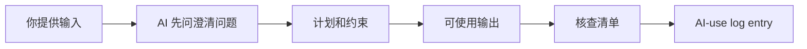
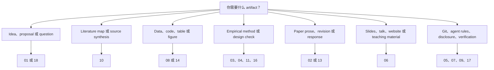
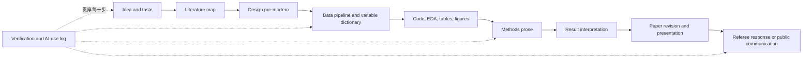

# 02 复制即用：AI 研究指令与模板

这是本仓库的中文直接使用工具箱。它对应英文版 `02 Copy and Use` 的内容结构。你不需要读完所有技能；先看索引，找到一个具体任务，复制一个 block，替换方括号内容，在 ChatGPT、Claude、Codex、Claude Code、Cursor、GitHub Copilot 或其他 AI 工具中使用，然后核查输出。

> Copyright (c) 2026 SuperJayLiu (Chaojie Liu). Licensed under the repository MIT License. 本页中文技能和工作流为本仓库原创改写，外部启发在相关页面中简要引用。

如果你需要概念、风险和工具解释，先读 [01 从这里开始：AI 经济金融研究手册](01-从这里开始：AI经济金融研究手册.md)。

> [!TIP]
> 从一个很窄的任务开始。复制一个 block。加入你的项目事实。先让 AI 给 plan。然后核查。

> [!IMPORTANT]
> 初学者不要一次使用所有技能。按照你面前的研究对象选择：idea、literature、data、code、methods、paper text、slides、verification 或 revision。

建议或新增 skill 请邮件 [jay.liu@bristol.ac.uk](mailto:jay.liu@bristol.ac.uk)，标题写 `[AI Econ Finance Skills] Suggest a skill or prompt`。

## 目录

- [先从任务卡片开始](#先从任务卡片开始)
- [默认澄清指令](#默认澄清指令)
- [这里有什么](#这里有什么)
- [Copy-ready skill 应该如何工作](#copy-ready-skill-应该如何工作)
- [Skill 选择地图](#skill-选择地图)
- [按功能和关键词查找](#按功能和关键词查找)
- [按软件查找](#按软件查找)
- [带标签的 Skill 索引](#带标签的-skill-索引)
- [为什么需要这些 Skill Families](#为什么需要这些-skill-families)
- [为什么有些主题单独成页](#为什么有些主题单独成页)
- [研究 Pipeline：哪个 Skill 接哪个 Skill](#研究-pipeline哪个-skill-接哪个-skill)
- [最常用 Blocks](#最常用-blocks)
- [如何使用这些 Blocks](#如何使用这些-blocks)
- [通用安全指令](#通用安全指令)
- [通用输出契约](#通用输出契约)
- [来源使用规则](#来源使用规则)
- [建议一个新 Skill](#建议一个新-skill)
- [常用中文 Copy Blocks](#常用中文-copy-blocks)
- [Introduction spine 指令](#introduction-spine-指令)
- [因果识别诊断](#因果识别诊断)
- [数据清洗、合并和输出工作流](#数据清洗合并和输出工作流)
- [Text-as-Data 和 LLM Measurement 协议](#text-as-data-和-llm-measurement-协议)
- [AGENTS.md 研究项目规则](#agentsmd-研究项目规则)
- [Paper-to-talk converter](#paper-to-talk-converter)
- [展示练习](#展示练习)
- [资源查找指令](#资源查找指令)

## 先从任务卡片开始

| 我想要... | 先复制 | 然后这样核查 |
| --- | --- | --- |
| 判断一个研究想法是否值得继续 | [研究想法压力测试](#研究想法压力测试) | 说清 closest papers、data obstacle、identification/model obstacle |
| 做不含假引用的文献综述 | [来源可靠的文献综述](#来源可靠的文献综述) | 每个 claim 对照 supplied sources 或 verified search results |
| 写或改 introduction | [Introduction spine 指令](#introduction-spine-指令) | 核查 question、contribution、data/design、strongest result |
| 写应用经济学 methods | [应用经济学实证方法段落](#应用经济学实证方法段落) | 对照 code、sample、timing、estimand、inference |
| 写金融学 methods | [金融学实证方法段落](#金融学实证方法段落) | 检查 timing、link tables、survivorship、delisting、event windows、factor-mining |
| debug Python/R/Stata 代码 | [代码调试与 toy test 指令](#代码调试与-toy-test-指令) | 先在 toy data 上跑 known-answer test |
| 安全使用 agents 改文件 | [AGENTS.md 研究项目规则](#agentsmd-研究项目规则) | 检查 `git diff`、运行 checks、记录 AI-use log |
| 准备 slides 或 seminar | [Paper-to-talk converter](#paper-to-talk-converter) | 每个 slide claim 对照论文、表格、图或模型 |
| 判断 AI 输出能否接受 | [AI 输出核查方法选择器](#ai-输出核查方法选择器) | 选择 source、code、data、math、policy 或 disclosure checks |
| 为一个任务找更多资源 | [资源查找指令](#资源查找指令) | 拒绝 generic hype，最多先测试三个资源 |

## 默认澄清指令

在严肃任务、输入不完整、读者可能不懂术语时，先粘贴这段：

```text
Before producing the final answer, check whether any required input, term, data rule, method detail, institutional detail, policy constraint, or output format is unclear.

If something is unclear, ask up to five numbered clarifying questions first. If you can proceed with reasonable assumptions, state those assumptions clearly and ask me to confirm or correct them.

When you use technical terms, define them in plain language and give one economics or finance research example.

At the end, include a short section called "Questions for you" listing anything I should decide, check, or clarify next.
```

尤其适用于 Git、`.gitignore`、branches、worktrees、MCPs、agent permissions、data licenses、identification assumptions、variable construction 和 disclosure policies。

## 这里有什么

## Copy-ready skill 应该如何工作

每个可用技能都应该有清楚链条。



| 部分 | 读者应该看到 | 坏信号 |
| --- | --- | --- |
| inputs | 要粘贴或提供什么 | “给我所有材料” |
| clarifying questions | AI 行动前应问什么 | AI 猜测数据规则 |
| plan | 文件、假设、步骤、风险 | AI 直接写 final prose/code |
| output | draft text、code、table、checklist、slide plan | 只有泛泛建议 |
| verification | 具体 source/code/data/math/policy check | 只说“人工核查” |
| log | 使用输出后记录什么 | 没有 AI involvement trace |

## Skill 选择地图



## 按功能和关键词查找

| 功能 / 关键词 | 先看 | 典型输出 |
| --- | --- | --- |
| `write`, `revise`, `introduction`, `abstract` | paper drafting/revision | section draft、revision plan、citation-safe prose |
| `review`, `referee`, `response`, `R&R` | referee/peer review | self-review、referee report、response table |
| `literature`, `matrix`, `source`, `citation` | literature review/source synthesis | paper matrix、synthesis outline、claim-source bank |
| `idea`, `proposal`, `brainstorm`, `research question` | ideas/proposal/taste | idea stress test、proposal frame、question refinement |
| `economics methods`, `identification`, `design` | economics empirical methods | methods section、design audit、pre-mortem |
| `finance methods`, `asset pricing`, `corporate finance`, `banking` | finance empirical methods | finance methods draft、return/window/survivorship checks |
| `Python`, `R`, `Stata`, `debug`, `code review` | coding/debugging | language-specific code plan、diagnosis、toy test |
| `WRDS`, `CRSP`, `Compustat`, `merge`, `table`, `figure` | data cleaning/merging/output | pipeline、merge plan、output audit |
| `DiD`, `IV`, `RD`, `panel`, `time series` | causal/econometrics/time series | method diagnostic、estimator checklist |
| `text-as-data`, `LLM measurement`, `filings` | text-as-data/LLM measurement | labeling protocol、validation plan |
| `Git`, `DATA.md`, `AGENTS.md`, `AI-use log` | Git/data/replication safety | project safety files and logging templates |
| `slides`, `Beamer`, `HTML`, `website`, `practice talk` | presentation/talk skills | slide workflow、talk drill、website prompt |
| `find resources`, `follow builders`, `tool updates` | tool selection/resources | dated comparison、update filter、resource shortlist |

## 按软件查找

| 软件或工具 | 先用 | 让 AI 产出什么 |
| --- | --- | --- |
| Stata | Stata research workflow assistant | do-file plan、merge/check diagnostics、table command review |
| R | R econometrics workflow assistant | `fixest`/`did`/`rdrobust`/`tidyverse` plan with tests |
| Python | Python empirical analysis assistant | pandas/statsmodels/linearmodels plan with toy-data tests |
| LaTeX/Beamer | presentation and slide skills | paper section、Beamer deck、table/figure formatting |
| Codex/Claude Code/Cursor | project instructions and agent roles | project instructions、agent role、approval gates |

## 带标签的 Skill 索引

| Skill family | Field | Level | Required input | Output | Verification | Best tool mode |
| --- | --- | --- | --- | --- | --- | --- |
| Ideas/brainstorming/proposal | both | beginner | topic、setting、possible data、audience | idea stress test、proposal frame | closest papers、data/model obstacle | chat/project |
| Paper drafting/revision/citation | both | intermediate | verified claims、paper stage、audience | intro spine、revision、response plan | citations、claims、hedging、voice | project |
| Economics empirical methods | economics | intermediate | design、data、sample、equation、timing | methods prose/design audit | code、estimand、sample、timing、inference | project/agent |
| Finance empirical methods | finance | intermediate | data source、security/firms、timing、model、benchmark | finance methods prose/audit | look-ahead、survivorship、delisting、link tables、multiple testing | project/agent |
| Git/data/replication safety | both | beginner-intermediate | project folder、data rules、desired structure | `.gitignore`、`DATA.md`、`AGENTS.md`、AI-use log | Git diff、ignored files、data permissions | GitHub workflow |
| Presentations/slides/websites | both | beginner-intermediate | paper summary、audience、time、figures | HTML slides、Beamer plan、talk drill、website plan | claim-evidence match、privacy、sharing permission | chat/project/agent |
| Project instructions/roles | both | beginner-intermediate | research purpose、role、files、rules | project instructions、role prompts、agent rules | permissions、missing inputs、scope | project/agent |
| Coding/debugging | both | intermediate | code、error、expected output、schema | diagnosis、patch plan、toy test | run code、inspect output、compare design | coding agent |
| Tool selection/updates | both | beginner | task、budget、tool access、risk tolerance | dated tool choice、update digest | date、official docs、small-task test | chat |
| Literature review | both | beginner-intermediate | supplied papers、notes、BibTeX、verified links | matrix、synthesis、claim-source bank | source match、DOI/journal page | project/search-grounded |
| Causal/econometrics/time series | both | intermediate-advanced | design、timing、panel、outcome、treatment | estimator diagnostic | assumptions、clustering、robustness、timing | project/agent |
| Theory/model/math | both | advanced | model、assumptions、proposition、proof | model audit、proof gaps | algebra、limiting cases、equilibrium logic | project |
| Referee/peer review | both | intermediate | manuscript、policy、comments、journal | self-review、report aid、response plan | confidentiality、claim support、tone | project |
| Data cleaning/merging/output | both | advanced | schema、merge keys、timing、code、outputs | pipeline、merge plan、toy data、tables/figures | toy answer、audit tables、lineage | coding agent |
| Text-as-data/LLM measurement | both | advanced | corpus、labels、construct、validation sample | measurement protocol、sensitivity、methods paragraph | validation、model version、leakage | project/agent |
| Structural/quantitative/welfare | both | advanced | model、moments、parameters、estimation | structural map、estimation plan、welfare guardrail | fit、convergence、identification | project/coding agent |
| Verification/disclosure | both | beginner-intermediate | AI output、source/code/data object、target use | verification method、disclosure packet | source/code/data/math/policy check | chat/project/agent |
| Research question/taste/positioning | both | beginner-intermediate | topic、mechanism、closest papers、data idea | sharper question、mechanism tension、so-what test | importance、novelty、feasibility | chat/project |

## 为什么需要这些 Skill Families

| Skill family | 为什么新研究者需要 |
| --- | --- |
| idea and taste | AI 会让弱想法听起来 polished；这个 family 帮你检查问题是否值得做。 |
| literature review | AI 会 hallucinate citations；这个 family 强迫 source-grounded map 和 contribution check。 |
| empirical methods | AI 可以写很顺的 prose，却错说 identification；这个 family 让 design、data、inference explicit。 |
| data and coding execution | AI 在执行层最省时间，但前提是 merge、timing、variables、outputs 都可测试。 |
| text-as-data | LLM labels 是 measurement，不是 magic；需要 validation、versioning、sensitivity。 |
| theory and structural work | AI 可以解释和组织模型，但 assumptions、identification、equilibrium、welfare 需要审查。 |
| writing and slides | AI 可以改善 clarity，也可能 overclaim 或把论文声音变平。 |
| agents and project rules | file-editing AI 需要边界：能碰什么、不能碰什么、怎么核查。 |
| verification and disclosure | “check it” 太模糊；这个 family 给具体核查方法和 AI-use records。 |

## 为什么有些主题单独成页

| 独立主题 | 原因 |
| --- | --- |
| literature review | 需要 source matrices、synthesis workflows、fake-citation guardrails |
| causal/econometrics/time series | method-specific checks 更容易集中查找 |
| data cleaning/merging/output | execution workflows 需要 code、toy tests、data lineage |
| text-as-data/LLM measurement | AI-generated variables 有特殊 validation 和 reproducibility 问题 |
| structural/quantitative/welfare | estimation、simulation、counterfactual、welfare 与 reduced-form 不同 |
| theory/math | proof、equilibrium、model-audit 需要不同 guardrails |
| verification/reproducibility/disclosure | 所有技能都依赖具体 verification methods |
| referee/review | reviewer comments、journal responses、PR-style feedback 需要独立工作流 |

## 研究 Pipeline：哪个 Skill 接哪个 Skill



| 阶段 | 先复制什么 |
| --- | --- |
| idea | Topic-to-tension research question builder |
| literature | Source-grounded literature review builder |
| design | Identification design pre-mortem |
| data execution | Reproducible research data pipeline builder |
| code | Debug Stata/R/Python research code |
| methods | Economics methods 或 finance methods |
| verification | Verification method selector |
| presentation | Paper-to-talk converter |

## 最常用 Blocks

| 任务 | 先复制 |
| --- | --- |
| early idea | 研究想法压力测试 |
| proposal | proposal builder |
| literature review | source-grounded literature review builder |
| intro | introduction spine builder |
| econ methods | draft empirical methods section for economics |
| finance methods | draft empirical methods section for finance |
| causal inference | causal design diagnostic |
| data pipeline | reproducible research data pipeline builder |
| WRDS/CRSP/Compustat merge | WRDS、CRSP、Compustat、CCM merge plan |
| text-as-data | LLM-as-measurement protocol |
| structural/quantitative model | moments-to-parameters audit |
| verification/disclosure | AI reproducibility packet and disclosure draft |
| theory model | economic model discussant |
| messy repo | clean up existing project and start Git safely |
| slides | interactive HTML research slides |
| coding | debug Stata/R/Python research code |
| referee response | journal referee response planner |

## 如何使用这些 Blocks

1. 复制一个 block。
2. 替换 `[paper title]`、`[data source]`、`[target journal]` 等方括号字段。
3. 加入你的真实项目材料。
4. 让 AI 在写作、编辑或 coding 前先澄清 missing inputs。
5. 让 AI 在写作、编辑或 coding 前先给 plan。
6. 核查所有内容。
7. 把接受的输出和 checks 记录到 AI-use log。

## 通用安全指令

```text
Do not invent citations, data sources, coefficients, robustness checks, institutional details, mathematical derivations, or claims about the literature. If information is missing, say exactly what is missing and what I must verify manually. Separate verified facts, interpretation, suggestions, and uncertainty.

Follow all university, employer, journal, conference, funder, data-provider, and coauthor policies on AI use. If the relevant rule is stricter than this instruction, follow the stricter rule.

If any input, term, policy, method, data rule, or output format is unclear, ask up to five clarifying questions before giving the final answer. If you proceed with assumptions, state them explicitly. End with "Questions for you" if anything remains uncertain.

Before finishing, state what you changed or produced, what you did not change, and what I must verify manually.
```

## 通用输出契约

```text
Return your answer in six sections:
1. Direct output I can use.
2. Assumptions you made.
3. Items I must verify manually.
4. Risks or failure modes.
5. What you changed, what you did not change, and what I must verify.
6. Questions for you and next action checklist.
```

## 来源使用规则

部分 skill 受 Paul Goldsmith-Pinkham、Zara Zhang、PaperSpine、Nature-style skill repositories 和 official tool documentation 启发。不要在 license 不允许时整段复制外部 skills。本仓库只把 workflow ideas 改写为经济金融研究指令。

## 建议一个新 Skill

```text
Email subject: [AI Econ Finance Skills] Suggest a new skill

Suggested skill name:
Research task:
Who would use it:
Required inputs:
Expected output:
Risks/failure modes:
Verification checklist:
External inspiration or source, if any:
```

## 常用中文 Copy Blocks

### 研究想法压力测试

```text
请作为经济学/金融学研究设计顾问，压力测试我的研究想法。

研究想法：
[写下想法]

可能的数据：
[数据来源或未知]

可能的方法：
[识别策略、模型、理论、结构估计或未知]

目标读者：
[PhD seminar / field journal / top journal / policy audience]

请输出：
1. 研究问题是否清楚；
2. 最接近的文献类型；
3. 可能的贡献；
4. 最大的数据障碍；
5. 最大的识别、模型或解释障碍；
6. 这个想法最可能被 referee 攻击的地方；
7. 我下一步应该核查的三件事。

如果缺少关键信息，请先问最多五个澄清问题。不要编造引用。
```

### 来源可靠的文献综述

```text
请只基于我提供的论文、BibTeX、笔记或 verified links，帮我做文献综述工作流。

研究问题：
[问题]

提供的来源：
[粘贴论文列表/DOI/BibTeX/笔记]

输出：
1. 文献矩阵：paper、question、data、method/design/model、main finding、limitation、relation to my project；
2. 主题分类，而不是逐篇堆叠；
3. 哪些 novelty claims 可以说，哪些必须人工核查；
4. 每个重要 claim 对应哪个来源；
5. 缺失文献和搜索关键词；
6. 需要我人工核查的 citations。

规则：
- 不要发明论文、作者、年份、journal 或 DOI。
- 如果来源不够，请明确说不够。
- 最后列出 Questions for you。
```

### Introduction spine 指令

```text
请作为经济学/金融学论文 introduction 结构顾问，帮我搭建 introduction spine。不要替我发明结果、引用、数据或贡献。

论文主题：
[主题]

研究问题：
[一句话问题]

最接近文献：
[已核查的论文/作者/年份/DOI/BibTeX；如果没有，请写“未知”]

数据和设计：
[数据、样本、方法、识别策略/模型]

核心发现：
[只写已经确认的结果；如果还没有结果，请写“尚无结果”]

目标读者或期刊：
[seminar / field journal / top journal / policy audience]

请先检查是否缺少必要信息。如果缺少，请先问最多五个澄清问题。

请输出：
1. introduction 的逻辑 spine：motivation -> gap/tension -> setting/data -> design -> findings -> contribution；
2. 每一段应该完成的功能；
3. 哪些 claim 需要 citation；
4. 哪些 claim 现在不能写，因为证据不足；
5. 可能被 referee 攻击的地方；
6. 我下一步应该补什么材料。

最后请说明：你改变了什么、没有改变什么、我必须人工核查什么。
```

### 应用经济学实证方法段落

```text
请帮我起草应用经济学论文的 empirical methods section，但只能使用我提供并已核查的事实。

研究问题：
[问题]

数据：
[数据来源、样本、单位、时间、变量]

设计：
[DiD / IV / RD / panel FE / RCT / event study / other]

方程或模型：
[粘贴 equation 或 table shell]

推断：
[clustering / standard errors / randomization inference / other]

请输出：
1. methods section draft；
2. assumptions and identifying variation；
3. sample and timing details；
4. inference and robustness details；
5. limitations paragraph；
6. [needs author input] markers；
7. what I must verify against code and data。

不要替我选择 identification strategy。不要编造 robustness checks。
```

### 因果识别诊断

```text
请作为应用计量经济学的 design pre-mortem reviewer，审查我的因果识别设计。不要重新替我设计论文，除非我明确要求。

研究问题：
[问题]

处理/冲击/政策：
[treatment/shock/policy/event]

结果变量：
[outcome]

数据结构：
[unit, time, sample, panel/cross-section]

当前设计：
[DiD / staggered DiD / IV / RD / event study / panel FE / RCT / synthetic control / other]

当前方程或代码片段：
[paste if available]

请先问澄清问题，特别是 treatment timing、comparison group、sample construction、clustering、data frequency、pre-period 和 policy timing。

请输出：
1. identifying variation 是什么；
2. 识别假设是什么；
3. 当前 estimator 是否匹配设计；
4. 对 DiD：是否涉及 staggered timing、heterogeneous effects、TWFE weighting、pre-trends low power；
5. 对 IV：instrument relevance、exclusion、monotonicity、weak IV；
6. 对 RD：running variable、bandwidth、manipulation、local interpretation；
7. 对 panel/event study：timing、fixed effects、clustering、anticipation、dynamic effects；
8. 必须跑的 robustness/sensitivity checks；
9. 哪些话不能在论文里写；
10. 我必须用数据、代码或文献核查什么。

最后请说明：你改变了什么、没有改变什么、我必须人工核查什么。
```

### 金融学实证方法段落

```text
请帮我起草金融学论文的 empirical methods section。

研究领域：
[asset pricing / corporate finance / banking / household finance / market microstructure / accounting-adjacent finance]

数据：
[CRSP / Compustat / WRDS / SEC / TAQ / TRACE / other]

样本和时间：
[sample period, screens, frequency]

设计或模型：
[portfolio sort / Fama-MacBeth / panel FE / event study / factor model / other]

请特别检查：
1. look-ahead bias；
2. survivorship bias；
3. delisting returns；
4. CCM/link table rules；
5. event window and timing；
6. factor model and benchmark；
7. multiple testing or factor-mining risk；
8. transaction costs or implementation concerns if relevant。

请输出 methods draft、audit checklist、missing details、what I must verify manually。
```

### 数据清洗、合并和输出工作流

```text
请作为经济学/金融学实证项目的数据 pipeline 助手，帮我设计一个可复现的数据清洗、合并、变量构造、表格和图形输出工作流。

研究任务：
[任务]

数据来源：
[FRED/BEA/BLS/IPUMS/WRDS/CRSP/Compustat/SEC/TAQ/TRACE/other]

数据权限：
[public/licensed/restricted/confidential/unknown]

文件结构或 schema：
[变量名、keys、unit、time、file list；不要粘贴保密 raw data]

目标输出：
[analysis dataset / Table 1 / regression tables / figures / replication package]

请先判断哪些材料不能上传公共 AI 工具，并提出安全替代输入，例如 metadata、toy data、schema、变量字典或 synthetic rows。

请输出：
1. raw -> clean -> analysis -> output 的 pipeline；
2. 每一步输入、输出、文件名建议；
3. merge keys、timing、duplicates、missing values、sample restrictions 的检查；
4. toy-data known-answer test；
5. 表格和图形生成检查；
6. `.gitignore`、`DATA.md`、AI-use log 应记录什么；
7. 我必须人工核查的数据 license、变量定义和结果一致性。

最后请说明：你改变了什么、没有改变什么、我必须人工核查什么。
```

### Text-as-Data 和 LLM Measurement 协议

```text
请作为 text-as-data 和 LLM-generated measurement 的方法审查员，帮我设计一个可复现的文本测量协议。

研究问题：
[问题]

文本来源：
[10-K/10-Q/8-K/earnings calls/news/central bank speeches/social media/other]

构念：
[要测量的概念，例如 risk disclosure、tone、uncertainty、greenwashing、policy stance]

样本和时间：
[firms/countries/documents/time]

计划使用的模型或工具：
[LLM/API/local model/dictionary/supervised model/unknown]

请先问澄清问题，特别是文本权限、时间戳、look-ahead leakage、模型版本、prompt 稳定性和人工验证样本。

请输出：
1. construct definition；
2. annotation 或 scoring protocol；
3. prompt/model/version/temperature/seed/logging plan；
4. validation sample 和 inter-rater/benchmark checks；
5. prompt sensitivity、model drift、reproducibility checks；
6. data leakage 和 pretraining/look-ahead 风险；
7. methods paragraph draft；
8. disclosure 和 replication notes。

最后请说明：你改变了什么、没有改变什么、我必须人工核查什么。
```

### 代码调试与 toy test 指令

```text
请帮我 debug 这段 Stata/R/Python 研究代码。

语言：
[Stata/R/Python]

研究目标：
[代码应该产生什么 table/figure/dataset]

错误或问题：
[error message 或 unexpected output]

代码：
[paste code]

数据结构：
[变量、unit、time、keys；不要粘贴 confidential/raw data]

请先：
1. 问澄清问题；
2. 解释可能原因；
3. 给最小修改方案；
4. 设计一个 toy data known-answer test；
5. 说明我如何确认真实数据输出没有改变 sample、timing、variable construction 或 interpretation。

不要直接假设 sample restriction 或 merge rule。
```

### AGENTS.md 研究项目规则

```text
请帮我为一个经济学/金融学研究 repo 起草 `AGENTS.md`。目标是让 Codex、Claude Code、Cursor 或其他 file-editing AI 在安全边界内工作。

项目：
[项目名称和一句话目标]

研究阶段：
[idea/literature/data cleaning/analysis/writing/revision/replication/teaching]

数据敏感性：
[public/licensed/restricted/confidential/coauthored/unknown]

允许 AI 修改的文件：
[list]

禁止 AI 修改或读取的文件：
[list]

验证命令：
[tests/scripts/none yet]

请先问澄清问题，尤其是数据权限、文件夹结构、运行命令、coauthor approval 和 GitHub visibility。

请输出：
1. `AGENTS.md` 初稿；
2. files never to touch；
3. allowed commands；
4. required plan-before-edit rule；
5. required diff/test/report rule；
6. AI-use log rule；
7. coauthor/RA approval rule；
8. 我必须人工确认的项目规则。

最后请说明：你改变了什么、没有改变什么、我必须人工核查什么。
```

### Paper-to-talk converter

```text
请把我的经济学/金融学论文转换成 seminar 或 conference talk 结构。目标是清楚解释研究问题、机制、设计、证据和贡献，而不是做花哨 slides。

论文材料：
[abstract/introduction/figures/tables/outline]

听众：
[field seminar/general economics/finance seminar/policy audience/PhD workshop]

时长：
[10/20/45/60/90 minutes]

必须包含的图表：
[list]

不能公开的内容：
[confidential/unpublished/coauthor/private data restrictions]

请先问澄清问题，特别是听众背景、时长、核心结果是否已确认、哪些材料不能公开。

请输出：
1. talk spine；
2. slide-by-slide outline；
3. 每页 slide 的一句话 purpose；
4. 每个 empirical claim 应对应哪张表、图或原文段落；
5. 哪些地方容易 overclaim；
6. Q&A 练习问题；
7. 如果适合，给出 HTML slides 或 Beamer slides 的生成建议。

最后请说明：你改变了什么、没有改变什么、我必须人工核查什么。
```

### 展示练习

```text
请作为严厉但建设性的 seminar audience，帮我练习经济学/金融学研究展示。

展示对象：
[paper/job talk/conference presentation/RA update/teaching demo]

听众：
[field experts/general economists/finance audience/mixed audience]

展示时长：
[minutes]

我的 talk outline 或 slides：
[paste outline or slide text]

请先问澄清问题。然后：
1. 找出研究问题是否在前 3 分钟讲清楚；
2. 找出 design、data、mechanism 或 contribution 最可能被问的问题；
3. 区分 friendly questions、hard referee questions、hostile questions；
4. 给每个问题一个谨慎回答 draft；
5. 标出任何过度因果解释、夸大 external validity、夸大 policy/investment implication 的地方；
6. 给我一个 20 分钟练习计划。

最后请说明：你改变了什么、没有改变什么、我必须人工核查什么。
```

### 资源查找指令

```text
请帮我为一个经济学/金融学研究任务找可靠资源，但不要给泛泛的工具列表。

任务：
[例如：学习 DiD、搭建 WRDS pipeline、找 text-as-data 方法、学习 Claude Code、找 finance datasets]

我的水平：
[beginner/intermediate/advanced]

限制：
[预算、机构权限、数据安全、语言、软件、时间]

请输出：
1. 最多 5 个高质量资源；
2. 每个资源的类型：official docs / method reference / skill repo / dataset / tutorial / builder workflow；
3. 为什么和这个任务相关；
4. 需要注意的 license、工具版本、数据安全或过时风险；
5. 我应该先测试哪个最小任务；
6. 哪些资源不建议使用，为什么。

如果资源用途、权限、工具版本或我的水平不清楚，请先提出澄清问题。最后请说明我必须人工核查什么。
```

### AI 输出核查方法选择器

```text
请帮我选择如何核查下面的 AI 输出。

AI 输出：
[paste]

研究场景：
[literature / code / data / methods / theory / slides / disclosure]

请分类输出类型，并给出：
1. 主要风险；
2. 最合适的核查方法；
3. 我需要哪些原始来源、代码、数据、表格或政策文件；
4. 接受、修改或拒绝的标准；
5. AI-use log 应该记录什么。
```
