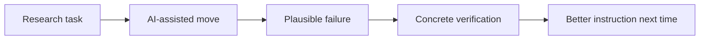
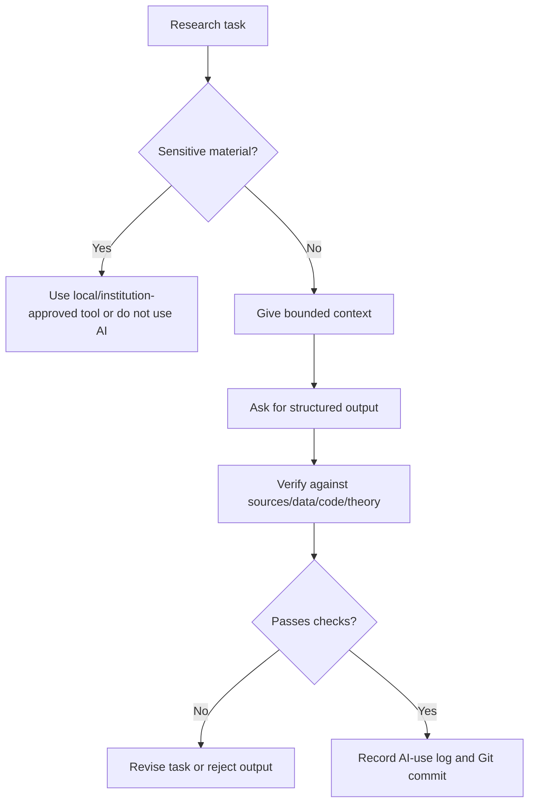
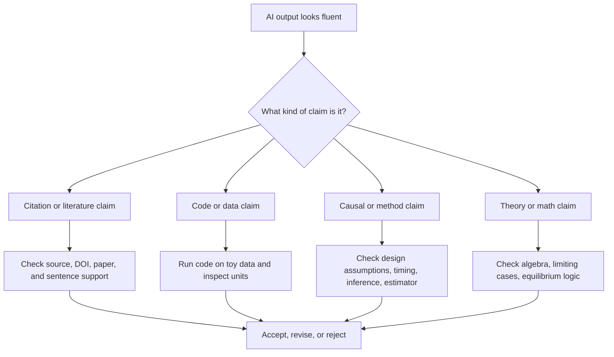

# 04 案例、图示与失败案例

这一页对应英文版 `04 Examples, Diagrams, and Failure Cases`。它把案例放在一起，让读者通过模式学习，而不是只读抽象规则。失败案例和成功案例同样重要。

建议或案例投稿请邮件 [jay.liu@bristol.ac.uk](mailto:jay.liu@bristol.ac.uk)，标题写 `[AI Econ Finance Examples] Suggest an example or failure case`。

## 目录

- [选择一个案例](#选择一个案例)
- [如何从案例中学习](#如何从案例中学习)
- [可复用的 GitHub-native 视觉模式](#可复用的-github-native-视觉模式)
- [AI 研究工作流图](#ai-研究工作流图)
- [失败案例循环](#失败案例循环)
- [Worked Spine：一个 synthetic paper 从 idea 到 seminar](#worked-spine一个-synthetic-paper-从-idea-到-seminar)
- [Agentic 版本：同一篇 paper 用 file-editing AI](#agentic-版本同一篇-paper-用-file-editing-ai)
- [三个 worked examples：好输出和坏输出](#三个-worked-examples好输出和坏输出)
- [案例 1：Asset Pricing 文献综述](#案例-1asset-pricing-文献综述)
- [案例 2：Corporate Finance 实证论文](#案例-2corporate-finance-实证论文)
- [案例 3：Job Talk 或 Seminar 展示练习](#案例-3job-talk-或-seminar-展示练习)
- [失败案例库](#失败案例库)
- [填好的失败案例：AI 写的 merge code 造成 look-ahead bias](#填好的失败案例ai-写的-merge-code-造成-look-ahead-bias)
- [填好的失败案例：LLM-generated text measure 不可复现](#填好的失败案例llm-generated-text-measure-不可复现)
- [填好的失败案例：Event-study slide 过度因果解释](#填好的失败案例event-study-slide-过度因果解释)
- [填好的失败案例：AI 代码能跑但改变了 sample](#填好的失败案例ai-代码能跑但改变了-sample)
- [失败案例模板](#失败案例模板)
- [AI 输出审计模板](#ai-输出审计模板)

## 选择一个案例

| 如果你的任务是... | 看 | 复制/使用 |
| --- | --- | --- |
| 在 asset pricing 中定位论文 | 案例 1 | literature map skill |
| 写 corporate finance methods | 案例 2 | finance empirical methods skill |
| 从 idea 到 output 运行项目 | worked spine | pipeline skills |
| 检查 AI 生成输出 | failure case library | audit prompt |
| 准备 seminar slides | presentation failure cases | presentation practice skill |
| 设置 research repo | project safety failure cases | clean project workflow |

## 如何从案例中学习

不要把案例当故事读。把它们当可复用模式读。



| 你看到什么 | 应该提取什么 |
| --- | --- |
| good example | workflow structure，而不是 exact wording |
| bad example | hidden failure mode |
| failure case | 能抓住错误的 verification method |
| diagram | approval、checking、logging 的 sequence |
| synthetic paper | skills 如何组合成项目 |

## 可复用的 GitHub-native 视觉模式

| Pattern | 最适合 | 为什么有帮助 |
| --- | --- | --- |
| Mermaid flowchart | research pipeline、agent workflow、approval gates | 先看顺序，再读细节 |
| Decision table | tool choice、data-safety choice、verification method | 快速选择 |
| Task checklist | setup steps、replication checks、slide checks | 读者可复制或逐项检查 |
| Failure card | 具体 AI mistakes | 比抽象 warning 更容易记住 |
| Collapsible `<details>` | optional examples 或 long prompts | 页面更短但保留可复制内容 |

## AI 研究工作流图



## 失败案例循环

大多数 AI 错误不是离奇错误，而是乍看合理的输出。



## Worked Spine：一个 synthetic paper 从 idea 到 seminar

Synthetic paper:

```text
Question:
Do local bank branch closures affect small-firm borrowing and employment?

Data idea:
Branch-level closures, county/firm outcomes, credit bureau or firm panel data, local labor outcomes.

Main risk:
Closures are not random; weak local demand may cause both closures and lower borrowing.
```

| Stage | AI-assisted action | Skill | Human check |
| --- | --- | --- | --- |
| 1. Question | 把 topic 变成 mechanism tension | topic-to-tension | 问题是否重要，而不仅可行 |
| 2. Literature | map supplied banking/local credit papers | source-grounded literature review | 核查 closest papers，不要过度 novelty |
| 3. Design | pre-mortem DiD/event-study design | DiD/event-study check | staggered timing、heterogeneous effects、pre-trend power、clustering |
| 4. Data | 创建 raw-to-analysis pipeline | reproducible data pipeline | raw files 不变，licensed data 受保护 |
| 5. Code | 先做 toy data 再写 real code | toy data test harness | known-answer test 必须通过 |
| 6. Methods | 从核查事实写 methods | economics methods | prose 对应 scripts、sample、timing、inference |
| 7. Results | 检查 coefficient interpretation | magnitude check | units、baseline、CI、design support |
| 8. Talk | 准备 seminar Q&A | presentation practice | 不编造 limitations 的回答 |
| 9. Trace | 记录 disclosure 和 AI use | reproducibility packet | 查 policy、coauthor、data-provider rules |

重点不是 AI 产生论文，而是每一步 AI-assisted artifact 都能在下一步前被核查。

## Agentic 版本：同一篇 paper 用 file-editing AI

| Stage | Agent task | Allowed files | Forbidden files | Human approval | Success check |
| --- | --- | --- | --- | --- | --- |
| repo intake | inspect structure and propose `.gitignore` | file list only | all file edits | approve cleanup plan | raw data ignored and untouched |
| data dictionary | draft `DATA.md` | `DATA.md` | raw records | approve sensitivity labels | data access rules explicit |
| toy pipeline | create synthetic toy data and merge test | `code/toy_*` | real data | approve test logic | known-answer merge passes |
| real pipeline | update scripts after toy test | approved `code/` files | `data/raw/` | approve exact files | scripts run and audit tables print |
| methods audit | compare paper methods to code/tables | `paper/methods.md` draft/comments | code/data unless approved | approve prose edits | methods match scripts/sample |
| talk prep | create Q&A and slide outline | `slides/`, copied figures | raw data/code | approve public claims | slide claims match paper |
| trace | draft AI-use log entry | `AI-USE-LOG.md` | none | approve commit | diff reviewed and logged |

## 三个 Worked Examples：好输出和坏输出

### Worked Example A: Literature Review Without Fake Citations

| Part | Content |
| --- | --- |
| Research task | map supplied papers on bank competition, credit access, and small-firm outcomes |
| User input | five verified papers, BibTeX records, one paragraph on the new project |
| Good AI output | “只基于 supplied papers，文献可分成 bank-market structure、local credit access、firm employment responses。” |
| Bad AI output | “This paper is the first to study branch closures and employment, as shown by Smith and Jones (2021).” |
| Researcher verifies | 每个 citation 存在；“first” claim 删除或人工核查；每个 gap 绑定 supplied source |
| Safer output | “The contribution should be stated conditionally until closest branch-closure and small-firm credit papers are checked.” |

### Worked Example B: Finance Methods And Look-Ahead Bias

| Part | Content |
| --- | --- |
| Research task | monthly portfolio sort with Compustat accounting variables and CRSP returns |
| Good AI output | methods 必须说明 reporting-lag rule、CCM filters、share/exchange codes、delisting returns、factor model、exploratory/pre-specified status |
| Bad AI output | “We merge annual fundamentals to same-year monthly returns and find robust predictability.” |
| Researcher verifies | availability date、delisting returns、survivorship filters、factor set、multiple testing |
| Safer output | portfolios formed only after public-availability assumption；exploratory anomaly tests labeled as such |

### Worked Example C: Applied Econ DiD And Panel Design

| Part | Content |
| --- | --- |
| Research task | audit DiD/event-study for staggered state policy adoption |
| Good AI output | 先判断 TWFE 是否在 heterogeneous effects 下可解释；必要时报告 group-time 或 imputation-style estimates |
| Bad AI output | “Pre-trends are insignificant, so parallel trends holds and coefficient is causal.” |
| Researcher verifies | treatment timing、comparison groups、estimator、event-time support、cluster count、pre-trend power |
| Safer output | event study 作为 consistent evidence，加入 staggered timing estimator checks，并说明 remaining threats |

## 案例 1：Asset Pricing 文献综述

Good AI use:
- 用 supplied papers 建表
- 区分 predictor、sample、horizon、benchmark、result
- 标记 factor-mining 和 multiple-testing concerns
- 标出 novelty claims 需要人工核查

Bad AI use:
- 让 AI “找所有相关论文”并直接相信
- 接受 invented citations
- 不读 closest papers 就写 contribution

## 案例 2：Corporate Finance 实证论文

Good AI use:
- 明确 unit of observation
- 检查 variable timing
- 检查 controls 和 fixed effects
- 识别 clustering 和 serial correlation
- 对照 methods prose 和 code

Bad AI use:
- 因为有 fixed effects 就宣称 causality
- 描述没有做过的 robustness checks
- 忽略 sample selection 和 measurement issues

## 案例 3：Job Talk 或 Seminar 展示练习

Good AI use:
- 创建 hostile-but-fair questions
- 发现 slide sequence problems
- 标记 overclaiming
- 用 evidence requirements 准备短答案
- 为 mixed audience 翻译 technical answers

Bad AI use:
- 编造你回答不了的问题答案
- 隐藏 limitations
- 把弱 design 写得很 confident
- 生成 flashy 但遮蔽核心 argument 的 slides

## 失败案例库

| Failure | Why it looks plausible | How to catch it |
| --- | --- | --- |
| fake citation | title sounds field-appropriate | verify DOI, journal, author, year |
| wrong code that runs | code produces output | toy example and formula comparison |
| event-study timing error | graph looks normal | inspect treatment date, event window, leads/lags |
| coefficient overinterpretation | prose sounds academic | check units and economic magnitude |
| AI overwrites raw data | agent “cleans” files | Git, `.gitignore`, raw-data rules |
| figure label changed | slide looks cleaner | compare to original table/figure |
| factor-mining story | narrative sounds like finance theory | pre-specification, out-of-sample checks, costs |
| slide overstates claim | confident title | compare slide title to design and table |
| public summary becomes investment advice | friendly language sounds useful | remove recommendations and state limits |
| methods mismatch code | prose cleaner than code comments | methods-to-code consistency check |
| CRSP delisting returns omitted | portfolio results look significant | print delisting treatment and compare |
| Compustat timing uses future data | annual variables merge successfully | enforce reporting-lag rule |
| TWFE hides negative weights | standard coefficient table | estimator-choice audit |
| LLM text score drifts | labels look reasonable | pin model/date and rerun sensitivity |
| structural counterfactual changes too much | clean welfare number | isolate mechanism and reoptimization assumptions |

## 填好的失败案例：AI 写的 Merge Code 造成 Look-Ahead Bias

What happened: AI 把 Compustat fiscal-year accounting variables 直接 merge 到同一年 monthly stock returns，没有 reporting lag。

Why plausible: merge 能跑，sample size 正常，regression signs 看起来合理。

What caught it: timing audit 问 “投资者在 portfolio formation date 是否能知道这个 accounting variable？”

Rule: annual accounting variables 进入 return tests 前必须有 public-availability 或 reporting-lag assumption。

## 填好的失败案例：LLM-generated Text Measure 不可复现

What happened: 1 月份 LLM 给 10-K risk disclosures 打分；5 月模型更新后同一 prompt 得到不同 scores。

What caught it: validation sample rerun 后 rank changes 足以改变 regression coefficients。

Rule: LLM-generated variables 是 measurement instruments，必须记录 model、prompt、date、settings、raw outputs 和 sensitivity checks。

## 填好的失败案例：Event-study Slide 过度因果解释

What happened: AI 把 event-study table 转成 slide title：“Branch closures reduce small-firm employment.”

What caught it: slide-claim audit 发现 local demand shocks 和 treatment timing 仍有疑问。

Rule: slide title 的动词必须由 design 支持；否则使用 “is associated with,” “falls after,” “is consistent with,” 或 “we estimate”。

## 填好的失败案例：AI 代码能跑但改变了 Sample

What happened: AI 用 `drop_na()` 修 merge error，代码能跑，但 missing pre-period covariates 的 treated units 被丢掉。

What caught it: before/after sample audit 打印 unit counts、treated-unit counts 和 event-time support。

Rule: missing-data fixes 必须报告按 treatment status、time 和 subgroup 损失了哪些 observations。

## 失败案例模板

```markdown
## Failure: [short name]

What happened:

Why it looked plausible:

Where it entered the workflow:

What caught it:

What would have prevented it:

Rule to add to future AI instructions:

Related files or commits:
```

## AI 输出审计模板

```text
Audit this AI-assisted output for economics/finance research failure modes.

Output to audit:
[paste]

Project context:
[context]

Check for:
- fake citations
- invented data/results
- overclaimed causality
- wrong coefficient interpretation
- missing limitations
- code/method mismatch
- finance-specific factor-mining or backtest risks

Return a severity-ranked list of issues and what I must verify.
```
