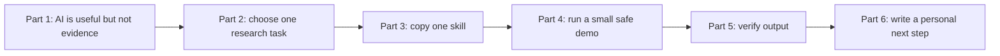
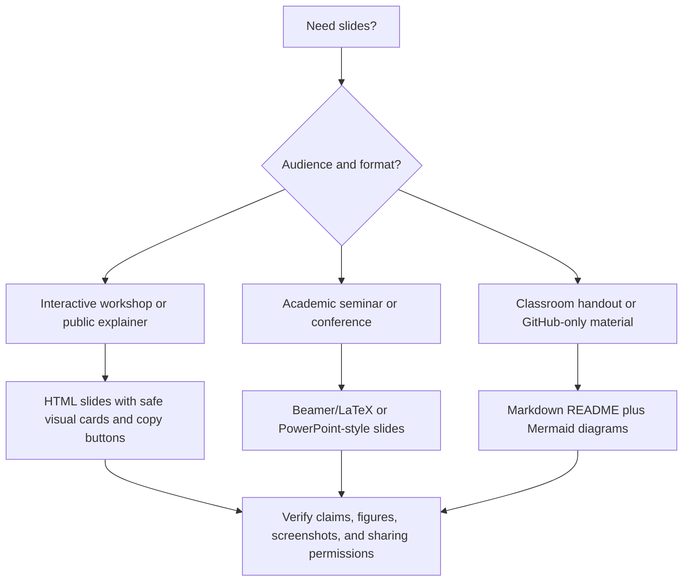

# 06 教学、工作坊、练习展示和分享 Slides

这一页对应英文版 `06 Teach Workshops, Practice Talks, and Share Slides`。它面向教师、PI、PhD 组织者、seminar leader 和希望把本仓库变成现场教学/展示材料的研究者。

> [!TIP]
> 每次 workshop 都应是一次 live workflow-design session。参与者离开时应至少带走一个 project instruction、一个 skill 和一个 verification rule。

建议请邮件 [jay.liu@bristol.ac.uk](mailto:jay.liu@bristol.ac.uk)，标题写 `[AI Econ Finance Teaching] Workshop suggestion`。

## 目录

- [为什么需要这一页](#为什么需要这一页)
- [使用这一页做什么](#使用这一页做什么)
- [Teaching flow](#teaching-flow)
- [Two-hour presentation kit](#two-hour-presentation-kit)
- [两小时讲授这份仓库](#两小时讲授这份仓库)
- [Beginner module：这些工具是什么](#beginner-module这些工具是什么)
- [两次课工作坊](#两次课工作坊)
- [Exercise：核查是一项技能](#exercise核查是一项技能)
- [Slide-ready outline](#slide-ready-outline)
- [Slide deck choice map](#slide-deck-choice-map)
- [Workshop handout：一页规则](#workshop-handout一页规则)
- [RA onboarding checklist](#ra-onboarding-checklist)
- [RA first assignment](#ra-first-assignment)
- [Presentation practice activity](#presentation-practice-activity)
- [End-to-end classroom activity](#end-to-end-classroom-activity)
- [Slide-building exercise](#slide-building-exercise)

## 为什么需要这一页

教研究者使用 AI，不是展示“AI 多厉害”。一个有用的 workshop 应该让参与者带走：

1. 一个更安全的 AI mental model；
2. 一个可复用 project setup；
3. 一个 copy-ready skill；
4. 一个具体 verification method；
5. 一个关于不要上传或不要自动化什么的规则。

初学者应从普通工具开始：ChatGPT 或 Claude 用于 chat，GitHub 用于 version history，VS Code 用于代码/项目，Zotero 或 BibTeX 用于来源，AI-use log 用于记录。

## 使用这一页做什么

| Goal | Use |
| --- | --- |
| 教两小时 presentation | 英文 [presentation script](../../06-Teach-Workshops-Practice-Talks-and-Share-Slides/materials/two-hour-ai-econ-finance-presentation.md) 和 [HTML slides](../../06-Teach-Workshops-Practice-Talks-and-Share-Slides/materials/two-hour-ai-econ-finance-slides.html) |
| 教 90 分钟 introduction | 两次课工作坊的 Session 1 |
| 教半天 workshop | 两个 sessions + live skill-building |
| 培训 RA | RA onboarding checklist |
| 准备 seminar/job talk | presentation practice activity |
| 做 shareable material | slide-ready outline 和 HTML/Beamer skills |

## Teaching Flow

最简单但强的 workshop 有三个动作：展示问题、让参与者用一个 skill、让他们核查输出。



| Teaching asset | Best visual format | Participants leave with |
| --- | --- | --- |
| concept explanation | one diagram + one example | mental model |
| live demo | casual vs controlled prompt | better instruction habit |
| skill practice | copy block with bracketed fields | reusable workflow |
| failure case | small case card | verification method |
| agent setup | approval-gate diagram | safe file-editing rule |
| presentation practice | Q&A drill table | better answers under pressure |

## Two-Hour Presentation Kit

| Asset | Use it for | Notes |
| --- | --- | --- |
| [Two-hour presentation script](../../06-Teach-Workshops-Practice-Talks-and-Share-Slides/materials/two-hour-ai-econ-finance-presentation.md) | readable GitHub version、speaker plan、timed agenda、demos、exercises | teaching source of truth |
| [Interactive HTML slide deck](../../06-Teach-Workshops-Practice-Talks-and-Share-Slides/materials/two-hour-ai-econ-finance-slides.html) | live presentation | 本地浏览器打开 |
| [Presentation and slide skills](02-复制即用：AI研究指令与模板.md#展示练习) | 改成其他 audience | 包括 HTML、Beamer、talk practice、paper-to-talk |

使用建议：

```text
1. 先读 Markdown script。
2. 在浏览器中打开 HTML deck。
3. 使用 deck 中的 synthetic visuals，或只替换成你有权限展示的 public examples。
4. 所有 live demo 都使用 public 或 synthetic examples。
5. demo 小到可以现场核查。
```

## 两小时讲授这份仓库

| Time | Concept | Demo | Skill to copy | Warning | Audience exercise |
| --- | --- | --- | --- | --- | --- |
| 0-15 min | AI output is not evidence | casual prompt vs controlled prompt | default clarification rule | fluency hides errors | 把 vague request 改成 controlled workflow |
| 15-35 min | literature and citations | supplied-source mini map | source-grounded literature review | never trust generated citations | 标出需要 DOI/source checks 的 claims |
| 35-55 min | empirical methods | methods paragraph audit | econ/finance methods skill | fixed effects are not identification | 找 sample、timing、inference、causal language |
| 55-75 min | Git and data safety | `.gitignore`, `DATA.md`, `AGENTS.md`, AI-use log | Git/data safety template | private/licensed data must not leak | classify a dataset |
| 75-95 min | agents | plan -> approve -> diff -> check -> commit | approval gate template | agents must not silently change design/code/data | draft an approval table |
| 95-115 min | verification | failure case audit | verification selector | “verify manually” is not enough | choose source/code/data/math/policy check |
| 115-120 min | personal next step | one-minute reflection | one selected skill | adopt one workflow at a time | 写下本周要测试的一个 skill |

## Beginner Module：这些工具是什么

| Tool | 一句话解释 | 初学者练习 |
| --- | --- | --- |
| ChatGPT/Claude | 可以基于你提供的 context 生成文字/代码的 chat 工具 | 结构化总结一个 public abstract |
| Project | 带 instructions 和 files 的 persistent AI workspace | 为一个 paper idea 建一个 project |
| Codex/Claude Code/Cursor/Copilot | 能与 files/code 工作的 AI coding agents/assistants | 先让它给 plan，不要直接改文件 |
| VS Code | 管理 code、Git、terminal、project navigation 的 editor | 打开 repo，看 Git diff |
| GitHub | version control、collaboration、issues、releases、recovery | 建 private repo，commit README |
| Skill | repeated task 的 reusable instruction | 把一个重复任务变成 inputs、steps、output、verification |
| MCP/connector | AI 连接外部 tools/data 的接口 | 讨论 permissions 和 data exposure |

## 两次课工作坊

### Session 1：基础

Goal：帮助学者理解 AI 可以和不可以做什么。

Agenda:
1. AI is not evidence.
2. LLMs, projects, skills, agents, MCPs.
3. Data safety and confidentiality.
4. Literature review without fake citations.
5. Empirical methods drafting and checking.
6. Verification methods, not just “be careful.”
7. AI-use logs and disclosure.

Exercise:

```text
Take one research task you do repeatedly. Convert it into:
1. purpose
2. safe inputs
3. AI instruction
4. expected output
5. verification checklist
```

### Session 2：应用工作流

Goal：帮助学者建立安全工作流。

Agenda:
1. One paper, one repo, one AI project.
2. GitHub safety and `.gitignore`.
3. AGENTS.md and project instructions.
4. Replication-package agent workflow.
5. Presentation practice with AI.
6. Data-pipeline and toy-data testing.
7. Staying updated without hype.

Exercise:

```text
Create a safe AI project setup for one paper:
- project instructions
- folder structure
- data rules
- AI-use log
- first skill to create
- first verification check
```

## Exercise：核查是一项技能

给参与者一个故意有问题的 AI 输出：

- fake citation
- coefficient unit interpretation 错误
- merge plan with look-ahead bias
- event-study paragraph that claims parallel trends “passed”
- slide title turning correlation into causality

要求他们识别：

1. 为什么看起来可信；
2. 需要什么 evidence 核查；
3. 需要 source、code、toy data、table 中的哪一个；
4. 哪句话或指令可以下次防止。

## Slide-ready outline

```text
Title: AI for Economics and Finance Research

1. The promise and danger
2. Why AI output is not evidence
3. Research workflow maturity ladder
4. What AI can help with
5. What not to automate
6. Data safety matrix
7. Skills, projects, agents, MCPs
8. GitHub as research safety infrastructure
9. Copy-ready workflows
10. Failure cases
11. Data pipelines and toy-data tests
12. Building your own AI research system
13. Q&A and live workflow design
```

## Slide Deck Choice Map



## Workshop Handout：一页规则

```text
1. AI output is not evidence.
2. Never trust generated citations.
3. If AI can edit files, use Git.
4. If data is private, licensed, restricted, or confidential, do not upload it without permission.
5. Plan before execution.
6. Turn repeated tasks into skills.
7. Keep an AI-use log.
8. Check code, tables, equations, and citations against original sources.
9. Use dated tool claims.
10. Automate only when verification is stronger than automation.
```

## RA Onboarding Checklist

```text
Before an RA uses AI on a project:
- read project README
- read DATA.md
- read AGENTS.md
- confirm data privacy rules
- set up Git
- understand branch workflow
- know what files never to edit
- know how to log AI use
- run one small reproducibility check
- ask before uploading or sharing drafts
```

## RA First Assignment

```text
Create a safe project orientation note for this research project.

Use only the files and rules provided by the PI.

Include:
1. project purpose
2. folder map
3. data sensitivity rules
4. files never to edit
5. how to run the main code
6. how to record AI use
7. first reproducibility check
8. questions for the PI
```

## Presentation Practice Activity

要求每个参与者准备：

- one-slide research question
- one-slide design/data
- one-slide main result
- one-slide limitation

然后让 AI 生成 tough questions，并要求 human answers。

## End-to-End Classroom Activity

```text
Synthetic project:
Does a local policy shock affect firm investment?

Teams:
1. idea and mechanism team
2. literature map team
3. design and identification team
4. data pipeline team
5. methods prose team
6. verification and failure-case team
7. presentation team

Each team uses one skill and produces:
- input facts;
- AI instruction used;
- output artifact;
- verification checklist;
- one thing they refused to let AI decide.
```

## Slide-Building Exercise

| Slide style | Exercise | Best for |
| --- | --- | --- |
| HTML interactive | animated mechanism、event timeline、data-flow slide | teaching、online sharing、public explainers |
| LaTeX/Beamer | standard seminar deck with equations、tables、limitations | conferences、job talks、academic seminars |

Prompt:

```text
Take this paper abstract and results summary.
Create two presentation plans:
1. an interactive HTML explainer deck;
2. a traditional LaTeX Beamer seminar deck.

For each, explain:
- target audience
- slide sequence
- what interaction or equation belongs where
- what claims must be verified
- where limitations should be shown
```
